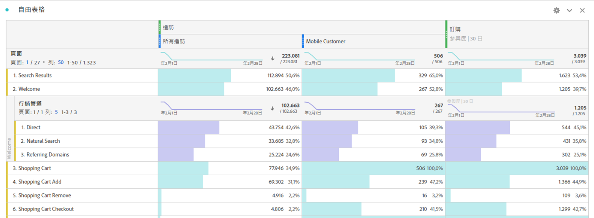
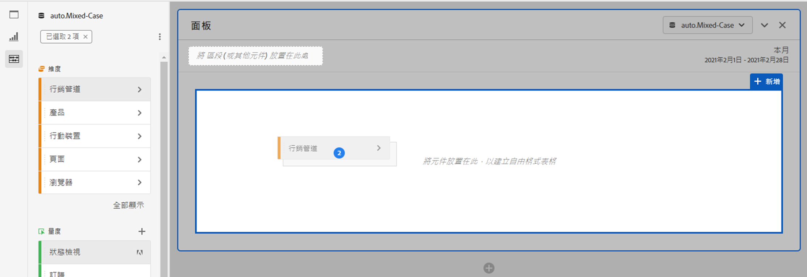
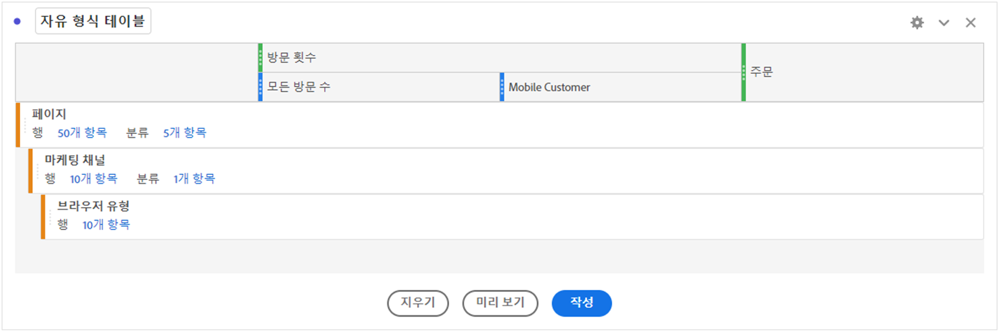

# 自由格式表格概觀 {#freeform-table-overview}

<!-- markdownlint-disable MD034 -->

>[!CONTEXTUALHELP]
>id="workspace_freeformtable_button"
>title="自由表格"
>abstract="建立一個空白的自由格式表格視覺效果，您可以使用維度、區段、量度和日期範圍進一步建置。您可以使用自由格式表格作為其他視覺效果的基礎。"

<!-- markdownlint-enable MD034 -->

>[!BEGINSHADEBOX]

_本文記錄_ _&#x200B;**Adobe Analytics** 中的自由格式表格視覺效果。_ _請參閱[自由格式表格](https://experienceleague.adobe.com/zh-hant/docs/analytics-platform/using/cja-workspace/visualizations/freeform-table/freeform-table)，以取得本文的_  _&#x200B;**Customer Journey Analytics** 版本。_

>[!ENDSHADEBOX]

在 Analysis Workspace 中， **[!UICONTROL 自由格式表格]**&#x200B;視覺效果是互動式資料分析的基礎。您可以將各種[元件](/help/analyze/analysis-workspace/components/analysis-workspace-components.md)拖放至行和欄中，建立自訂表格供分析之用。表格會在您放置元件後立即更新，以便您快速分析和深入了解。

若要建立並設定[!UICONTROL 自由格式表格]：

* 新增**[!UICONTROL 自由格式表格]**&#x200B;視覺效果。請參閱[新增視覺效果至面板](../freeform-analysis-visualizations.md#add-visualizations-to-a-panel)。

## 自動化表格

若要建立表格，直接將元件拖放至空白專案、面板或自由表格中是最快的方法。以建議的格式為您建立自由格式表格。[觀看教學課程](https://experienceleague.adobe.com/zh-hant/docs/analytics-learn/tutorials/analysis-workspace/building-freeform-tables/auto-build-freeform-tables-in-analysis-workspace)。

## 自由表格產生器

如果您偏好先將數個元件新增至表格，然後再轉譯資料，您可以選取「**[!UICONTROL 啟用表格產生器]**」。啟用產生器後，您可以拖放許維度、劃分、量度和篩選器，以建立回答更複雜的問題之表格。一旦您選取「**[!UICONTROL 建置]**」，資料就會進行更新。

## 互動

您可以透過多種方式與自由表格互動及自訂表格：

### 篩選和排序

* 您可以[篩選和排序](filter-and-sort.md)表格中的資料。

### 資料列

* 您可以使用 ，從一列或多列快速[建立新的視覺效果](../freeform-analysis-visualizations.md#visualize)。
* 您可以調整專案的[檢視密度](/help/analyze/analysis-workspace/build-workspace-project/view-density.md)，在單一畫面中放入更多列。
* 分頁之前，每個維度列最多可顯示 400 列。請選取第一欄標題中&#x200B;**[!UICONTROL 行]**&#x200B;旁邊的數字，以在頁面上顯示更多列。使用第一欄標題中的 ，導覽至不同頁面。
* 您可以根據其他元件劃分列。若要一次劃分許多列，請選取多個列，然後將下一個元件拖曳至選取列的頂端。了解更多關於[劃分](/help/analyze/analysis-workspace/components/dimensions/t-breakdown-fa.md)的資訊。
* 您可以[篩選](/help/analyze/analysis-workspace/visualizations/freeform-table/filter-and-sort.md)列，以顯示縮減的項目集。[列設定](/help/analyze/analysis-workspace/visualizations/freeform-table/column-row-settings/table-settings.md)之下有提供其他設定。

### 資料欄

* 元件可堆疊在欄內，以建立篩選量度、跨索引標籤分析等等。
* [資料欄設定](/help/analyze/analysis-workspace/visualizations/freeform-table/column-row-settings/column-settings.md)底下可調整每個欄的檢視方式。
* 透過[內容選單](/help/analyze/analysis-workspace/visualizations/freeform-analysis-visualizations.md#context-menu)可執行數個動作。根據您選取表格標題、列或欄，選單均會提供不同動作。

## 設定

請選取「」以顯示「**[!UICONTROL 表格設定]**」。可使用下列特定視覺效果[設定](../freeform-analysis-visualizations.md#settings)：

### 資料來源

| 選項 | 說明 |
|---|---|
| **[!UICONTROL 連結的視覺效果]** | 列出所有連結的視覺效果。 |
| **[!UICONTROL 顯示資料來源]** | 取消勾選時，作為視覺效果資料來源的自由格式表格會隱藏在 Workspace。 |

### 設定

| 選項 | 說明 |
|---|---|
| **[!UICONTROL 對齊各欄日期，讓所有開始日期在同一列。]** | 是否讓每一欄的日期與同一列中所有開始日期一致。 |

## 內容選單

可從視覺效果標題使用下列[內容選單](../freeform-analysis-visualizations.md#context-menu)選項：

| 選項 | 說明 |
| --- | --- |
| **[!UICONTROL 插入複製的視覺效果]**&#x200B;n | 將複製的視覺效果貼上 (插入) 至專案內另一個位置或完全不同的專案中。 |
| **[!UICONTROL 複製資料至剪貼簿]** | 從視覺效果複製資料至剪貼簿。 |
| **[!UICONTROL 複製選取項目至剪貼簿]** | 從視覺效果將選取項目複製至剪貼簿。 |
| **[!UICONTROL 將項目下載為 CSV (*維度名稱*)]** | 立即將視覺效果的維度項目 (最多 50,000 個) 下載至您的本機裝置。選取維度的最大維度項目數為 50,000。 |
| **[!UICONTROL 複製視覺效果]** | 複製視覺效果，以便於您將其插入至專案內另一個位置或完全不同的專案中。 |
| **[!UICONTROL 下載資料為 CSV 檔]** | 將視覺效果顯示的資料立即下載至本機裝置。 |
| **[!UICONTROL 複製視覺效果]** | 完全複製視覺效果。 |
| **[!UICONTROL 編輯說明]** | 新增 (或編輯) 視覺效果的文字說明。請參閱[文字](../text.md)。 |
| **[!UICONTROL 取得視覺效果連結]** | 直接複製並共用視覺效果連結。共用連結對話框顯示此連結。請選取「複製」以複製此連結至剪貼簿。 |
| **[!UICONTROL 重新開始]** | 刪除目前視覺效果的設定，以便於您可從頭開始再設定。 |

## 影片

>[!BEGINSHADEBOX]

請參閱  [自由格式表格產生器概觀](https://video.tv.adobe.com/v/31318?quality=12&learn=on){target="_blank"}的示範影片。

>[!ENDSHADEBOX]

>[!BEGINSHADEBOX]

請參閱  [自由格式表格篩選器](https://video.tv.adobe.com/v/23232?quality=12&learn=on){target="_blank"}的示範影片。

>[!ENDSHADEBOX]

>[!BEGINSHADEBOX]

請參閱  [自由格式表格總計](https://video.tv.adobe.com/v/29273?quality=12&learn=on){target="_blank"}的示範影片。

>[!ENDSHADEBOX]

>[!MORELIKETHIS]
>
>[將視覺化新增至面板](/help/analyze/analysis-workspace/visualizations/freeform-analysis-visualizations.md#add-visualizations-to-a-panel)
>&#x200B;>[視覺效果設定](/help/analyze/analysis-workspace/visualizations/freeform-analysis-visualizations.md#settings)
>&#x200B;>[視覺化內容選單](/help/analyze/analysis-workspace/visualizations/freeform-analysis-visualizations.md#context-menu)
>

