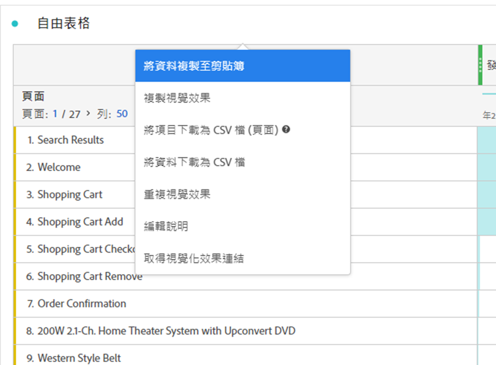

# 自由表格

在 Analysis Workspace 中，自由表格是互動式資料分析的基礎。您可以將各種[元件](https://experienceleague.adobe.com/docs/analytics/analyze/analysis-workspace/components/analysis-workspace-components.html?lang=zh-Hant)拖放至行和欄中，建立自訂表格供分析之用。放置每個元件時，表格會立即更新，以便您快速分析，並深入探討。

## 建立簡單的自由表格

您以空白的自由表格開始。

如果您將 **[!UICONTROL **&#x200B;瀏覽&#x200B;**]** 量度 **[!UICONTROL **&#x200B;將量度拖曳到此處（或任何其他元件）**]**，自由表格會在您選取的日曆期間自動填入每天的造訪次數。

若您接著將 **[!UICONTROL **&#x200B;頁面&#x200B;**]** 要替換的維 **[!UICONTROL **&#x200B;日&#x200B;**]** 維度欄時，自由表格會自動反映每個頁面的造訪次數。

接著，您可以劃分，例如 **[!UICONTROL **&#x200B;類別：5 **]** 頁面，將 **[!UICONTROL **&#x200B;行銷管道&#x200B;**]** 維度 **[!UICONTROL **&#x200B;類別：5 **]** 行。

## 自動化表格

如上圖所示，建立表格的最快方式是直接將元件拖放至空白專案、面板或自由表格中。 系統會自動以建議的格式為您建立自由表格。[觀看教學課程](https://experienceleague.adobe.com/docs/analytics-learn/tutorials/analysis-workspace/building-freeform-tables/auto-build-freeform-tables-in-analysis-workspace.html?lang=zh-Hant)。

## 自由表格產生器

如果您偏好先將數個元件新增至表格，然後再轉譯資料，則可啟用「自由表格產生器」。啟用產生器後，許多維度、劃分、量度和區段都可以拖放使用，以便建立可回答更複雜問題的表格。 資料不會即時更新，但當您按一下 **[!UICONTROL 建置]**.

## 表格互動

您可以透過多種方式與自由表格互動及自訂表格：

* **行**
   * 您可以調整專案的[檢視密度](https://experienceleague.adobe.com/docs/analytics/analyze/analysis-workspace/build-workspace-project/view-density.html?lang=zh-Hant)，在單一畫面中放入更多列。
   * 分頁之前，每個維度列最多可顯示 400 列。按一下「列」旁邊的數字，就能在頁面上顯示更多列。使用頁首的頁面箭頭，即可導覽至其他頁面。
   * 列可以依其他元件劃分。若要一次劃分許多列，只需選取多列，然後將下一個元件拖曳至選取的列上即可。進一步了解[劃分](https://experienceleague.adobe.com/docs/analytics/analyze/analysis-workspace/components/dimensions/t-breakdown-fa.html?lang=zh-Hant)。
   * 您可以[篩選](https://experienceleague.adobe.com/docs/analytics/analyze/analysis-workspace/visualizations/freeform-table/filter-and-sort.html?lang=zh-Hant)列，以顯示縮減的項目集。[「列設定」](https://experienceleague.adobe.com/docs/analytics/analyze/analysis-workspace/visualizations/freeform-table/column-row-settings/table-settings.html?lang=zh-Hant)底下提供其他設定。

* **欄**
   * 元件可堆疊在欄內，以建立分段量度、跨標籤分析等等。
   * [欄設定](https://experienceleague.adobe.com/docs/analytics/analyze/analysis-workspace/build-workspace-project/column-row-settings/column-settings.html?lang=zh-Hant)底下可調整每個欄的檢視方式。
   * 您可善用[滑鼠右鍵選單](https://experienceleague.adobe.com/docs/analytics-learn/tutorials/analysis-workspace/building-freeform-tables/using-the-right-click-menu.html?lang=zh-Hant)執行數個動作。無論是在表格標頭、列或欄上按一下，選單都會提供不同動作。

## 匯出自由表格資料

深入了解 Analysis Workspace 的所有資料[匯出選項](https://experienceleague.adobe.com/docs/analytics/analyze/analysis-workspace/curate-share/download-send.html?lang=zh-Hant)。

* 按一下右鍵 >**[!UICONTROL 「複製資料到剪貼簿」]**，即可匯出顯示的表格資料。如果已選取表格，此選項會顯示&#x200B;**[!UICONTROL 「複製選取項目到剪貼簿」]**。也可以使用 **Ctrl + C** 快捷鍵複製所選取的資料。
* 按一下右鍵 >**[!UICONTROL 「以 CSV 格式下載資料」]**，將顯示的表格資料下載為 CSV 檔案。如果已選取表格，此選項會顯示&#x200B;**[!UICONTROL 「以 CSV 格式下載選取項目」]**。
* 按一下滑鼠右鍵> **[!UICONTROL 「專案>以CSV格式下載項目」]** 針對選取的維度匯出最多50,000個維度項目。

深入了解 Analysis Workspace 的所有資料[匯出選項](https://experienceleague.adobe.com/docs/analytics/analyze/analysis-workspace/curate-share/download-send.html?lang=zh-Hant)。

## 影片

自由格式表格建立器概觀：

>[!VIDEO](https://video.tv.adobe.com/v/31318/?quality=12)

自由格式表格篩選器：

>[!VIDEO](https://video.tv.adobe.com/v/23232/?quality=12)

自由格式表格總計：

>[!VIDEO](https://video.tv.adobe.com/v/29273/?quality=12)
