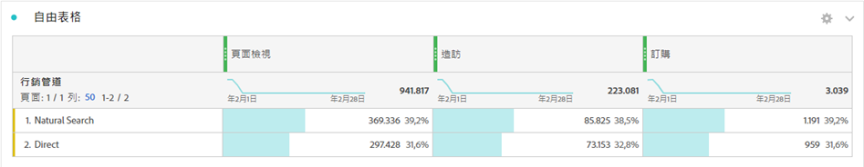
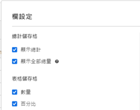
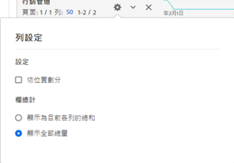

# 工作區總計

在自由表格中，每個劃分層級都會顯示總列數，當中會顯示兩個總計數字：

* **[!UICONTROL 總量]** (在其他數字中顯示為灰色) - 這項總計代表已收集到的所有點擊，有時可稱為「報表套裝總計」。在面板層級或自由表格內套用區段時，這項總計會經過調整，藉此反映所有符合區段條件的點擊。
* **[!UICONTROL 表格總計]** (黑色數字) - 此總計通常等於[!UICONTROL 總量]或為總量的子集。它反映的是在自由表格中套用的任何表格篩選條件，包括[!UICONTROL 「不包含任何項目」]選項。

## 顯示總計設定 {#display-total}

**[!UICONTROL 「欄設定」]**&#x200B;下方有&#x200B;**[!UICONTROL 「顯示總計」]**&#x200B;和&#x200B;**[!UICONTROL 「顯示總量」]**&#x200B;選項。如果取消勾選這些設定，總計就會從表格中遭到移除。當總計不符常理（例如，在某些[計算量度案例](https://experienceleague.adobe.com/docs/analytics/components/calculated-metrics/calcmetrics-reference/cm-totals.html?lang=zh-Hant)中）時，可能需要此設定。

## 靜態列總計設定 {#static-row-total}

[靜態列](https://experienceleague.adobe.com/docs/analytics/analyze/analysis-workspace/visualizations/freeform-table/column-row-settings/manual-vs-dynamic-rows.html?lang=zh-Hant)總計的行為方式不同，且須經由&#x200B;**[!UICONTROL 「列設定」]**&#x200B;控制。

* **[!UICONTROL 將目前的列數加總顯示為總計]** - 這個選項會顯示表格中的用戶端列數加總，因此總計&#x200B;**不會**&#x200B;刪除「造訪次數」或「訪客人數」等重複量度。
* **[!UICONTROL 顯示總量]** - 這個選項會顯示伺服器端的加總，因此總計會刪除「造訪次數」或「訪客人數」等重複量度。

## 常見問答

| 問題 | 回答 |
|---|---|
| 灰色欄的百分比以哪些「總計」為依據？ | 這項數據須視&#x200B;**[!UICONTROL 「列設定」]**&#x200B;中的&#x200B;**[!UICONTROL 「百分比」]**&#x200B;設定選取項目而定:<ul><li>依欄計算百分比 - 此為預設設定。百分比將以「表格總計」為依據。</li><li>依列計算百分比 - 百分比將以「總量」為依據。</li></ul> |
| **[!UICONTROL 「包含未指定 (無)」]**&#x200B;設定對總計會有何影響？ | 如果取消勾選&#x200B;**[!UICONTROL 「包含未指定 (無)」]**&#x200B;設定，「無/未指定」列將從表格和「表格總計」中遭到移除，且這種情形會持續在任何使用[「總計」量度類型](https://experienceleague.adobe.com/docs/analytics/components/calculated-metrics/calcmetric-workflow/m-metric-type-alloc.html?lang=zh-Hant)的計算量度中生效。 |
| 如果在自由表格套用自訂表格篩選器，篩選器是否會採計我的所有計算量度和條件式格式？ | 目前不會。篩選器會採計&#x200B;**[!UICONTROL 「包含未指定 (無)」]** ，但自訂表格篩選器不會影響下列項目:<ul><li>條件式格式使用的欄最大值/最小值範圍會檢查所有資料。</li><li>使用&#x200B;**[!UICONTROL 「總量」]**&#x200B;量度類型的計算量度 。</li><li>內含的函數可計算自由表格中所有列的計算量度，例如「欄加總」、「欄最大值」、「欄最小值」、「計數」、「平均值」、「中位數」、「百分位數」、「四分位數」、「列計數」、「標準差」、「變數」、「累積」、「累積平均值」、「迴歸變數」、「T 分數」、「T 檢定」、「Z 分數」、「Z 檢定」。</li></ul> |
| 在計算量度中，**[!UICONTROL 總量]**&#x200B;量度型別會反映什麼？ | **[!UICONTROL 「總量」]**&#x200B;只會持續參考&#x200B;**[!UICONTROL 「總量」]**，不會反映套用至表格或&#x200B;**[!UICONTROL 「表格總計」]**&#x200B;的篩選器。 |
| 如果資料經由自由表格複製貼上或透過 CSV 下載，系統會顯示哪項總計？ | 總列數只會反映&#x200B;**[!UICONTROL 「表格總計」]**，並遵從欄的&#x200B;**[!UICONTROL 「顯示總計」]**&#x200B;設定。 |
