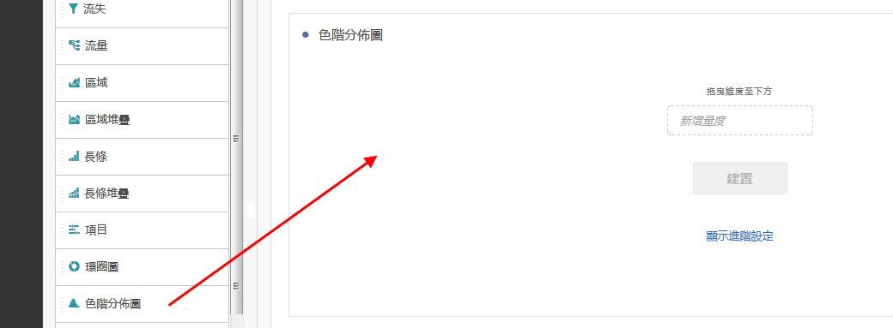
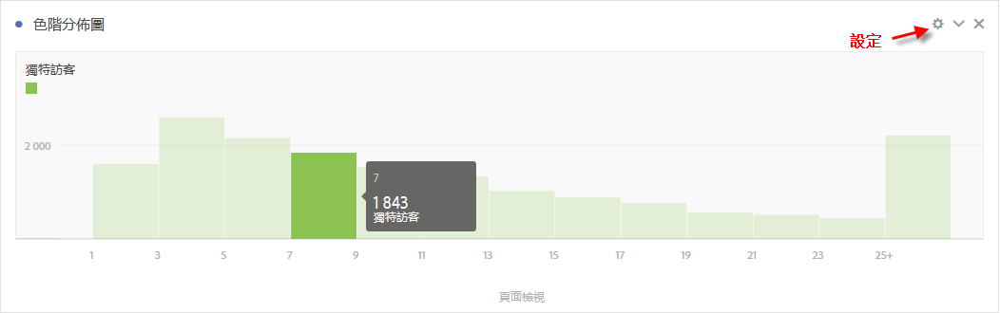
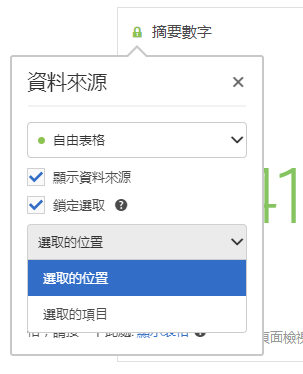
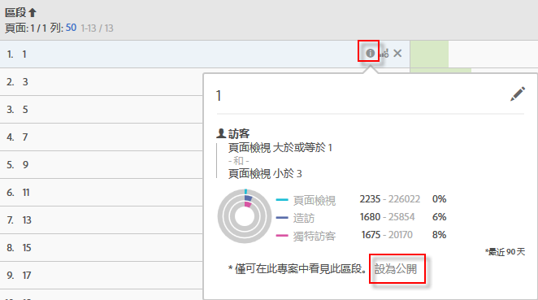

# 直方圖 {#histogram}

arkdownlint-disable MD034 —>

>[!CONTEXTUALHELP]
>id="workspace_histogram_button"
>title="直方圖"
>abstract="建立直方圖視覺效果來表示數值資料在範圍組中的分佈情形。"

<!-- markdownlint-enable MD034 -->

>[!BEGINSHADEBOX]

_本文會在_  _**Adobe Analytics**&#x200B;中記錄長條圖視覺效果。_ _檢視此文章的_  _**Customer Journey Analytics**&#x200B;版本的[色階分佈圖](https://experienceleague.adobe.com/en/docs/analytics-platform/using/cja-workspace/visualizations/histogram)。_

>[!ENDSHADEBOX]

直方圖類似於長條圖，但前者將數字分組為範圍 (貯體)。Analytics 會自動將數字分組至範圍貯體，但您可以在[進階設定](#section_09D774C584864D4CA6B5672DC2927477)中變更設定。

以下是有關如何使用直方圖的影片：

>[!VIDEO](https://video.tv.adobe.com/v/23725/?quality=12)

## 建立直方圖 {#section_74647707CC984A1CB6D3097F43A30B45}

若要建立直方圖：

1. 按一下左側邊欄中的&#x200B;**[!UICONTROL 「視覺效果」]**。
1. 將&#x200B;**[!UICONTROL 「直方圖」]**&#x200B;拖曳至面板。
1. 選擇要拖曳至直方圖視覺效果的量度並按一下&#x200B;**[!UICONTROL 「建立」]**。

>[!NOTE]
>
>直方圖僅支援標準量度，不支援計算量度。

這裡我們使用了每個不重複訪客的頁面檢視次數量度。第一個 (最左邊) 貯體對應至每個不重複訪客 1 次頁面檢視、第二個貯體對應至 2 次頁面檢視，以此類推。

## 進階設定 {#section_09D774C584864D4CA6B5672DC2927477}

若要調整直方圖設定，請按一下右上角的「設定」(「齒輪」) 圖示。您可以修改的設定如下：

| 直方圖設定 | 用途 |
|---|---|
| 起始貯體 | 決定直方圖開始使用的貯體。「1」是預設值。您可設定從 0 開始的數字，一直到無限大 (無負數)。 |
| 量度貯體 | 可讓您增加/減少資料範圍（貯體）的數量。 值區的最大數量為50。 |
| 量度貯體大小 | 可讓您設定每個貯體的大小。例如，您可將貯體大小從 1 次頁面檢視變更為 2 次頁面檢視。 |
| 計算方法 | 可讓您選擇[訪客](/help/components/metrics/unique-visitors.md)、[造訪](/help/components/metrics/visits.md)或[點擊類型](/help/components/dimensions/hit-type.md)。例如，每次造訪的頁面檢視數、每個訪客的頁面檢視數，或每次點擊的頁面檢視數。若為點擊，自由表格會將「發生次數」設為 Y 軸的量度。 |

<!--Russ or Meike - Check Hit Type link above. -->

**範例**：

* 起始貯體：1、量度貯體：5、量度貯體大小：2 會產生這個直方圖：1-2、3-4、5-6、7-8、9-10。
* 起始貯體：0、量度貯體：3、量度貯體大小：5 會產生這個直方圖：0-4、5-9、10-14

## 檢視和編輯直方圖資料 {#section_B2CD7CDF0F6B432F928103AE7AAA3617}

若要檢視或變更直方圖的資料來源，請按一下直方圖標頭旁的點，前往「**[!UICONTROL 資料來源設定]** > **[!UICONTROL 顯示資料來源]**」。

此表格中顯示的預先建立區段是內部區段，不會顯示在區段選取器中。按一下區段名稱旁的「i」圖示，然後按一下&#x200B;**[!UICONTROL 「設為公用」]**，將該區段設為公用。

若想探索管理自由資料表及其他視覺效果的其他方法，例如進行資料劃分，請前往[此處](https://experienceleague.adobe.com/docs/analytics/analyze/analysis-workspace/visualizations/freeform-analysis-visualizations.html?lang=zh-Hant)。
