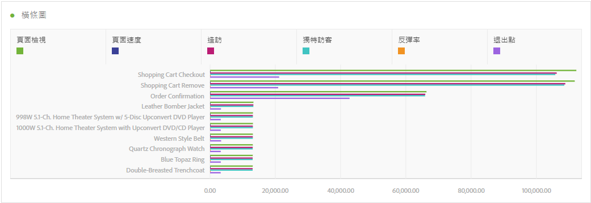
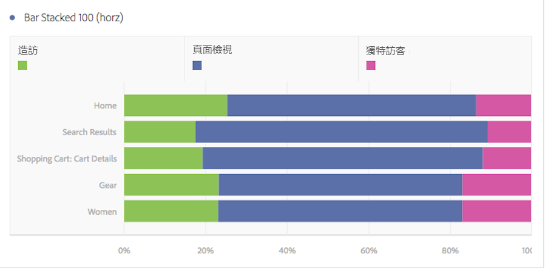

# 橫條圖和堆疊橫條圖

>[!BEGINSHADEBOX]

_本文記錄了_  _**Adobe Analytics**&#x200B;中的水準橫條圖和棧疊水準橫條圖視覺效果。_ _檢視本文的_  _**Customer Journey Analytics**&#x200B;版本的[水準橫條圖和棧疊的水準橫條圖](https://experienceleague.adobe.com/en/docs/analytics-platform/using/cja-workspace/visualizations/horizontal-bar)。_

>[!ENDSHADEBOX]

橫條圖視覺效果有標準和棧疊選項。

## 水平條 {#horizontal-bar}

<!-- markdownlint-disable MD034 -->

>[!CONTEXTUALHELP]
>id="workspace_horizontalbar_button"
>title="橫條圖"
>abstract="建立橫條圖視覺效果來表示一個或多個量度的各種值。"

<!-- markdownlint-enable MD034 -->

此視覺效果會顯示代表一或多個量度多個值的橫條。

## 堆疊橫條圖 {#horizontal-bar-stacked}

<!-- markdownlint-disable MD034 -->

>[!CONTEXTUALHELP]
>id="workspace_horizontalbarstacked_button"
>title="堆疊橫條圖"
>abstract="建立橫條圖視覺效果來表示一個或多個堆疊量度的各種值。"

<!-- markdownlint-enable MD034 -->

此視覺效果類似[!UICONTROL 長條圖]，但數列橫條互相堆疊。

「堆疊長條圖」視覺效果中的[!UICONTROL 「堆疊橫條圖」]視覺效果設定可將圖表顯示為「100% 堆疊」的視覺效果：

