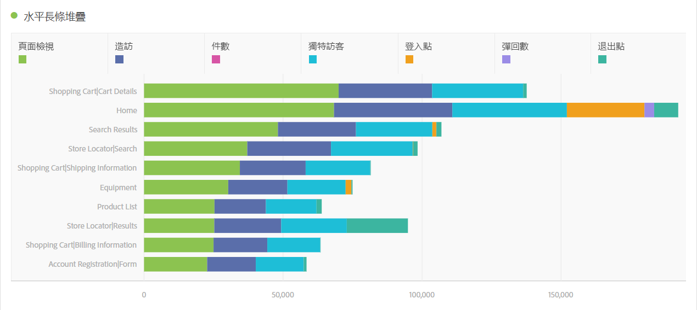
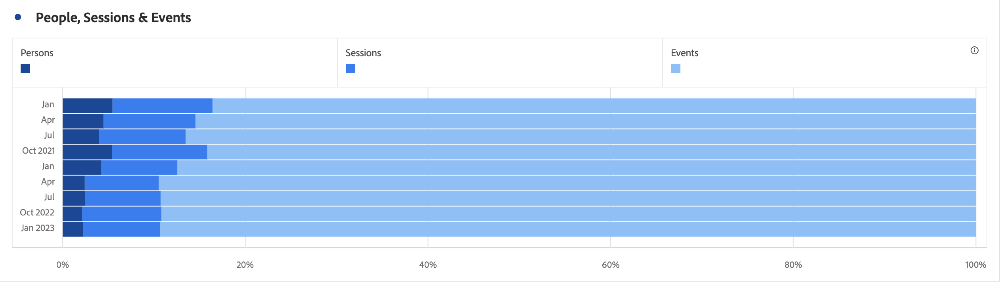

# 橫條圖 (堆疊)

>[!BEGINSHADEBOX]

_本文記錄_ _**Adobe Analytics** 中的橫條圖和堆疊橫條圖視覺效果。_ _請參閱[橫條圖和堆疊橫條圖](https://experienceleague.adobe.com/zh-hant/docs/analytics-platform/using/cja-workspace/visualizations/horizontal-bar)，以取得本文的_  _**Customer Journey Analytics** 版本。_

>[!ENDSHADEBOX]

此橫條圖視覺效果具有標準和堆疊選項。

## 橫條圖 {#horizontal-bar}

<!-- markdownlint-disable MD034 -->

>[!CONTEXTUALHELP]
>id="workspace_horizontalbar_button"
>title="橫條圖"
>abstract="建立橫條圖視覺效果來表示一個或多個量度的各種值。"

<!-- markdownlint-enable MD034 -->

 **[!UICONTROL 橫條圖]**&#x200B;視覺效果顯示代表一個或多個量度多個值的橫條。

## 堆疊橫條圖 {#horizontal-bar-stacked}

<!-- markdownlint-disable MD034 -->

>[!CONTEXTUALHELP]
>id="workspace_horizontalbarstacked_button"
>title="堆疊橫條圖"
>abstract="建立橫條圖視覺效果來表示一個或多個堆疊量度的各種值。"

<!-- markdownlint-enable MD034 -->

 **[!UICONTROL 堆疊橫條圖]**&#x200B;視覺效果類似[!UICONTROL 橫條圖]，但數列橫條以堆疊顯示。

使用 **[!UICONTROL 設定]**&#x200B;中的 **[!UICONTROL 100% 堆疊]**&#x200B;選項，將圖表轉換為 100% 堆疊視覺效果。

>[!MORELIKETHIS]
>
>[將視覺化新增至面板](/help/analyze/analysis-workspace/visualizations/freeform-analysis-visualizations.md#add-visualizations-to-a-panel)
>[視覺效果設定](/help/analyze/analysis-workspace/visualizations/freeform-analysis-visualizations.md#settings)
>[視覺化內容選單](/help/analyze/analysis-workspace/visualizations/freeform-analysis-visualizations.md#context-menu)
>

