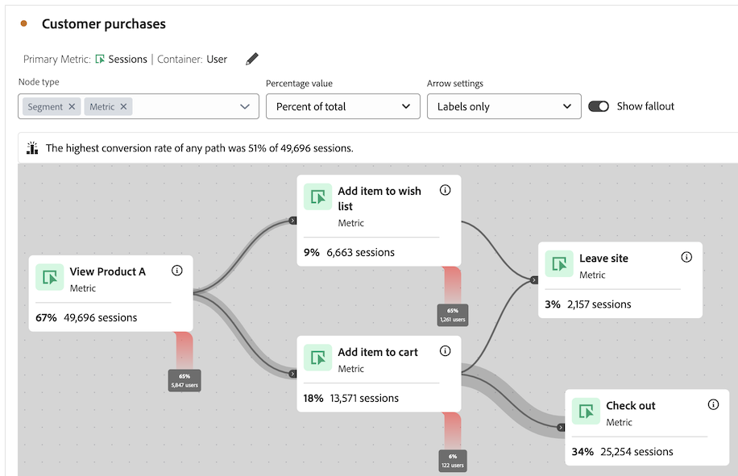

# 歷程畫布概觀 {#journey-canvas-overview}

<!-- markdownlint-disable MD034 -->

>[!CONTEXTUALHELP]
>id="cja_journeycanvas_button"
>title="歷程畫布"
>abstract="顯示人們如何完成或退出一系列接觸點。 用於具有多個進入點和路徑的歷程。"

<!-- markdownlint-enable MD034 -->

<!-- markdownlint-disable MD034 -->

>[!CONTEXTUALHELP]
>id="cja_journeycanvas_panel"
>title="歷程畫布"
>abstract="分析人們如何完成或退出定義的歷程。 建立由節點和箭頭組成的彈性圖表來表示事件、維度項目和區段的任何組合，藉以建置使用者歷程分析。 拖曳畫布上的節點，重新排列歷程的事件和條件。 當您這樣做時，資料會隨之更新。"

<!-- markdownlint-enable MD034 -->

<!-- markdownlint-disable MD034 -->

>[!CONTEXTUALHELP]
>id="journeycanvas_button2"
>title="歷程畫布"
>abstract="顯示人們如何完成或退出一系列接觸點。 用於具有多個進入點和路徑的歷程。"

<!-- markdownlint-enable MD034 -->

<!-- markdownlint-disable MD034 -->

>[!CONTEXTUALHELP]
>id="journeycanvas_panel2"
>title="歷程畫布"
>abstract="分析人們如何完成或退出定義的歷程。 建立由節點和箭頭組成的彈性圖表來表示事件、維度項目和區段的任何組合，藉以建置使用者歷程分析。 拖曳畫布上的節點，重新排列歷程的事件和條件。 當您這樣做時，資料會隨之更新。"

<!-- markdownlint-enable MD034 -->

>[!BEGINSHADEBOX]

_本文記錄了_  _**Adobe Analytics**中的Journey Canvas視覺效果。  _&#x200B;若需本文的&#x200B;__**Customer Journey Analytics**版本，請參閱[Journey Canvas概觀](https://experienceleague.adobe.com/zh-hant/docs/analytics-platform/using/cja-workspace/visualizations/journey-canvas/journey-canvas)。_

>[!ENDSHADEBOX]

{{release-limited-testing}}

您可以利用歷程畫布視覺化圖表，針對您提供給使用者和客戶的歷程進行分析並獲取深入洞察。 它可讓您定義歷程，然後檢視人們如何離開（流失）或繼續通過（流過）歷程。

您可以使用事件、維度項目、區段和日期範圍的任意組合來建立歷程節點，藉以[建置使用者歷程分析](/help/analyze/analysis-workspace/visualizations/journey-canvas/configure-journey-canvas.md)。 連接節點以建立歷程流程，並包含多條路徑和決策點。 拖曳動畫布上的節點，以重新排列歷程的事件和條件。 當您進行變更時，資料會即時更新。

[節點已連線](/help/analyze/analysis-workspace/visualizations/journey-canvas/configure-journey-canvas.md#logic-when-connecting-nodes)為「最終路徑」，這表示只要訪客最終從某個節點移至另一個節點，就會計入訪客，無論兩個節點之間發生任何事件。 使用者沿著路徑移動所分配的時間由容器設定來決定。

## 主要功能

歷程畫布視覺效果的主要功能包括：

* 考慮最複雜的使用者歷程下，流失和流過的深入分析。

* 對應和視覺化使用者歷程各個入口點、節點和路徑的畫布。

* 透過拖放互動將元件新增至畫布，並重新定位現有節點。

## 潛在的洞察

歷程畫布會為最複雜的歷程提供可操作洞察。

### 轉換率最高的路徑 {#conversion-rate-caption}

歷程畫布中最突出的洞察顯示為畫布最上方的標題。

此標題總結歷程中哪條路徑的轉換率最高。

當歷程包含多個起始節點時，標題如下所示：

當歷程包含單一起始節點時，標題如下所示：

解釋此標題時，請考慮以下幾點：

* _路徑_&#x200B;是定義為透過箭頭連接到終止節點的起始節點，並且之間連接任意數量的節點。

* 轉換率的計算取決於歷程的類型 (歷程包含的起始節點和終點節點的數量，以及二者之間的路徑是否相交)。

  下表描述如何根據歷程類型計算轉換率：

  | 歷程類型 | 轉換率計算 | 範例 |
  |---------|----------|---------|
  | **單一起始節點和單一結束節點** | 轉換率的計算方式是將結束節點的數量除以起始節點的數量。 |  |
  | **單一起始節點和多個結束節點** | 轉換率的計算方法是找出數量最高的結束節點，然後將該數量除以起始節點的數量。 |  |
  | **多個獨立路徑，每個路徑包含一個起始節點和一個結束節點** | 轉換率的計算方式是將結束節點的數量除以起始節點的數量。 標題內有轉換率最高的路徑說明。 |  |
  | **多個起始節點，且歷程的任何一點會匯集一個共同節點** | 轉換率的計算方法是找出數量最高的結束節點，然後將該數量除以數量最低的起始節點數量。 |  |

### 流過、流失及其他

以下是歷程畫布可幫助提供其他洞察的一些範例。 您可以選擇這些見解是以報告套裝中的所有人員、開始歷程的所有人員，還是歷程先前節點的所有人員為基礎。

#### 流過

* 完成歷程 (到達結束節點) 的人數和百分比

* 到達歷程中特定節點的人數和百分比

* 在歷程中特定節點之後或之前最常見的步驟

#### 流失

* 歷程中最常出現中途退出的節點 (從未到達任何接下來的節點)

#### 每個節點更多資料

* 在歷程任何節點上新增劃分維度，以查看該特定節點的其他資料

## 在歷程畫布、流失或流量視覺效果之間作選擇

歷程畫布視覺效果與[流失視覺效果](/help/analyze/analysis-workspace/visualizations/fallout/fallout-flow.md)和[流量視覺效果](/help/analyze/analysis-workspace/visualizations/c-flow/flow.md)有相似之處，但也有重要的差異。

### 了解差異性

<!-- Information in this snippet is shared between Journey canvas, Fallout, and Flow visualization docs -->

{{journey-visualization-comparisons}}

### 何時使用歷程畫布

歷程畫布對以下方面至關重要：

* 對有多個入口點和路徑的歷程進行流失分析。

* 有多個入口點和路徑的非線性歷程，且其中有預先定義的頁面序列。

* 根據預先定義歷程進行的探索性臨時分析。

* 需要主要量度的分析，但工作階段、人員或發生次數除外。

使用[上面表格](#understand-the-differences)來了解歷程畫布、流失和流量視覺效果之間的差異。

## 在歷程畫布中建立分析

您可以在歷程畫布中建立以 Analysis Workspace 中適用任何維度或量度的分析。 如需更多資訊，請參閱「[設定歷程畫布視覺效果](/help/analyze/analysis-workspace/visualizations/journey-canvas/configure-journey-canvas.md)」。

>[!MORELIKETHIS]
>
> * [Adobe Customer Journey Analytics 歷程畫布視覺效果指南](https://experienceleaguecommunities.adobe.com/t5/adobe-analytics-blogs/a-guide-to-journey-canvas-visualization-in-adobe-customer/ba-p/737857)

