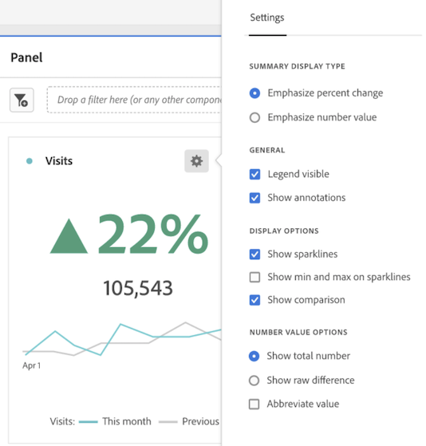
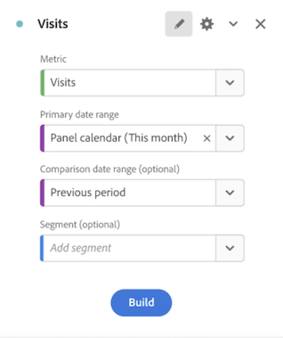

# 關鍵量度摘要

The [!UICONTROL 關鍵量度摘要]視覺效果可讓您查看一項重要的量度在單一時間範圍內的趨勢分析。也能讓您比較兩個時間範圍內的量度成效。它提供多個視覺效果合併成單一視覺效果的優勢。

* **[!UICONTROL 線段]**&#x200B;視覺效果會顯示主要和比較日期範圍的趨勢分析

* **[!UICONTROL 摘要百分比變更]**&#x200B;會顯示主要和比較日期範圍之間的量度增減

* 量度目前的總值 ([!UICONTROL **摘要數字**])

## 使用案例

此視覺效果處理各種常見的使用案例，包括：

* 分析嘗試了解本月創造的商機跟去年同一時間範圍相比之下的表現。

* 行銷人員探索特定本月與上個月之間銷售機會的銷售機會開發變化。

* 高階主管想要了解本季與上一季之間的新預約變化。

## 設定關鍵量度摘要

1. 從左側邊欄的「**[!UICONTROL 視覺效果]**」選單，將&#x200B;**[!UICONTROL 關鍵量度摘要]**&#x200B;視覺效果拖曳至面板。

1. 選取量度、主要日期範圍和比較日期範圍及區段 (如果想要)，以設定視覺效果：

   

   | 組態設定 | 定義 |
   | --- | --- |
   | **[!UICONTROL 量度]** | 選取想要檢查的量度。支援所有量度。 |
   | **[!UICONTROL 主要日期範圍]** | 任意形狀表格目前的日期範圍。 |
   | **[!UICONTROL 比較日期範圍]** | 您要與主要日期範圍進行比較的日期範圍。 |
   | **[!UICONTROL 區段 (選擇性)]** | 您對於此摘要特別感興趣的任何區段。 |

   {style="table-layout:auto"}

1. 按一下&#x200B;**[!UICONTROL 「建置」]**。

## 檢視輸出

請注意：

* **[!UICONTROL 前一期]**&#x200B;線圖 (總是以灰色顯示) 對應於設定步驟中的&#x200B;**[!UICONTROL 比較日期範圍]**。

* 如果未在設定期間指定比較日期範圍，或在視覺效果設定中隱藏日期比較範圍，僅會顯示主要日期範圍的線圖。將會隱藏摘要變更。

* 您可以從此處將指標停留在線圖上，以查看個別天數的統計資料：

## 視覺效果設定

關鍵量度摘要提供多種彈性設定，以為重要量度提供更佳的報告和溝通。您可以透過視覺效果右上角的齒輪圖示存取設定。

| 設定 | 說明 |
| --- | --- |
| **[!UICONTROL 強調百分比變化]** | 在視覺效果中心，以顯著粗體顯示摘要變更 |
| **[!UICONTROL 強調數字值]** | 在視覺效果中心，以顯著粗體顯示摘要數字 |
| **[!UICONTROL 可見圖例]** | 顯示或隱藏視覺效果底部的圖例 |
| **[!UICONTROL 顯示註解]** | 顯示或隱藏管理員新增的註解 |
| **[!UICONTROL 顯示走勢圖]** | 顯示或隱藏圖表底部的折線圖。隱藏時，圖例將會變更，以不再參考線條 |
| **[!UICONTROL 在走勢圖上顯示最小值和最大值]** | 在主要和比較折線圖上顯示或隱藏最小值和最大值 |
| **[!UICONTROL 顯示比較]** | 顯示或隱藏比較資料。隱藏時，比較折線圖和摘要變更物件將會隱藏起來。 |
| **[!UICONTROL 顯示總數]** | 顯示或隱藏摘要數字 |
| **[!UICONTROL 顯示原始差異]** | 顯示主要日期範圍與次要日期範圍中量度總值之間的原始差異 |
| **[!UICONTROL 縮簡值]** | 縮簡數字值，以簡化傳達的見解 (例如 20,000 -> 20K) |

## 編輯視覺效果

建置視覺效果後，您仍可編輯原始的設定。

1. 按一下視覺效果右上角的鉛筆圖示 (設定齒輪圖示旁)。

   

   現在您會返回原始設定檢視。

1. 依偏好變更量度、主要日期範圍、比較日期範圍或區段。
