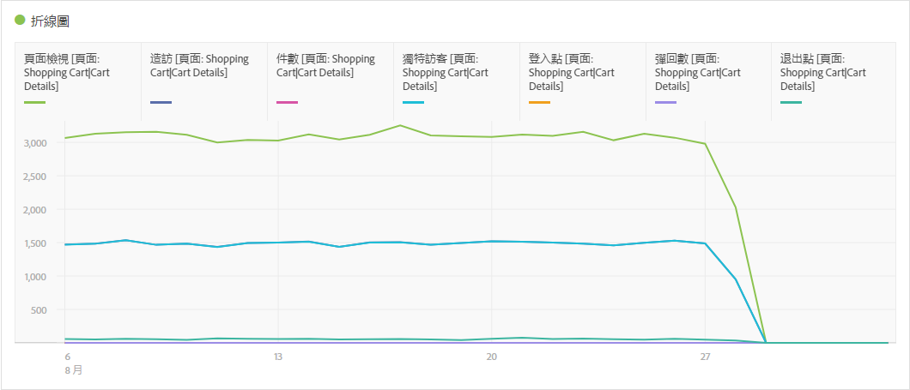
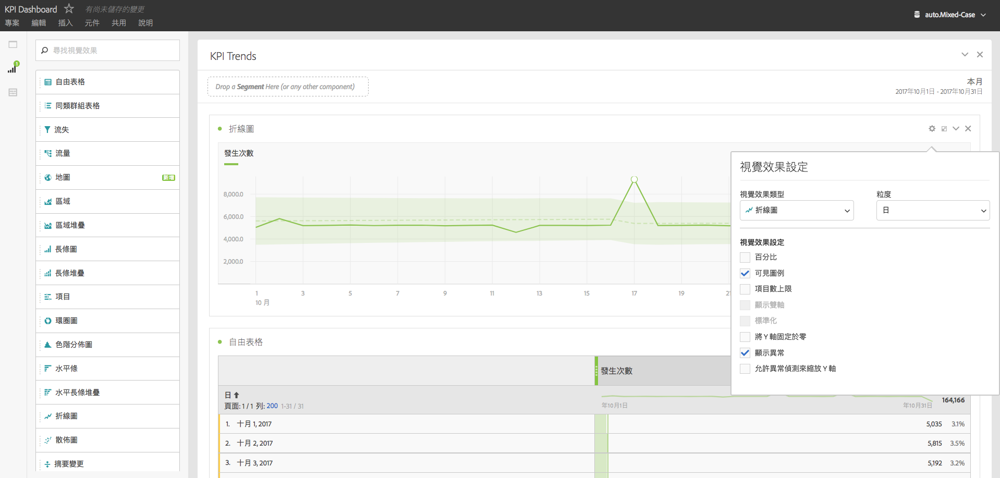

# 折線圖

此視覺效果使用折線圖表示量度，以顯示一段時間中值的變化。僅可在使用時間當作維度時，才使用折線圖。

[視覺效果設定](/help/analyze/analysis-workspace/visualizations/freeform-analysis-visualizations.md#section_D3BB5042A92245D8BF6BCF072C66624B)中的粒度下拉式清單可讓您將趨勢視覺效果 (例如折線圖、長條圖) 從每日變更為每週、每月等。

