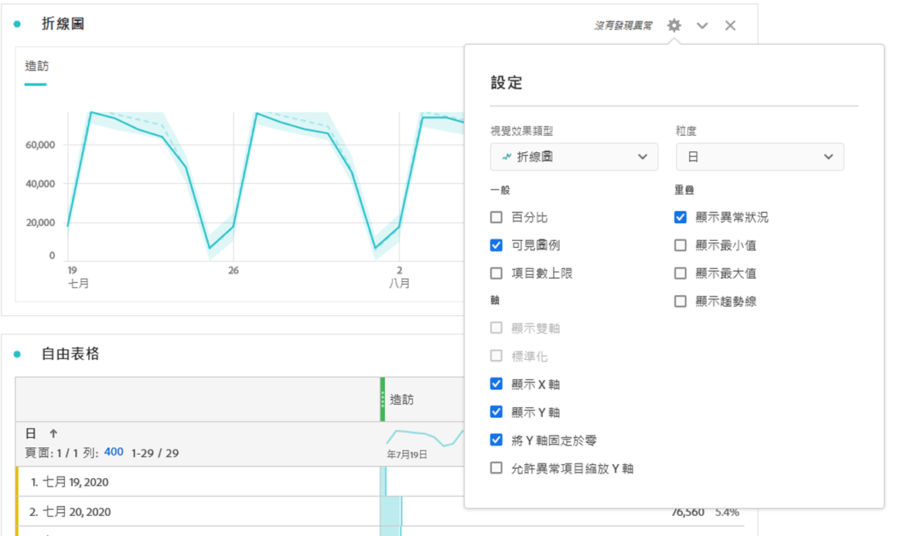

# 折線圖

「行」視覺化會使用行來表示量度，以顯示值在一段時間內的變化。 僅可在使用時間當作維度時，才使用折線圖。

按一下「線條」視覺化右上角的齒輪圖示，以存取可用 [**的視覺化設**](freeform-analysis-visualizations.md) 定。 設定分為：

* **一般**:在各種視覺化類型中都常見的設定
* **軸**:影響線條視覺化x或y軸的設定
* **覆蓋**:用於新增其他上下文至行視覺化中顯示的系列的選項。

## 變更詳細程度

[視覺效果設定](freeform-analysis-visualizations.md)中的粒度下拉式清單可讓您將趨勢視覺效果 (例如折線圖、長條圖) 從每日變更為每週、每月等。詳細程度也會在資料來源表格中更新。

## 顯示最小值或最大值

在「 **[!UICONTROL 視覺化設定]** >覆蓋 **[!UICONTROL >顯]******&#x200B;示最小值／最大值」下方，您可以覆蓋最小值和最大值標籤，以快速反白顯示量度中的尖峰和低谷。 注意：最小值／最大值是從視覺化中的可見資料點衍生而來，而非維度中的完整值集。

## 顯示趨勢線覆蓋

在「 **[!UICONTROL 視覺化設定]** >覆蓋 **[!UICONTROL >]** 顯示趨勢線 ****」下方，您可以選擇將回歸或移動平均趨勢線新增至行系列。 趨勢線有助於描述資料中更清晰的模式。

>[!TIP]
>
>我們建議將趨勢線套用至不包含今天（部分資料）或未來日期的資料，因為這些資料會扭曲趨勢線。 但是，如果您需要包含未來日期，請從資料中移除零，以防止這些日期出現偏差。 若要這麼做，請前往視覺化的資料來源表格，並選擇您的量度欄。 然後前往「 [!UICONTROL 欄設定」] ，並勾 **[!UICONTROL 選「解譯零為無值]**」。)

所有回歸模型趨勢線都使用普通最小二乘擬合：

| 模型 | 說明 |
| --- | --- |
| 線性 | 為簡單的線性資料集建立最適合的直線，當資料以穩定速率增加或減少時，該直線非常有用。 等式： `y = a + b * x` |
| 對數 | 建立最適合的曲線，當資料的變更率快速增加或減少，然後退出等級時，就很有用。 對數趨勢線可使用負值和正值。 等式： `y = a + b * log(x)` |
| 指數 | 建立曲線，當資料以不斷增加的速率上升或下降時，就很有用。 如果您的資料包含零值或負值，則不應使用此選項。 等式： `y = a + e^(b * x)` |
| 乘冪 | 建立曲線，對於比較以特定速率增加的度量的資料集很有用。 如果您的資料包含零值或負值，則不應使用此選項。 等式： `y = a * x^b` |
| 二次方 | 尋找形狀為拋物線（向上或向下凹入）的資料集的最佳擬合。 等式： `y = a + b * x + c * x^2` |
| 移動平均 | 根據一組平均值建立平滑趨勢線。 例如7天移動平均值或4週移動平均值。 移動平均值也稱為滾動平均值，計算先前範圍的平均值，將該平均值用作趨勢線資料點，然後移動到下一個週期以重複。 「期間」輸入定義了計算平均值的範圍。 |
