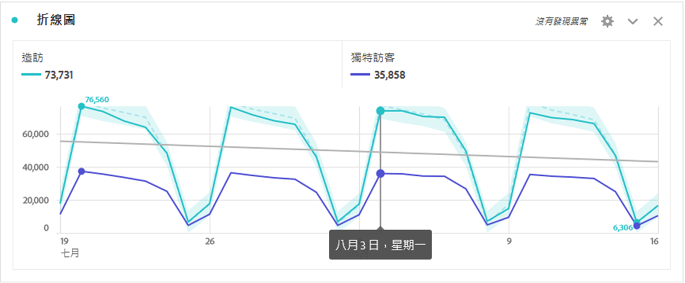
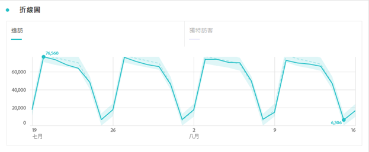
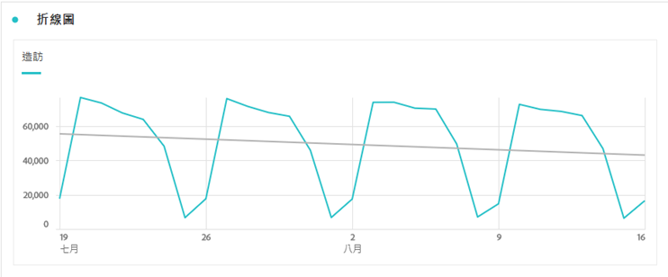

# 折線圖 {#line}

<!-- markdownlint-disable MD034 -->

>[!CONTEXTUALHELP]
>id="workspace_line_button"
>title="折線圖"
>abstract="建立折線圖視覺效果，顯示值在一段時間內如何變化。僅在使用時間當作維度時，才使用折線圖視覺效果。"

<!-- markdownlint-enable MD034 -->

>[!BEGINSHADEBOX]

_本文會在_  _**Adobe Analytics**&#x200B;中記錄線條視覺效果。_ _檢視此文章的_  _**Customer Journey Analytics**&#x200B;版本的[行](https://experienceleague.adobe.com/en/docs/analytics-platform/using/cja-workspace/visualizations/line)。_

>[!ENDSHADEBOX]

 **[!UICONTROL 線條]**&#x200B;視覺效果使用線條來表示量度，以顯示一段時間內值的變化。 折線圖視覺效果只可以在當做維度時使用。

## 設定

作為[視覺效果設定](freeform-analysis-visualizations.md#settings)的一部分，可以使用特定的線條視覺效果設定。

| 設定 | 說明 |
|---|---|
| **[!UICONTROL 粒度]** | 從詳細程度下拉式清單中選取，將趨勢視覺效果從每日變更為每週、每月等。 詳細程度也會在資料來源表格中更新。 |
| **[!UICONTROL 顯示最小值]**  **[!UICONTROL 顯示最大值&#x200B;]** | 您可以覆蓋最小值和最大值標籤，以反白標示量度中的最小值和最大值。 最小/最大值是從視覺效果中的可見資料點衍生而來，而非維度中的完整值集。  |
| **[!UICONTROL 顯示趨勢線]** | 您可以選擇新增回歸或移動平均趨勢線到您的線圖序列。 趨勢線有助於描繪出資料中更清晰的模式。 選取後，從清單中選取模型。 請參閱[模型](#models)，以取得可用模型的概觀和說明。 。 |

>[!TIP]
>
>建議將趨勢線套用至不包含今天（部分資料）或未來日期的資料。 今天或未來的日期會扭曲趨勢線。 但是，如果您需要包含未來日期，請從資料中移除零，以防止這些日期出現偏差。前往視覺效果的資料來源表格，選擇您的量度欄，然後啟用&#x200B;**[!UICONTROL 欄設定]** > **[!UICONTROL 將零解譯為無值]**。

### 模型

所有回歸模型趨勢線都適合使用普通最小二乘法：

| 模型 | 說明 |
| --- | --- |
| **[!UICONTROL 線性]** | 為簡單的線性資料集建立最合適的直線，當資料以穩定速率增加或減少時非常有用。 方程式：`y = a + b * x` |
| **[!UICONTROL 對數]** | 建立最合適的曲線，當資料變更率快速增加或減少，然後穩定下來時相當有用。 對數趨勢線可使用負值和正值。方程式：`y = a + b * log(x)` |
| **[!UICONTROL 指數]** | 建立曲線，當資料以不斷提高的速率上升或下降時相當有用。 如果您的資料包含零或負值，則不應使用此選項。方程式：`y = a + e^(b * x)` |
| **[!UICONTROL 電源]** | 建立曲線，比較以特定速率增加的測量之資料集時相當實用。 如果您的資料包含零或負值，則不應使用此選項。方程式：`y = a * x^b` |
| **[!UICONTROL 二次方]** | 找出拋物線形（向上或向下凹入）的資料集最適合的造型。 方程式：`y = a + b * x + c * x^2` |
| **[!UICONTROL 移動平均]** | 根據一組平均值建立平滑趨勢線。 移動平均也稱為滾動平均，會使用特定數量的資料點（由您的[!UICONTROL 粒度]選取範圍決定）、求取其平均值，並將平均值當做線條中的某個點。 例如七天移動平均值或四周移動平均值。 |

>[!MORELIKETHIS]
>
>[將視覺效果新增至面板](/help/analyze/analysis-workspace/visualizations/freeform-analysis-visualizations.md#add-visualizations-to-a-panel)
>[視覺效果設定](/help/analyze/analysis-workspace/visualizations/freeform-analysis-visualizations.md#settings)
>[視覺效果內容功能表](/help/analyze/analysis-workspace/visualizations/freeform-analysis-visualizations.md#context-menu)
>

