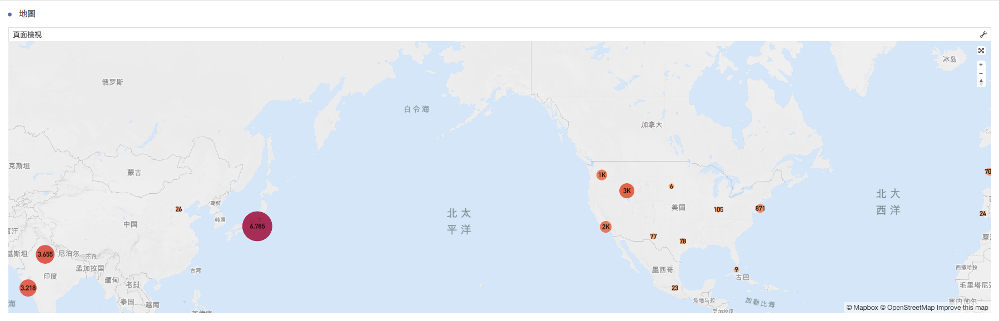

# 地圖 {#map}

<!-- markdownlint-disable MD034 -->

<!-- markdownlint-disable MD034 -->

>[!CONTEXTUALHELP]
>id="workspace_map_button"
>title="地圖"
>abstract="此視覺效果是透過將量度覆蓋在地圖上來表示量度。此一視覺化是辨識不同地理區域之間資料的實用方法。"

<!-- markdownlint-enable MD034 -->

<!-- markdownlint-disable MD034 -->

>[!CONTEXTUALHELP]
>id="workspace_map_bubbles"
>title="泡泡圖"
>abstract="使用泡泡圖繪製事件。"

<!-- markdownlint-enable MD034 -->

<!-- markdownlint-disable MD034 -->

>[!CONTEXTUALHELP]
>id="workspace_map_heatmap"
>title="熱度圖"
>abstract="使用熱度圖繪圖事件。"

<!-- markdownlint-enable MD034 -->

>[!BEGINSHADEBOX]

_本文記錄_  _&#x200B;**Adobe Analytics** 中的地圖視覺效果。_ _檢視此文章的[&#x200B; &#x200B;](https://experienceleague.adobe.com/zh-hant/docs/analytics-platform/using/cja-workspace/visualizations/map)CustomerJourneyAnalytics_ 版本的&#x200B;_&#x200B;**地圖**。_

>[!ENDSHADEBOX]

Analysis Workspace 的 **[!UICONTROL 地圖]**&#x200B;視覺效果

* 可讓您建置任何量度 (包括計算量度) 的視覺化地圖。
* 相當實用，可辨識和比較不同地理區域之間的量度資料。
* 可支援 2 種資料來源：行動裝置使用的經度/緯度、或網頁使用的地理維度。
* 支援 PDF 匯出，以及
* 針對圖形顯示使用 WebGL。如果您的顯示卡驅動程式不支援 WebGL 轉譯，您可能需要更新驅動程式。

>[!BEGINSHADEBOX]

請參閱  [Analysis Workspace 中地圖視覺效果](https://video.tv.adobe.com/v/23559/?quality=12){target="_blank"}的示範影片。

>[!ENDSHADEBOX]

## 使用

1. 新增 [!UICONTROL 地圖]視覺效果。請參閱[新增視覺效果至面板](freeform-analysis-visualizations.md#add-visualizations-to-a-panel)。您僅可將地圖視覺效果拖曳至自由格式表格的頂部。

   {width="50%"}

1. 從下拉式清單選取量度。或從量度清單拖曳量度 (包括計算量度)。
1. 指定您要擷取的資料來源只有為行動應用程式資料啟用「位置追蹤」後，系統才會顯示此對話方塊。

   | 來源 | 說明 |
   | --- | --- |
   | **[!UICONTROL 行動裝置緯度/經度]** | 此選項代表行動應用程式資料。 只有當您在「[!UICONTROL Analytics] > [!UICONTROL 管理員] > [!UICONTROL 報表套裝] > (選取報表套裝) > [!UICONTROL 編輯設定] >  [!UICONTROL 行動管理] > [!UICONTROL 啟用位置追蹤]」中為您的報表套裝啟用此選項時，才會顯示此選項。 這些為預設設定 (如果已啟用位置追蹤)。 |
   | **[!UICONTROL 地理維度]** | 此選項代表有關訪客位置 (根據訪客 IP 位址) 的地理劃分資料。 此資料可轉換為[!UICONTROL 國家]、[!UICONTROL 地區]和[!UICONTROL 城市]。 請注意，此資料不會深入至 DMA 或郵遞區號層級。 幾乎所有報表套裝都會啟用這個維度。如果您尚未啟用，請聯絡 Adobe 客戶服務，以啟用地理報表。 |

1. 請選取「**[!UICONTROL 建置]**」。

   產生附泡泡圖的世界地圖視覺效果。

   

1. 您可以立即：

   * 按兩下地圖或使用捲動滾輪來&#x200B;**放大**&#x200B;此地圖，以放大顯示某些區域。地圖會根據游標的位置來縮放顯示。透過縮放互動，所需的維度 (國家/地區 > 州/省 > 城市) 也會根據縮放等級自動更新。
   * 以並排方式&#x200B;**比較**&#x200B;同一個專案中的兩個或多個地圖視覺效果。
   * **顯示比較期間(例如，逐年比較)**：

      * 顯示負數：舉例來說，如果您繪製的是逐年比較量度，則地圖可以在紐約上顯示 -33％。
      * 對於&#x200B;*百分比*&#x200B;類型的量度，叢集會一併平均此百分比。
      * 綠/紅色彩配置：正值/負值

   * 按住 [!UICONTROL Ctrl] 鍵並移動地圖，以&#x200B;**旋轉** 2D 或 3D 地圖。

   * 使用下述[設定](/help/analyze/analysis-workspace/visualizations/map-visualization.md#section_5F89C620A6AA42BC8E0955478B3A427E)，**切換**&#x200B;至不同的檢視 (例如熱度圖)。請注意，泡泡圖檢視是預設設定。

1. **儲存**&#x200B;專案，以儲存所有地圖設定 (座標、縮放、旋轉)。
1. 從左側邊欄拖曳至位置的維度和量度，可填入視覺效果下方的自由格式表格：

## 設定

若要重新設定地圖視覺效果，請選取「」。

## 設定

若要定義視覺效果的設定，請選取「」。

| 設定 | 說明 |
|--- |--- |
| **[!UICONTROL 地圖類型]** | |
| **[!UICONTROL 泡泡] | 使用泡泡圖繪圖事件。泡泡圖是多變數圖表，散點圖和等比區域圖的混合體。此檢視為預設。 |
| [!UICONTROL 熱度圖] | 使用熱度圖繪圖事件。熱度圖是以圖形來顯示資料，並以顏色來代表對照表中所包含的個別值。 |
| **[!UICONTROL 樣式]** | |
| [!UICONTROL 色彩主題] | 顯示熱度圖和泡泡圖的顏色主題。您可以選擇珊瑚色、紅色、綠色或藍色。此預設為珊瑚色。 |
| [!UICONTROL 地圖樣式] | 您可以從基本、街道、明亮、淺色、深色和衛星中進行選擇。 |
| **[!UICONTROL 叢集半徑]** | 將指定像素數內的資料點分組在一起。預設值為 50。 |
| **[!UICONTROL 自訂最大值]** | 可用於變更地圖最大值的臨界值。調整此數值可以調整泡泡圖/熱度圖的值 (顏色和大小) 相對於自訂最大值的比例。 |

<!--
## Build a time-parting heatmap

Here is a video on the topic:

>[!VIDEO](https://video.tv.adobe.com/v/26991/?quality=12)

-->

