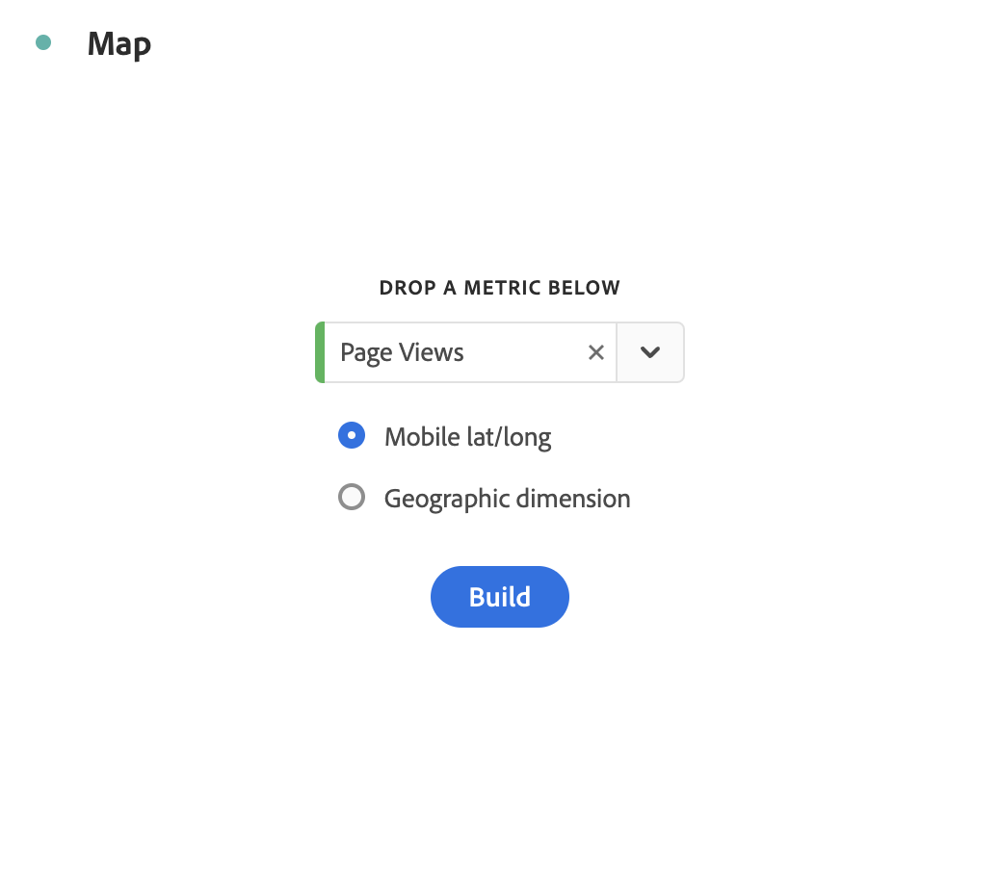
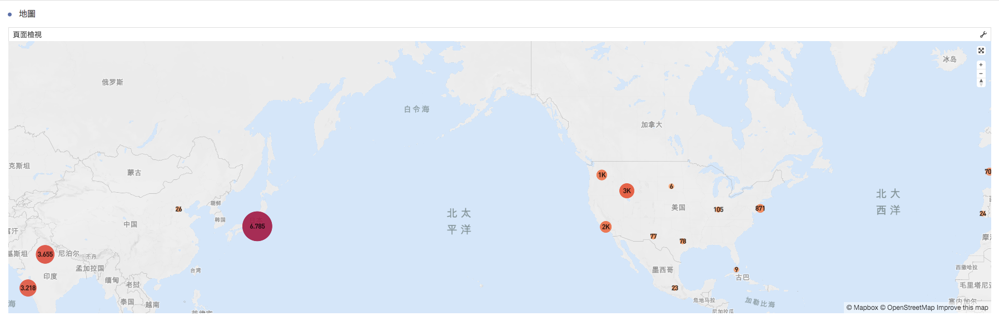

# 地圖 {#map}

<!-- markdownlint-disable MD034 -->

<!-- markdownlint-disable MD034 -->

>[!CONTEXTUALHELP]
>id="workspace_map_button"
>title="地圖"
>abstract="此視覺效果是透過將量度覆蓋在地圖上來表示量度。此一視覺化是辨識不同地理區域之間資料的實用方法。"

<!-- markdownlint-enable MD034 -->

<!-- markdownlint-disable MD034 -->

>[!CONTEXTUALHELP]
>id="workspace_map_bubbles"
>title="泡泡圖"
>abstract="使用泡泡圖繪製事件。"

<!-- markdownlint-enable MD034 -->

<!-- markdownlint-disable MD034 -->

>[!CONTEXTUALHELP]
>id="workspace_map_heatmap"
>title="熱度圖"
>abstract="使用熱度圖繪圖事件。"

<!-- markdownlint-enable MD034 -->

>[!BEGINSHADEBOX]

_本文記錄_  _**Adobe Analytics** 中的地圖視覺效果。_ _See [Map](https://experienceleague.adobe.com/en/docs/analytics-platform/using/cja-workspace/visualizations/map)  for the_  _**Customer Journey Analytics** version of this article._

>[!ENDSHADEBOX]

Analysis Workspace 的 **[!UICONTROL 地圖]**&#x200B;視覺效果

* 可讓您建置任何量度 (包括計算量度) 的視覺化地圖。
* 相當實用，可辨識和比較不同地理區域之間的量度資料。
* 可支援 2 種資料來源：行動裝置使用的經度/緯度、或網頁使用的地理維度。
* 支援 PDF 匯出，以及
* 針對圖形顯示使用 WebGL。如果您的顯示卡驅動程式不支援 WebGL 轉譯，您可能需要更新驅動程式。

>[!BEGINSHADEBOX]

請參閱  [Analysis Workspace 中地圖視覺效果](https://experienceleague.adobe.com/en/docs/analytics-learn/tutorials/analysis-workspace/visualizations/map-visualization){target="_blank"}的示範影片。

>[!ENDSHADEBOX]

## 使用

1. 新增[!UICONTROL 地圖]視覺效果。請參閱[新增視覺效果至面板](freeform-analysis-visualizations.md#add-visualizations-to-a-panel)。您僅可將地圖視覺效果拖曳至自由格式表格的頂部。

   {width="50%"}

1. 從下拉式清單選取量度。或從量度清單拖曳量度 (包括計算量度)。
1. 指定您要擷取的資料來源只有為行動應用程式資料啟用「位置追蹤」後，系統才會顯示此對話方塊。

   | 來源 | 說明 |
   | --- | --- |
   | **[!UICONTROL 行動裝置緯度/經度]** | 此選項代表行動應用程式資料。 只有當您在「[!UICONTROL Analytics] > [!UICONTROL 管理員] > [!UICONTROL 報表套裝] > (選取報表套裝) > [!UICONTROL 編輯設定] >  [!UICONTROL 行動管理] > [!UICONTROL 啟用位置追蹤]」中為您的報表套裝啟用此選項時，才會顯示此選項。 這些為預設設定 (如果已啟用位置追蹤)。 |
   | **[!UICONTROL 地理維度]** | 此選項代表有關訪客位置 (根據訪客 IP 位址) 的地理劃分資料。 此資料可轉換為[!UICONTROL 國家]、[!UICONTROL 地區]和[!UICONTROL 城市]。 請注意，此資料不會深入至 DMA 或郵遞區號層級。 Almost all report suites have this dimension enabled. If yours does not, contact Adobe Customer Care to have geographic reports enabled. |

1. 選取「**[!UICONTROL 建置]**」。

   產生附泡泡圖的世界地圖視覺效果。

   

1. 您可以立即：

   * **Zoom** into this map to magnify certain areas by double-clicking the map or by using your scroll wheel. The map zooms according to where you have placed your cursor. Through zoom interaction, the required dimension (country > state > city) is automatically updated, based on the zoom level.
   * **Compare** two or more map visualizations in the same project by placing them side by side.
   * **顯示比較期間(例如，逐年比較)**：

      * 顯示負數：舉例來說，如果您繪製的是逐年比較量度，則地圖可以在紐約上顯示 -33％。
      * 對於&#x200B;*百分比*&#x200B;類型的量度，叢集會一併平均此百分比。
      * 綠/紅色彩配置：正值/負值

   * **Rotate** the map in 2D or 3D by holding the [!UICONTROL Ctrl] key and moving the map.

   * **Toggle** to a different view, such as the heat map, using the [settings](/help/analyze/analysis-workspace/visualizations/map-visualization.md#section_5F89C620A6AA42BC8E0955478B3A427E) described below. Note that the bubble view is the default setting.

1. **Save** the project to save all map settings (coordinates, zoom, rotation).
1. 從左側邊欄拖曳至位置的維度和量度，可填入視覺效果下方的自由格式表格：

## 設定

若要重新設定地圖視覺效果，請選取「」。

## 設定

若要定義視覺效果的設定，請選取「」。

| 設定 | 說明 |
|--- |--- |
| **[!UICONTROL 地圖類型]** | |
| **[!UICONTROL Bubbles] | Plots events using bubbles. A bubble chart is a multi-variable graph that is a cross between a scatterplot and a proportional area chart. 此檢視為預設。 |
| [!UICONTROL 熱度圖] | Plots events using a heatmap. A heatmap is a graphical representation of data where the individual values contained in a matrix are represented as colors. |
| **[!UICONTROL 樣式]** | |
| [!UICONTROL 色彩主題] | Shows the color scheme for the heat map and bubbles. You can choose among Coral, Reds, Greens or Blues. 此預設為珊瑚色。 |
| [!UICONTROL 地圖樣式] | 您可以從基本、街道、明亮、淺色、深色和衛星中進行選擇。 |
| **[!UICONTROL 叢集半徑]** | 將指定像素數內的資料點分組在一起。預設值為 50。 |
| **[!UICONTROL 自訂最大值]** | 可用於變更地圖最大值的臨界值。調整此數值可以調整泡泡圖/熱度圖的值 (顏色和大小) 相對於自訂最大值的比例。 |

<!--
## Build a time-parting heatmap

Here is a video on the topic:

>[!VIDEO](https://experienceleague.adobe.com/en/docs/analytics-learn/tutorials/analysis-workspace/visualizations/build-a-time-parting-heatmap)

-->

