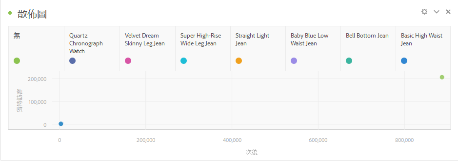

# 散佈圖 {#scatter}

<!-- markdownlint-disable MD034 -->

>[!CONTEXTUALHELP]
>id="workspace_scatter_button"
>title="散佈圖"
>abstract="建立散佈圖視覺效果，顯示維度項目與最多三個量度之間的關係。"

<!-- markdownlint-enable MD034 -->

>[!BEGINSHADEBOX]

_本文記錄_ _&#x200B;**Adobe Analytics** 中的散佈圖視覺效果。_ _請參閱[散佈圖](https://experienceleague.adobe.com/zh-hant/docs/analytics-platform/using/cja-workspace/visualizations/scatterplot)，以取得本文的_  _&#x200B;**Customer Journey Analytics** 版本。_

>[!ENDSHADEBOX]

 **[!UICONTROL 散佈圖]**&#x200B;視覺效果顯示維度項目與最多三個量度之間的關係。此視覺效果需要三個元件，且支援視覺效果最多四個元件。

* 列元件 (通常為維度) 代表圖形上的每個點。不同的列以不同顏色的點顯示。
* 最左側的欄 (通常為量度) 繪製點在 Y 軸 (垂直軸) 上的位置。
* 第二欄繪製點在 X 軸 (水平軸) 上的位置。
* 第三欄則決定點的半徑。
* 散點圖視覺效果會忽略自由表格中所有後續的欄。

>[!BEGINSHADEBOX]

請參閱  [視覺散佈圖效果](https://video.tv.adobe.com/v/334459/?quality=12){target="_blank"}的示範影片。

>[!ENDSHADEBOX]

>[!MORELIKETHIS]
>
>[將視覺化新增至面板](/help/analyze/analysis-workspace/visualizations/freeform-analysis-visualizations.md#add-visualizations-to-a-panel)
>&#x200B;>[視覺效果設定](/help/analyze/analysis-workspace/visualizations/freeform-analysis-visualizations.md#settings)
>&#x200B;>[視覺化內容選單](/help/analyze/analysis-workspace/visualizations/freeform-analysis-visualizations.md#context-menu)
>
