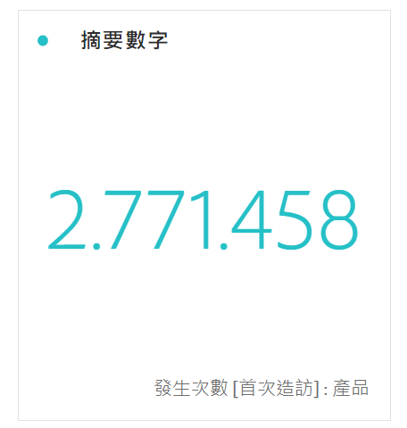
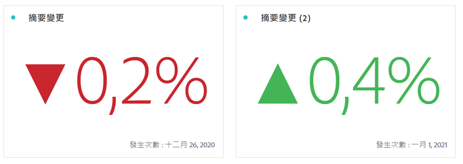

# 摘要數字和變更

>[!BEGINSHADEBOX]

_本文記錄了_  _&#x200B;**Adobe Analytics**&#x200B;中的摘要編號和摘要變更視覺效果。_ _檢視此文章的[&#x200B; &#x200B;](https://experienceleague.adobe.com/zh-hant/docs/analytics-platform/using/cja-workspace/visualizations/summary-number-change)CustomerJourneyAnalytics_ 版本的&#x200B;_&#x200B;**摘要編號和摘要變更**。_

>[!ENDSHADEBOX]

>[!BEGINSHADEBOX]

請參閱  [摘要數字和摘要變更視覺效果](https://video.tv.adobe.com/v/335564/?quality=12&learn=on){target="_blank"}的示範影片。

>[!ENDSHADEBOX]

## 摘要數字 {#summary-number}

<!-- markdownlint-disable MD034 -->

>[!CONTEXTUALHELP]
>id="workspace_summarynumber_button"
>title="摘要數字"
>abstract="建立顯示總計和小計的視覺效果。"

<!-- markdownlint-enable MD034 -->

使用**[!UICONTROL 摘要數字]**&#x200B;視覺效果可強調專案中重要的大數字。 此視覺效果使用關聯資料來源，其行為方式如下：

* 如果未選取儲存格，則會選取該欄的總計。
* 如果選取單一儲存格，則會顯示該儲存格的摘要。
* 如果選取多個儲存格，則會顯示第一個選取的儲存格。
* 如果選取欄，則會挑選欄中第一個儲存格的值。

作為視覺效果設定的一部分，可使用特定摘要數字選項。

| 選項 | 定義 |
|--- |--- |
| **[!UICONTROL 縮簡值]** | 請選取「**[!UICONTROL 縮簡值]**」以智慧的方式縮簡數值。選取後，請輸入一個數字來定義縮簡的總數。例如： <table><tr><td>**原始值**</td><td>**縮簡值**</td><td>**結果**</td></tr><tr><td>$12,011,141.25</td><td>未選取</td><td  align="right">$12,011,141.25</td></tr><tr><td>$12,011,141.25</td><td>已選取，設定為 `0`</td><td align="right">$12,000,000</td></tr><tr><td>$12,011,141.25</td><td> 已選取，設定為 `1`</td><td  align="right">$12,000,000</td></tr><tr><td>$12,011,141.25</td><td>已選取，設定為 `2`</td><td align="right">$12,010,000</td></tr><tr><td>$12,011,141.25</td><td>已選取，設定為 `3`</td><td align="right">$12,011,000</td></tr></table> |
| **[!UICONTROL 值摘要依據]** | 選擇此選項即可顯示一系列資料的最大值、最小值、平均值、中間值或總和。 |

## 摘要變更 {#summary-change}

<!-- markdownlint-disable MD034 -->

>[!CONTEXTUALHELP]
>id="workspace_summarychange_button"
>title="摘要變更"
>abstract="建立顯示兩個數字之間的差異 (變化) 的視覺效果"

<!-- markdownlint-enable MD034 -->

使用  **[!UICONTROL 摘要變更]**&#x200B;視覺效果可顯示兩個數字間的差異 (變更)。<!-- This is applicable for AA, not CJA: The green and red color of the Summary Change can be controlled through [custom event polarity](/help/admin/tools/success-events/success-event.md) or a calculated metric's [Show Upward Trend As](/help/components/calculated-metrics/workflow/cm-build-metrics.md) option.-->

<!--
The green and red color of the Summary Change can be controlled through [custom event polarity](/help/admin/tools/manage-rs/edit-settings/conversion-var-admin/c-success-events/success-event.md.md) or a calculated metric's [Show Upward Trend As](/help/components/calculated-metrics/calcmetric-workflow/cm-build-metrics.md) option.
-->

此視覺效果的運作方式如下：

* 如果未選取儲存格，則會比較欄中前兩個儲存格的值。
* 如果選取一個儲存格，由於與自身比較儲存格的值，因此會顯示 0。
* 如果選取兩個儲存格，會取第一個選取的儲存格為分子，第二個選取的儲存格為分母。
* 如果選取超過兩個儲存格，僅會比較前兩個選取的儲存格。
* 如果選取某個範圍中的儲存格，會比較該範圍第一個與最後一個選取的儲存格。
* 如果選取欄，會就第一個值的本身進行比較，顯示變更為 0。

作為視覺效果設定的一部分，可使用特定&#x200B;**[!UICONTROL 摘要變更選項]**。

| 選項 | 定義 |
|--- |--- |
| **[!UICONTROL 顯示百分比變更]** | 顯示 2 個數字之間的百分比變化。 |
| **[!UICONTROL 顯示原始差異]** | 顯示 2 個數字之間的原始差異。您也可以縮簡值，使用此選項顯示最多小數點後 3 位。 |
| **[!UICONTROL 縮簡值]** | 請選取「**[!UICONTROL 縮簡值]**」以智慧的方式縮減變更的值。選取後，請輸入一個數字來定義縮簡的總數。例如： <table><tr><td>**原始值**</td><td>**縮簡值**</td><td>**結果**</td></tr><tr><td>$12,011,141.25</td><td>未選取</td><td  align="right">$12,011,141.25</td></tr><tr><td>$12,011,141.25</td><td>已選取，設定為 `0`</td><td align="right">$12,000,000</td></tr><tr><td>$12,011,141.25</td><td> 已選取，設定為 `1`</td><td  align="right">$12,000,000</td></tr><tr><td>$12,011,141.25</td><td>已選取，設定為 `2`</td><td align="right">$12,010,000</td></tr><tr><td>$12,011,141.25</td><td>已選取，設定為 `3`</td><td align="right">$12,011,000</td></tr></table> |

>[!MORELIKETHIS]
>
>[將視覺化新增至面板](/help/analyze/analysis-workspace/visualizations/freeform-analysis-visualizations.md#add-visualizations-to-a-panel)
>&#x200B;>[視覺效果設定](/help/analyze/analysis-workspace/visualizations/freeform-analysis-visualizations.md#settings)
>&#x200B;>[視覺化內容選單](/help/analyze/analysis-workspace/visualizations/freeform-analysis-visualizations.md#context-menu)
>
