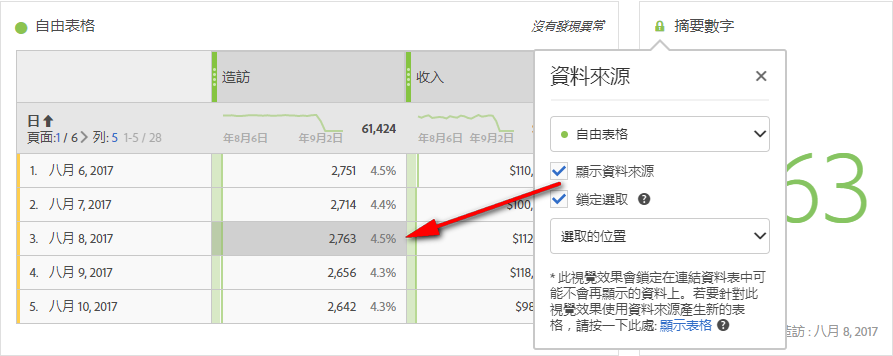
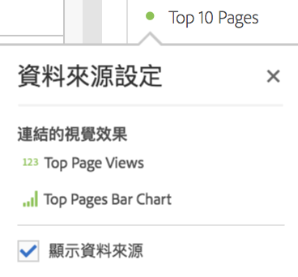

# 管理視覺效果資料來源

同步視覺效果可讓您控制哪些資料表或資料來源會對應至視覺效果。

**秘訣：**&#x200B;您可以藉由標題旁的點色彩得知哪些視覺效果為相關。相符色彩表示視覺效果是根據相同的資料來源。

管理資料來源可讓您顯示資料來源或鎖定選取項目。這些設定會決定當新資料進入時視覺效果的變更方式 (或不變更)。

1. [建立專案](/help/analyze/analysis-workspace/home.md)，內含資料表和[視覺效果](/help/analyze/analysis-workspace/visualizations/freeform-analysis-visualizations.md)。
1. 在資料表中，選取您想關聯至視覺效果的儲存格 (資料來源)。
1. 在視覺效果中，按一下標題旁的點可開啟&#x200B;**[!UICONTROL 「資料來源」]**&#x200B;對話方塊。選取&#x200B;**[!UICONTROL 「顯示資料來源」]**&#x200B;或&#x200B;**[!UICONTROL 「鎖定選取項目」]**。

   

   將視覺效果同步至某個表格儲存格，會建立新的 (隱藏) 表格，並為同步的視覺效果及該表格設定色彩代碼。

## 資料來源設定

>[!BEGINSHADEBOX]

如需示範影片，請參閱 [資料來源設定](https://video.tv.adobe.com/v/23729?quality=12&learn=on){target="_blank"}。

>[!ENDSHADEBOX]

| 元素 | 說明 |
| --- | --- |
| 連結的視覺效果 | 如果有連線至自由表格或同類群組表格的視覺效果，左上角的圓點會開啟，以列出連線的視覺效果，並以「顯示」核取方塊選項來顯示/隱藏表格。 游標暫留時會反白顯示連結的視覺效果，只要按一下，即可進入該視覺效果。 |
| 顯示資料來源 | 可讓您顯示 (勾選核取方塊) 或隱藏 (取消勾選) 對應至視覺效果的資料表。 |
| 鎖定選取項目 | 啟用此設定，將視覺效果鎖定至相對應資料表中目前選取的資料。啟用後，請選擇以下兩者其中之一：<ul><li>**選取的位置**：如果您要將視覺效果持續鎖定在從相對應資料表中選取的位置上，即可選擇此選項。即使這些位置中的特定專案已變更，這些位置仍會繼續視覺化。 例如，如果您想一直以此視覺效果顯示前五名的促銷活動名稱 (無論顯示在前五名的促銷活動名稱為何)，即可選擇此選項。</li><li>**選取的項目**：如果您要將視覺效果持續鎖定在相對應資料表中目前選取的特定項目上，即可選擇此選項。這些專案會繼續視覺化，即使它們在表格中的專案之間變更了排名。 例如，如果您想一直以此視覺效果顯示相同的五個特定促銷活動名稱 (無論這些促銷活動名稱的排名為何)，即可選擇此選項。</li></ul> |

這個架構與舊版的不同之處，在於 Analysis Workspace 不會再建立重複的隱藏表格來儲存您的鎖定選取項目。資料來源現在會指出您建立視覺效果所用的表格。

## 範例使用案例

* 您可以建立摘要視覺效果，並將其鎖定至您建立視覺效果所用的表格中的儲存格。啟用「顯示資料來源」，便會顯示此資訊在表格上的確切位置。來源資料會呈現灰色：

  >
* 您可以新增多個視覺效果，並使用相同表格中多個不同儲存格當成資料來源，如下所示。此表格與上方範例中的表格相同，但來源儲存格 (與量度) 不同：

  >
* 您可以按一下左上角的點(資料Source設定)，以檢視是否有視覺效果連線至自由表格或同類群組表格。 游標暫留時會反白顯示連結的視覺效果，只要按一下，即可進入該視覺效果。

  >
