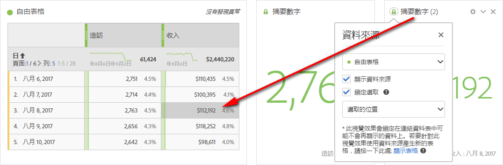

# 管理資料來源

同步視覺效果可讓您控制哪些資料表或資料來源對應至視覺效果。

**秘訣:** 您可以藉由標題旁的點色彩得知哪些視覺效果為相關。相符色彩表示視覺效果是根據相同的資料來源。

管理資料來源可讓您顯示資料來源或鎖定選取項目。這些設定會決定當新資料進入時視覺效果的變更方式 (或不變更)。

1. [使用資料](../../../analyze/analysis-workspace/build-workspace-project/t-freeform-project.md#task_C2C698ACC7954062A28E4784911E6CF2) 表格和 [視覺化建立專案](../../../analyze/analysis-workspace/visualizations/freeform-analysis-visualizations.md#concept_09242627629147A88A68F1506954C276)。
1. 在資料表中，選取您想關聯至視覺效果的儲存格 (資料來源)。
1. In the visualization, click the dot next to the title to bring up the **[!UICONTROL Data Source]** dialog. Select **[!UICONTROL Show Data Source]** or **[!UICONTROL Lock Selection]**.

   

   將視覺化同步至某個表格儲存格，會建立新的 (隱藏) 表格，並為同步的視覺化及該表格設定色彩代碼。

| 元素 | 說明 |
|--- |--- |
| 連結的視覺效果 | 如果有連接至自由表格或同類群組表格的視覺效果，左上角的圓點會開啟，列出連接的視覺效果，並以「顯示」核取方塊選項顯示/隱藏表格。游標暫留時會反白顯示連結的視覺效果，只要按一下，即可進入該視覺效果。 |
| 顯示資料來源 | 可讓您顯示 (勾選核取方塊) 或隱藏 (取消勾選) 對應至視覺效果的資料表。 |
| 鎖定選取項目 | 啟用此設定，將視覺效果鎖定至相對應資料表中目前選取的資料。啟用後，請選擇以下兩者其中之一：  <ul><li>**選取的位置**: 如果您要將視覺效果持續鎖定在從相對應資料表中選取的位置上，即可選擇此選項。縱使這些位置中的特定項目已變更，這些位置仍將持續視覺化。例如，如果您想一直以此視覺效果顯示前五名的促銷活動名稱 (無論顯示在前五名的促銷活動名稱為何)，即可選擇此選項。</li> <li>**選取的項目**: 如果您要將視覺效果持續鎖定在相對應資料表中目前選取的特定項目上，即可選擇此選項。縱使這些項目在表格中項目間的排名已改變，它們仍將持續視覺化。例如，如果您想一直以此視覺效果顯示相同的五個特定促銷活動名稱 (無論這些促銷活動名稱的排名為何)，即可選擇此選項。</li></ul> |

此架構與舊版不同，因為「分析工作區」不再建立重復隱藏表格，儲存鎖定的選取範圍。資料來源現在會指出您建立視覺效果所用的表格。

**範例使用案例:**

* 您可以建立摘要視覺效果，並將其鎖定至您建立視覺效果所用的表格中的儲存格。啟用「顯示資料來源」，便會顯示此資訊在表格上的確切位置。來源資料會呈現灰色:

   &gt;
* 您可以新增多個視覺效果，並使用相同表格中多個不同儲存格當成資料來源，如下所示。此表格與上方範例中的表格相同，但來源儲存格 (與量度) 不同:

   &gt;
* 您可以按一下左上角的圓點 (「資料來源設定」)，查看是否有連接至自由表格或同類群組表格的視覺效果。游標暫留時會反白顯示連結的視覺效果，只要按一下，即可進入該視覺效果。

   &gt;
