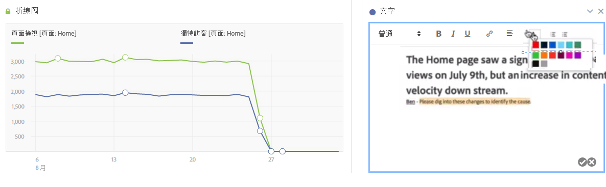

# 文字

可讓您將使用者定義文字新增至「工作區」。

您可以變更字型設定 (粗體、斜體等)。以及在文字方塊視覺效果和面板/視覺效果說明中新增超連結。

## 變更字型設定 {#section_32727EE03FD04A8EB1D1B387DCAF6537}

將「文字」視覺效果拖曳至面板新增文字後，您可以執行新增標頭等級、變更文字粗體/斜體/底線、變更文字顏色等文字格式設定工作。

## 新增超連結 {#section_D55B857188A74A06B49006DF3511DC7C}

反白標示文字，並按一下格式功能表中的超連結圖示以新增超連結。
