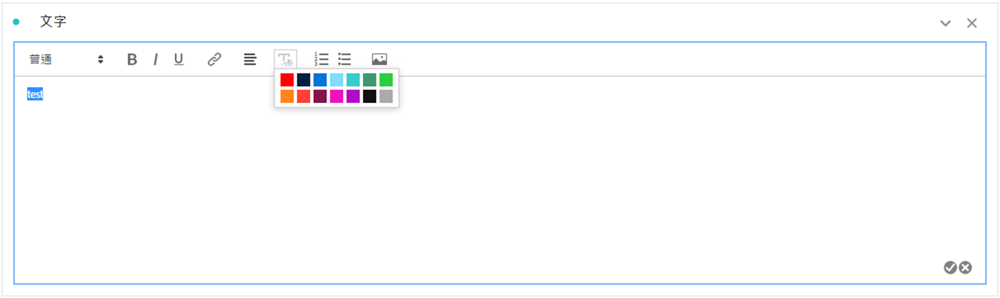
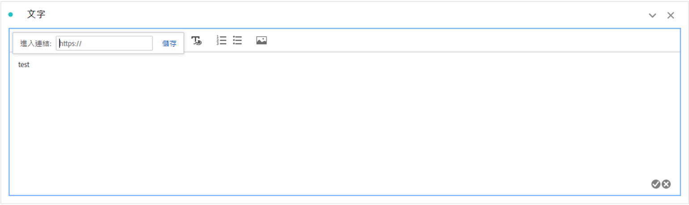
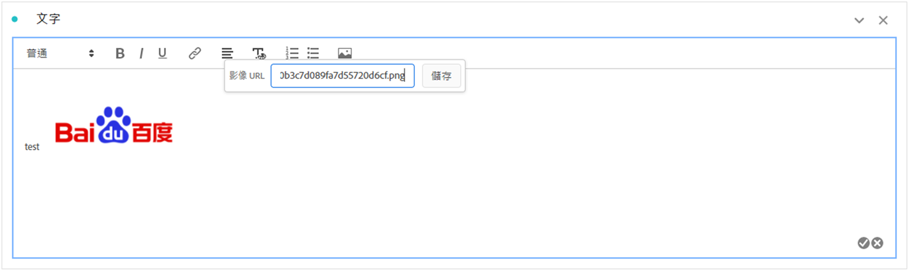

# 文字

您可以將用戶定義的文字新增至您的 Workspace 專案，方法是使用文字視覺效果或面板/視覺效果說明 (在標題按一下右鍵 > **[!UICONTROL 編輯說明]**)。您還可以變更文字格式、新增超連結，並新增影像。

## 調整格式 {#format}

編輯文字方框或說明時，您可以調整字體大小 (標題層級)、顏色、樣式 (粗體、斜體、下底線)，以及對齊所選的文字。您還可新增項目符號和自動編號清單。

## 新增超連結 {#hyperlinks}

若要新增超連結，請醒目顯示文字並按一下功能表中的超連結圖示。超連結可連結到外部網站、文件頁面、[Workspace 專案/面板/視覺效果](https://experienceleague.adobe.com/docs/analytics/analyze/analysis-workspace/curate-share/shareable-links.html?lang=zh-Hant)以及其他等，進一步協助您的項目收件者。

## 新增影像 {#images}

若要在專案中新增影像，請按一下功能表中的影像圖示並插入公開的影像 URL。影像 URL 必須可公開存取、以 `https` 開頭，且格式為 `.png`、`.jpeg`、`.jpg` 或 `.gif`。支持靜態和動畫影像。

