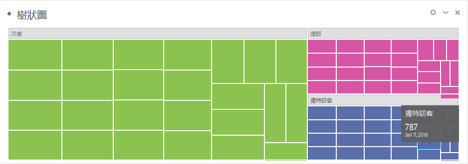

# [!UICONTROL 樹狀圖] {#treemap}

<!-- markdownlint-disable MD034 -->

>[!CONTEXTUALHELP]
>id="workspace_treemap_button"
>title="樹狀圖"
>abstract="建立樹狀圖視覺效果以顯示具有嵌套矩形的階層式 (樹形結構) 資料。"

<!-- markdownlint-enable MD034 -->

>[!BEGINSHADEBOX]

_本文會在_  _**Adobe Analytics**&#x200B;中記錄樹狀圖視覺效果。_ _檢視此文章的_  _**Customer Journey Analytics**&#x200B;版本的[樹狀圖](https://experienceleague.adobe.com/en/docs/analytics-platform/using/cja-workspace/visualizations/treemap)。_

>[!ENDSHADEBOX]

以一組巢狀矩形顯示階層式 (樹狀結構) 資料。

以下是有關[!UICONTROL 樹狀圖]視覺效果的影片：

>[!VIDEO](https://video.tv.adobe.com/v/334458/?quality=12)

每個樹狀分支都會呈現一個矩形，接著再與代表子分支的較小矩形並排顯示。

當顏色和大小維度以某種方式關連至樹狀結構時，例如假設某個顏色的關連性特別明顯，用戶通常就能輕鬆觀察出 (換作其他方法很難察覺的) 模式。樹狀圖還有一個優點，就是可以透過結構來有效利用空間。
