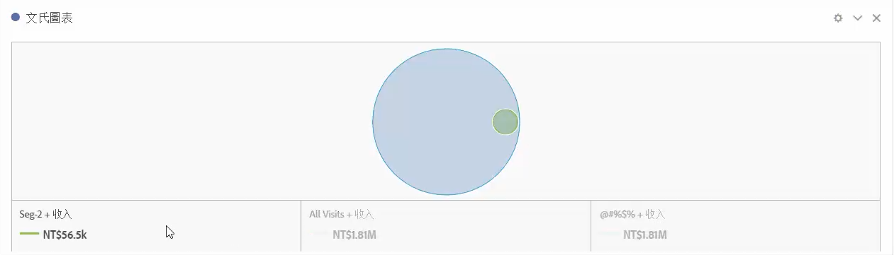
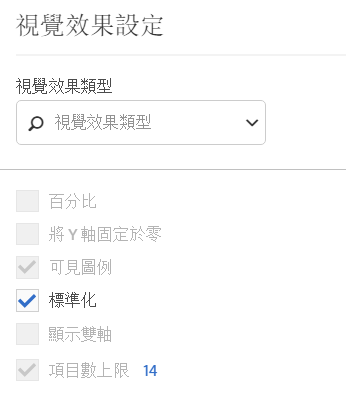

# 文氏圖表 {#venn}

<!-- markdownlint-disable MD034 -->

>[!CONTEXTUALHELP]
>id="workspace_venn_button"
>title="文氏圖表"
>abstract="建立文氏圖表視覺效果，以快速在視覺上比較兩個元素及其重疊的大小。"

<!-- markdownlint-enable MD034 -->

>[!BEGINSHADEBOX]

_本文記錄_ _&#x200B;**Adobe Analytics** 中的文式圖表視覺效果。_ _請參閱[文式圖表](https://experienceleague.adobe.com/zh-hant/docs/analytics-platform/using/cja-workspace/visualizations/venn)，以取得本文的_  _&#x200B;**Customer Journey Analytics** 版本。_

>[!ENDSHADEBOX]

**[!UICONTROL 文式圖表]**&#x200B;視覺效果可讓您拖曳最多 3 個篩選器和一個量度 (從元件面板) 來建置文氏圖表。

>[!NOTE]
>
>Analysis Workspace使用區域比例文氏圖表。 如果文氏圖表具有以兩個維度表示的三個或更多圓圈，則無法一律以完美比例繪製文氏圖表。
> 
>Workspace會嘗試建立最接近的文氏圖表，但結果可能並不一定在視覺上準確。

您可以在篩選器上停留，以獲得更多百分比等計量的深入分析。

若要從[!UICONTROL 文式圖表] 視覺效果產生[!UICONTROL 自由格式表格]，選取標上顏色的  (**[!UICONTROL 文式圖表]**&#x200B;旁) 標題並選取「**[!UICONTROL 顯示資料來源]**」。您將看到&#x200B;**[!UICONTROL 文式圖表資料]**&#x200B;自由格式表格，其中包括用於建立[!UICONTROL 文式圖表]視覺效果的資料。

<!--
To normalize the Venn diagram (take the size out of it), go select  and select **[!UICONTROL Normalization]**.

-->

>[!BEGINSHADEBOX]

請參閱  [&#x200B; 文式圖表視覺效果](https://video.tv.adobe.com/v/335798/?quality=12){target="_blank"}的示範影片。

>[!ENDSHADEBOX]

>[!MORELIKETHIS]
>
>[將視覺化新增至面板](/help/analyze/analysis-workspace/visualizations/freeform-analysis-visualizations.md#add-visualizations-to-a-panel)
>&#x200B;>[視覺效果設定](/help/analyze/analysis-workspace/visualizations/freeform-analysis-visualizations.md#settings)
>&#x200B;>[視覺化內容選單](/help/analyze/analysis-workspace/visualizations/freeform-analysis-visualizations.md#context-menu)
>

