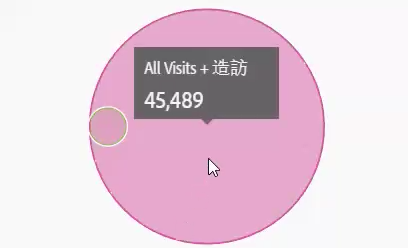

# Venn

Venn 視覺效果可讓您拖曳至最多 3 個區段 (從「元件」) 及一個量度來建立 Venn 圖表。

然後您可以在區段上暫留以取得更多百分比等的前瞻分析。

若要將 Venn 圖表轉換為自由表格，請按一下 **[!UICONTROL Venn]** 標頭旁的彩色點，並選取&#x200B;**[!UICONTROL 「管理資料來源]** > **[!UICONTROL 可用的資料來源]** > **[!UICONTROL 自由表格」]**。

若要標準化 Venn 圖表 (將大小移除)，請前往其「視覺效果設定」圖示並選取&#x200B;**[!UICONTROL 「標準化」]**。

