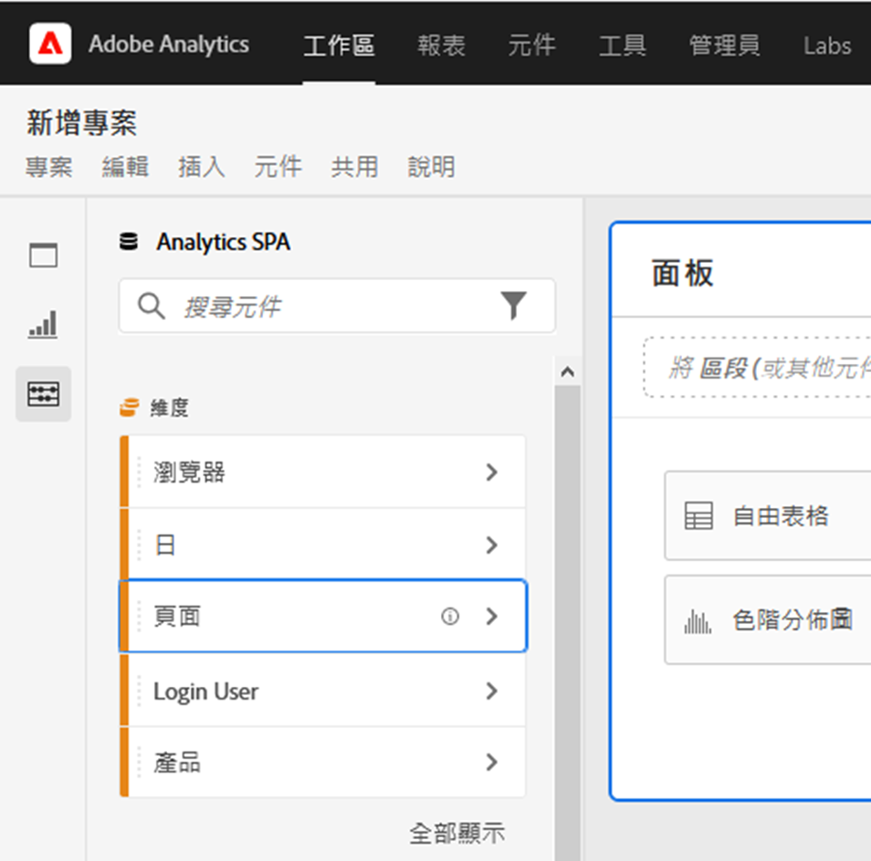
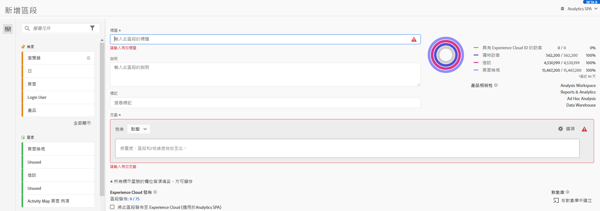

# Analysis Workspace 的協助工具

瞭解 Adobe Analytics 的主要分析工具 [!UICONTROL Analysis Workspace] 中的協助工具支援。

協助工具旨在讓產品適用於在視覺、聽覺、認知、運動能力和其他方面有障礙的人士。舉例來說，軟體產品的協助工具功能包括螢幕助讀程式支援、圖形等效文字、鍵盤快速鍵、將顯示器色彩變更為高對比等。

[!UICONTROL Analysis Workspace] 提供了一些方便使用的工具，包括：

## 使用鍵盤導覽 [!UICONTROL Workspace]

[!UICONTROL Analysis Workspace] 中的導覽可由上至下、由左至右運作。以下是可輔助協助工具的導覽元素：

* `Tab` 鍵會啟用地標捷徑，從而在 Workspace 中較大的區段之間移動。在左側欄中，`Tab` 也可讓您在不同的可拖曳選項之間移動。
* 在 `Tab` 標示 `left/right arrows` 之後，它就會在個別元素之間移動。
* `F6` 會瀏覽至專案中的第一個面板，並在該面板內的視覺化效果之間移動。 然後它會移到專案中的下一個面板，然後重複此程序。
* 我們套用了焦點指標，讓視力不佳的鍵盤使用者能夠清楚看出目前取得焦點的 UI 元素。此指標是選定元素周圍的藍色邊框。

  

### 功能表列的鍵盤導覽

1. 按 Tab 鍵，直到抵達功能表列為止。
1. 使用左/右方向鍵，瀏覽至您想要的功能表。
1. 按 `Enter` 可選取功能表並顯示其選項。
1. 使用上/下方向鍵，瀏覽至您想要的功能表選項。
1. 按 `Enter` 可選取選項。

### 拖放互動的鍵盤導覽

[!UICONTROL Analysis Workspace] 是著重於拖放功能的使用者介面。但使用者也可改用鍵盤新增元件：

1. 以 Tab 切換至左側邊欄中的元件。
1. 按 `Enter` 加以選取。
1. 使用方向鍵導覽至您要放置元件的區域。
1. 按 `Enter` 以放置元件。

### 鍵盤快速鍵 (熱鍵)

[!UICONTROL Analysis Workspace] 提供了一組豐富的[鍵盤快速鍵](https://experienceleague.adobe.com/docs/analytics/analyze/analysis-workspace/build-workspace-project/fa-shortcut-keys.html)，讓工作流程更加順暢。以下列出導覽、建立分析和加速深入分析的常用捷徑。

#### 導覽

| 快速鍵 | 動作 |
| --- | --- |
| `[Alt + Shift + 1 / 2 / 3]` | 跳至不同的邊欄：[!UICONTROL 面板]、[!UICONTROL 視覺效果]或[!UICONTROL 元件] |
| `[Alt + Left / Right]` | 在面板之間導覽 |
| `[Alt + M]` | 摺疊/展開所有面板 |
| `[Alt + Ctrl + M]` | 摺疊/展開作用中的面板 |
| `[Ctrl + /]` | 搜尋左側邊欄 |

#### 分析建立

| 快速鍵 | 動作 |
| --- | --- |
| `[Alt + 1]` | 新增自由形式表格 |
| `[Ctrl + Shift + C]` | 新增計算量度 |
| `[Ctrl + Shift + D]` | 新增日期範圍 |
| `[Ctrl + Shift + E]` | 新增區段 |
| `[Ctrl + Z]` | 還原 |
| `[Component drag + Shift]` | 建立下拉式篩選器 |

#### 加速

| 快速鍵 | 動作 |
| --- | --- |
| `[Ctrl + S]` | 儲存 |
| `[Ctrl + Shift + G]` | 組織 |
| `[Ctrl + G]` | 共用 |
| `[Alt + Shift + S]` | 排程 |
| `[Alt + L]` | 取得專案的連結 |
| `[Ctrl + Shift + B]` | 下載 PDF |

## 支援螢幕助讀程式和螢幕放大鏡

螢幕助讀程式會讀出顯示在電腦螢幕上的文字。它也會讀出非文字資訊，例如協助工具標記或屬性中提供的應用程式按鈕標籤或影像說明。

## 調色盤和對比

[!UICONTROL Analysis Workspace] 致力於達到 WCAG 2.1 AA 的要求，包括色彩對比的要求。

此外，使用者可在&#x200B;**[!UICONTROL 專案]** > **[!UICONTROL 專案設定]** > [專案調色盤](https://experienceleague.adobe.com/docs/analytics/analyze/analysis-workspace/build-workspace-project/color-palettes.html?lang=zh-Hant)下，針對專案設定自己偏好的調色盤。

## 元件產生器中的必要欄位驗證

建立元件時，會在您儲存必要欄位時加以驗證。如果必要欄位未通過驗證，則會以紅色列出並顯示錯誤圖示。需要修正的問題會顯示書面說明。

在元件通過驗證後，按 `Save` 即可關閉產生器。

## 支援作業系統協助工具功能

Analysis Workspace 支援內建的 MS Windows 和 macOS 協助工具功能，例如高對比模式、相黏鍵和慢速鍵/篩選鍵。此外也提供作業系統使用者介面的相關資訊，以透過輔助技術支援互動，包括螢幕助讀程式 (例如 macOS 的 VoiceOver 和 Windows 上的 NVDA)。
