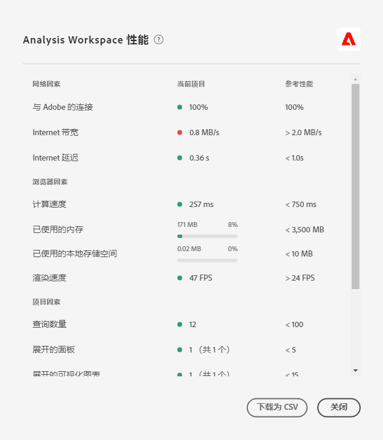

# Optimize [!UICONTROL Analysis Workspace performance]

各種因素都會影響分析工作區中專案的效能。 在您開始建立專案之前，請務必先瞭解這些貢獻者的身分，以便您能以最佳的方式規劃和建立專案。 本頁包含影響效能的因素清單，以及您可在分析工作區中最佳化以確保最佳效能的因素。

>[!IMPORTANT]
>
>分析工作區中的「效能」頁面為有限版本。 [更多詳情](https://docs.adobe.com/content/help/zh-Hant/analytics/landing/an-releases.html)

## [!UICONTROL 「說明] >分析 [!UICONTROL 工作區] 」中的效能

在「 **分析工作區 [!UICONTROL >說明] > [!UICONTROL 效能]**」下，您可以看到影響專案效能的因素，包括網路、瀏覽器和專案因素。 為獲得最準確的結果，請允許項目在開啟「效能」頁之前完全載入。

* 「目前的專案」欄會顯示您目前專案和使用者環境的結果。
* 「准則」欄會針對每個因素顯示Adobe的建議臨界值。

此外，您也可 **以下載為CSV** ，以輕鬆與Adobe客戶服務或您的內部IT團隊分享效能內容。

>[!NOTE]
>
>「效能」頁面上的資訊會隨著模式每次開啟而有所不同，因為系數可能會有所變更。 此外，Adobe將會在有更多資料可供使用時，繼續調整提供的准則。

## 網路因素

[!UICONTROL 幫助] > [!UICONTROL 效能網路] ，包括：

| 因素 | 定義 | 受 | 最佳化 |
| --- | --- | --- | --- |
| 與 Adobe 連線 | 當效能頁面開啟時，Adobe會傳送10個測試呼叫。 這代表成功呼叫Adobe的百分比。 | 本機網路問題或Adobe問題將影響此因素。 | 檢查status.adobe.com以確認是否有任何已知服務問題。 然後，驗證您的本地網路連接。 |
| 網際網路頻寬 | 僅適用於Google Chrome。 您的瀏覽器對您所在位置的頻寬預估。 准則為2.0MB/s。 | 您的本地網路連接將影響此因素。 | 驗證您的本地網路連接。 |
| 網際網路延遲 | 當效能頁面開啟時，Adobe會傳送10個測試呼叫。 這代表每個要求前往Adobe並傳回的平均時間。 更簡單地說，這是衡量網際網路在您所在位置與Adobe之間的速度。 指南為&lt; 1秒。 | 本端網路問題、許多開啟的瀏覽器標籤或Adobe問題都會影響此因素。 | 檢查status.adobe.com以確認是否有任何已知服務問題。 然後，驗證您的本機網路連線並關閉未使用的瀏覽器標籤。 |

## 瀏覽器因素

[!UICONTROL 「說明] >效 [!UICONTROL 能] 」瀏覽器因素包括：

| 因素 | 定義 | 受 | 最佳化 |
| --- | --- | --- | --- |
| 運算速度 | 電腦執行處理測試的速度有多快。 准則為&lt; 750毫秒。 | 您的硬體以及並行程式將影響這一因素。 | 開啟您電腦的Task Manager(PC)或Activity Monitor(Mac)，以判斷是否可關閉任何程式。 然後，關閉未使用的瀏覽器標籤或其他程式。   如果這些動作不奏效，請與您的IT團隊討論硬體詳細資訊。 |
| 已使用的記憶體 | 僅適用於Google Chrome。 Google Chrome瀏覽器中的每個「工作區」索引標籤共有4GB的記憶體。 這表示當前項目所消耗的記憶體裕量百分比。 指導方針為3500 MB，這是工作區開始出現記憶體錯誤的點。 | 在多個標籤中工作或下載50000列資料，將會增加記憶體使用量。 | 如果您收到記憶體錯誤，請關閉其他「工作區」標籤及／或執行50000列一次下載。 |
| 已使用的本機儲存空間 | 儲存在本機電腦的資料，以便在瀏覽器中使用。 每個來源（例如experience.adobe.com）有10MB的容量。 | 分析工作區使用本機儲存功能，包括儲存自動儲存（現有）的專案、使用者設定和功能標幟。 | 為確保分析工作區功能不會中斷，請清除experience.adobe.com網域的本機儲存。 |
| 演算速度 | FPS代表每秒影格數，這是瀏覽器在螢幕上繪製頁面的次數。 24 FPS是人眼常能觀察到的；如果FPS低於此值，您會在工作區中觀察到演算問題。 | FPS會受到同時執行多個工作區專案的多任務處理以及所檢視專案的大小的影響。 在您電腦上執行的其他程式可能會產生影響，例如串流、背景掃描器等。 此外，您的硬體也會影響此因素。 | 開啟您電腦的Task Manager(PC)或Activity Monitor(Mac)，以判斷是否可關閉任何程式。 然後，關閉未使用的瀏覽器標籤或其他程式。   如果這些動作不奏效，請與您的IT團隊討論硬體詳細資訊。 |

## 專案因素

[!UICONTROL 「說明] >效 [!UICONTROL 能] 」專案因素包括：

| 因素 | 定義 | 最佳化 |
| --- | --- | --- |
| 查詢數 | 向Adobe提出以擷取專案中顯示之資料的查詢（請求）總數。 查詢包括表格的排名請求、異常偵測、Sparkline、左側導軌中顯示的元件等。 排除收合的面板和視覺化。 准則是100。 | 將資料分割為多個專案，以符合特定目的或利益相關者群組，盡可能簡化您的專案。 使用標籤將專案組織成主題，並使 [用直接連結](https://docs.adobe.com/content/help/en/analytics/analyze/analysis-workspace/curate-share/shareable-links.html) ，建立內部目錄，讓利益相關者更輕鬆地找到所需項目。 |
| 擴充的面板（總面板數） | 在專案中的面板總數中，擴充的面板數目。 准則是5。 | 在採取步驟簡化專案後，收合專案中不需要載入時檢視的面板。 當專案開啟時，只會處理展開的面板。 收合的面板在使用者展開之前不會處理。 |
| 擴充的視覺化（總視覺化數） | 專案中總計中的擴充表格和視覺化數目，包括隱藏的資料來源。 准則是15。 | 在採取步驟簡化專案後，收合專案中不需要載入時檢視的視覺化效果。 排定對報告使用者最重要的視覺效果優先順序，並視需要將支援視覺效果區隔成個別、更詳細的面板或專案。 |
| 自由格式儲存格數目 | 專案中自由表格儲存格的總數，依所有表格的列*欄計算。 排除隱藏的資料來源。 准則是4000。 | 將表格中的欄數減少為最相關的資料點。 透過調整顯示的列數、套用表格篩選或套用區段，減少表格中的列數。 |
| 可用元件 | 在專案左側導軌中，跨專案中所有報表套裝擷取的元件總數。 指導方針是2000年。 | 請洽詢您的產品管理員，以建立包含更量身打造之元件集的精選虛擬報表套裝。 |
| 已使用的元件 | 項目中使用的元件總數。 准則是100。 | 使用的元件數量並不直接影響效能。 但是，這些元件的複雜性將有助於項目的執行。 請參閱下方「其他因素」一節的最佳化。 |
| 最大日期範圍  | 此系數會顯示專案使用的最長日期範圍。 准則是1年。 | 可能情況下，提取資料時請不要超出所需。將面板日曆縮小為分析的相關日期，或在自由表格中使用日期範圍元件（紫色元件）。 表格中使用的日期範圍會覆寫面板日期範圍。 例如，您可以將上個月、上週和昨天新增至表格欄，以請求這些特定的資料範圍。 如需在 Analysis Workspace 中使用日期範圍的相關資訊，請看[這段影片](https://docs.adobe.com/content/help/en/analytics-learn/tutorials/analysis-workspace/calendar-and-date-ranges/date-ranges-and-calendar-in-analysis-workspace.html)。  此外，將專案中使用的年與年比較次數減到最低。 當計算年度比較時，會在感興趣的月份中查看整個13個月的資料。 這與將面板日期範圍變更為過去13個月的影響相同。 |

## 其他因素

「說明>效能」中未包含的其他因素包括：

| 因素 | 定義 | 受 | 最佳化 |
| --- | --- | --- | --- |
| 區段複雜性 | 複雜的區段可能對專案效能造成重大影響。 | 會使區段增加複雜度的因素 (按影響程度由上往下排序) 包括： <ul><li>「包含」、「包含任何」、「符合」、「開始於」或「終止於」運算子 </li><li>連續區段，特別是使用維度限制 (「之內」/「之後」) 時 </li><li>區段使用的維度內不重複維度項目數量 (例如：具有 10 個不重複項目的頁面 =「A」，其速度會比具有 100000 個不重複項目的頁面 =「A」更快) </li><li>使用的不同維度數量 (例如：頁面 =「首頁」和頁面 =「搜尋結果」，其速度會比 eVar 1 =「紅色」和 eVar 2 =「藍色」更快)</li><li>多個「或」運算子 (而非「和」)</li><li>範圍各異的巢狀容器 (例如：「訪客」當中「造訪」內的「點擊」)</li></ul> | 雖然無法避免某些複雜因素，但請尋找機會來降低區段的複雜性。 一般而言，區段條件越明確越好。例如：<ul><li>若使用容器，在區段頂端使用單一容器，其速度會比一系列巢狀容器更快。</li><li>若使用運算子，「等於」會比「包含」更快，而「等於任何」會比「包含任何」更快。</li><li>若使用多個條件，「和」運算子會比一系列「或」運算子更快。</li></ul> 尋找將多個OR陳述式簡化為單一「等於任一陳述式」的機會。  [分類](/help/components/classifications/c-classifications.md) 也有助於將許多值合併為精簡的群組，然後您可從中建立區段。 與包含許多 OR 陳述式或「包含」標準的區段相比，針對分類群組而劃分的效能較佳。 |
| 視覺化複雜性（區段、量度、篩選） | 專案本身新增的視覺效果類型 (例如，流失率與自由表格對比) 對專案效能的影響不大。視覺效果的複雜度會增加處理時間。 | 增加視覺效果複雜度的因素包括：<ul><li>要求的資料範圍</li><li>套用的區段數；例如，用來作為自由表格列的區段</li><li>使用複雜區段</li><li>[自由表格的靜態項目列或欄](https://docs.adobe.com/content/help/zh-Hant/analytics/analyze/analysis-workspace/build-workspace-project/column-row-settings/manual-vs-dynamic-rows.html)</li><li>自由表格列所套用的篩選器</li><li>包含的量度數目，尤其是使用了區段的計算量度</li></ul> | 如果您注意到您的專案載入速度不如預期，可以的話，試著將一些區段取代為 eVar 和篩選器。  如果您發現自己持續使用區段和計算量度來處理對您業務而言很重要的資料點，請考慮改進實作，以更直接地擷取這些資料點。 使用Adobe Experience Platform Launch和Adobe處理規則等標籤管理程式，可快速且輕鬆地進行實作變更。 |
| 報表套裝的大小 | 收集到報表套裝中的資料量。 | - | 請洽詢您的實作團隊或Adobe專家，以判斷是否可進行實作改進，以改善Adobe Analytics的整體體驗。 |

## 常見錯誤訊息

在與分析工作區互動時，您可能會遇到也會影響效能的錯誤。 以下列出最常見的錯誤類型、產生原因，以及可進行的最佳化。

| 錯誤訊息 | 為何發生這項錯誤？ | 最佳化 |
| --- | --- | --- |
| [!UICONTROL 報表套裝正處理異常大量報告。請稍後再試。] | 您的組織針對特定報表套裝同時執行過多請求。造成此錯誤的因素包括 API 請求、已排程專案、已排程報表、已排程警報，以及同時提出報表請求的使用者數量。 | 將報表套裝的請求和排程分佈在一天中更平均。 |
| [!UICONTROL 發生系統錯誤。 請在「說明>提交支援票證」下記錄客戶服務要求，並包含您的錯誤碼。] | Adobe 遇到需要解決的問題。 | 將錯誤代碼提交給客戶服務。 |
| [!UICONTROL 要求太複雜。] | 您的報表請求規模過大，無法執行。造成此錯誤的因素包括請求的規模所導致的逾時、區段或搜尋篩選器中有過多相符項目、加入的量度過多、維度和量度組合不相容等。 | 移除表格中的某些欄或列，或考慮將表格分割為個別請求，以簡化您的請求。 |
| [!UICONTROL 此視覺化中的其中一個區段或搜尋包含傳回太多結果的文字搜尋。] | 您的區段標準或報表篩選太廣泛。 | 縮小搜尋文字標準並再次嘗試請求。 |
| [!UICONTROL 此維度目前不支援非預設的歸因模式。] | 您使用的維度不支援非預設歸因。 | Replace the dimension in your table with one that is compatible with [Attribution IQ](/help/analyze/analysis-workspace/attribution/overview.md). |
| [!UICONTROL 由於欄數過多或預先設定的列，您的請求失敗。] | 表格的自由格式儲存格太多（列*欄）。 | 移除表格中的欄或列，或考慮將表格分割為個別請求。 |
