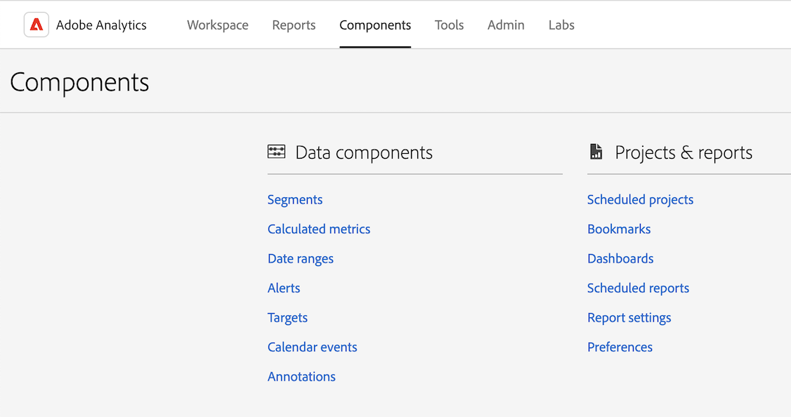

# 了解 Analytics 介面

Adobe Analytics 介面由以下主要區域組成，包括用於管理 Analysis Workspace 中的專案、管理元件、工具和管理員功能的索引標籤。

以下區段將說明 Analysis Workspace 的各個區域：

## 「工作區」標籤

「[!UICONTROL 工作區]」索引標籤依預設會顯示「[!UICONTROL 專案]」區域，其中顯示公司資料夾、您建立的任何個人資料夾、您的專案和行動計分卡。

1. 在 Adobe Analytics 中，選取「[!UICONTROL **工作區**]」索引標籤。

   

如需深入了解「[!UICONTROL 工作區]」索引標籤提供的功能，請參閱 [Adobe Analytics 登陸頁面](/help/analyze/landing.md)。

## 「報告」標籤

使用「[!UICONTROL **工作區**]」索引標籤左側邊欄中的「[!UICONTROL **報告**]」區域。如需詳細資訊，請參閱 [Adobe Analytics 登陸頁面](/help/analyze/landing.md)中的&#x200B;*瀏覽至報告索引標籤*。

## 「元件」標籤

「[!UICONTROL 元件]」索引標籤包含可協助您微調和增強資料分析的功能。

1. 在 Adobe Analytics 中，選取「[!UICONTROL **元件**]」索引標籤，然後選取「[!UICONTROL **所有元件**]」。

   

2. 選取以下任一產品功能以進行設定：

   | 產品功能 | 功能 | 詳細資訊 |
   |---------|----------|----------|
   | 區段 | Adobe Analytics 可讓您使用 Analytics 功能、Adobe Experience Cloud、Adobe Target 和其他整合的 Adobe 產品來建立、管理、分享強大的、有針對性的客群細分群體並將其應用到您的報告中。 | [Analytics 分段](https://experienceleague.adobe.com/docs/analytics/components/segmentation/seg-home.html) |
   | 計算量度 | 計算與進階計算 (或衍生) 量度為您可從現有量度建立的自訂量度。無論行銷人員、產品經理和分析人員，都不需變更 Analytics 實作就能詢問資料相關問題。 | [計算與進階計算量度](https://experienceleague.adobe.com/docs/analytics/components/calculated-metrics/cm-overview.html) |
   | 日期範圍 | Analysis Workspace 包含使用者在建置分析時可以使用的預設日期範圍清單。此外，您可以建立自訂日期範圍並將其提供給 Analysis Workspace 的使用者。 | [建立自訂日期範圍](https://experienceleague.adobe.com/docs/analytics/analyze/analysis-workspace/components/calendar-date-ranges/custom-date-ranges.html) <!-- should create an article in the Components Guide for managing/creating date ranges. This article in the Tools Guide needs updating. --> |
   | 虛擬報告套裝 | 虛擬報告套裝會將您的 Adobe Analytics 資料分段，以便您控制每個區段的存取權。 | [虛擬報告套裝概觀](https://experienceleague.adobe.com/docs/analytics/components/virtual-report-suites/vrs-about.html?lang=zh-Hant) |
   | 警報 | 警報提供更詳細的警報控制能力，並將警報系統與異常偵測功能整合。 | [警報概觀](https://experienceleague.adobe.com/docs/analytics/components/alerts/intellligent-alerts.html) |
   | 註解 | 工作區中的註解讓您能夠有效地將內容相關的資料細微差別和深入解析傳達給您的組織。註解可讓您將行事曆事件和特定的維度和量度連結起來。 | [管理註解](https://experienceleague.adobe.com/docs/analytics/analyze/analysis-workspace/components/annotations/manage-annotations.html) |
   | 分類集 | 分類集會提供管理分類和規則的單一介面。 
分類是將 Analytics 變數資料分類，然後在您產生報告時以不同方式顯示資料的方式。您在變數值和與其相關之中繼資料之間建立關係。分類可用於大多數自訂維度，例如追蹤程式碼、prop 和 eVar。
 | [分類集概觀](https://experienceleague.adobe.com/docs/analytics/components/classifications/sets/overview.html?lang=zh-Hant) |
   | 位置 | 為了從雲端目的地匯入 Adobe Analytics 分類資料，您首先需要新增並設定要收集分類資料的位置。您可以建立、編輯或刪除位置。 | [位置管理員](https://experienceleague.adobe.com/docs/analytics/components/locations/locations-manager.html) |
   | 已排程的專案 | 管理已排程的專案時，可以編輯和刪除定期發生的專案排程；在搜尋列中或使用左側邊欄中的篩選選項搜尋排程；並依標籤、核准的排程、擁有者等篩選。 | [已排程的專案](/help/components/scheduled-projects-manager.md) |
   | 儀表板 | 儀表板的作用是將量度視覺化並提供互動式分析資料功能。按一下儀表板中的項目，您可以快速輕鬆地將資料分段，以從分析中衍生出資訊。 
儀表板是 Data Workbench 的一部分。進一步了解 Data Workbench 的[生命週期結束公告](https://experienceleague.adobe.com/docs/data-workbench/using/eol.html?lang=zh-Hant)。 | [儀表板管理員](https://experienceleague.adobe.com/docs/analytics/analyze/reports-analytics/dashboard-manage.html) |
   | 排程報告 | 管理員層級使用者可以查看與管理組織中的排程報告。 | [排程報告佇列](https://experienceleague.adobe.com/docs/analytics/components/scheduled-reports-admin.html) |
   | 報告設定 | 這些設定參考舊版 Adobe Analytics 產品，其中不包括 Analysis Workspace 及其相關元件。若要調整 Analysis Workspace 設定，前往「元件 > 偏好設定」。 |  |
   | 偏好設定 | 為您建立的所有新專案或面板，管理 Analysis Workspace 及其相關元件的設定。現有專案和面板不受影響。 | [偏好設定](/help/analyze/analysis-workspace/user-preferences.md) |

   {style="table-layout:auto"}

## 「工具」索引標籤

<!-- The Tools tab ... -->

1. 在 Adobe Analytics 中，選取「[!UICONTROL **工具**]」索引標籤，然後選取「[!UICONTROL **所有工具**]」。

   

2. 選取以下任一產品功能以進行設定：

   | 產品功能 | 功能 | 詳細資訊 |
   |---------|----------|----------|
   | Data Warehouse | Data Warehouse 是指儲存和自訂報告所使用的 Analytics 資料複本，可供您透過篩選資料的方式來執行。 
「請求管理員」可讓您檢視或複製請求，以及重新排列請求的優先順序。
 | [管理 Data Warehouse 請求](https://experienceleague.adobe.com/docs/analytics/export/data-warehouse/data-warehouse-requests-manage.html) |
   | Activity Map | Activity Map 旨在透過視覺化覆蓋圖排行連結活動，並提供即時分析控制面板，以監視網頁的讀者參與度。它可讓您設定不同的視圖，以直觀識別客戶活動加速情況，量化行銷計劃，並根據客群需求和行為採取行動。 | [Activity Map 概觀](https://experienceleague.adobe.com/docs/analytics/analyze/activity-map/activity-map.html) |
   | Recommendations Classic | Recommendations 是 Adobe Target 功能，可依據先前的使用者活動、偏好設定或其他條件，自動顯示可能使訪客感興趣的產品、服務或內容。 | [Recommendations](https://experienceleague.adobe.com/docs/target/using/recommendations/recommendations.html) |
   | Search &amp; Promote | 不再支援此功能。 |  |
   | 行動服務 | 不再支援此功能。 |  |
   | Analytics 儀表板 (行動應用程式) | Adobe Analytics 儀表板應用程式可隨時隨地提供 Adobe Analytics 的深入分析。透過該應用程式，使用者可以檢視您使用 Adobe Analytics 桌面版 UI 建立的直覺式計分卡。 | iOS App Store 或 Google Play 商店中的 Adobe Analytics 儀表板應用程式 |
   | Report Builder | Adobe Report Builder 是 Microsoft Excel 的增益集。這可讓您根據能插入 Excel 工作表中的 Adobe Analytics 資料來建立自訂請求。這些請求可動態參考工作表中的儲存格，而您可以更新及自訂 Report Builder 展示資料的方式。 | [什麼是 Report Builder？](https://experienceleague.adobe.com/zh-hant/docs/analytics/analyze/report-builder/report-buider-overview) |

   {style="table-layout:auto"}

## 「管理員」標籤

「管理員」索引標籤包含用於管理 Adobe Analytics 的功能和設定選項。

1. 在 Adobe Analytics 中，選取「[!UICONTROL **管理員**]」索引標籤，然後選取「[!UICONTROL **所有管理員**]」。

   

2. 選取以下任一產品功能以進行設定：

   | 產品功能 | 功能 | 詳細資訊 |
   |---------|----------|----------|
   | Analytics 使用者與資產 | 雖然大多數使用者和產品管理功能目前只能在 [Adobe Admin Console](https://helpx.adobe.com/tw/enterprise/using/admin-console.html) 中使用，將資產從一個使用者轉移到另一個使用者以及設定使用者帳戶到期日的管理功能只能從 Adobe Analytics 管理區域使用。 | [轉移使用者資產或設定帳戶到期日](https://experienceleague.adobe.com/docs/analytics/admin/admin-tools/user-product-management/users-assets.html) |
   | 使用者 ID 移轉 | Analytics 使用者 ID 移轉可以讓管理員將 Analytics User Management 中的使用者帳戶輕鬆移轉至 Adobe Admin Console。 | [Analytics 使用者移轉至 Adobe Admin Console](https://experienceleague.adobe.com/docs/analytics/admin/admin-tools/user-product-management/migrate-users/c-migration-tool.html) |
   | 使用者管理首頁 (舊版) | 使用者和產品管理功能已移至 Adobe Admin Console。使用 Adobe Admin Console 開始管理 Adobe Analytics 使用者的使用者權限。 | [Adobe Admin Console 中的 Analytics](https://experienceleague.adobe.com/docs/analytics/admin/admin-console/home.html?lang=zh-Hant) |
   | 群組 (舊版) | 群組管理功能已移至 Adobe Admin Console。使用 Adobe Admin Console 開始管理 Adobe Analytics 群組。 | [Adobe Admin Console 中的 Analytics](https://experienceleague.adobe.com/docs/analytics/admin/admin-console/home.html?lang=zh-Hant) |
   | 報告套裝存取權 | 報告套裝存取權授與方法已移至 Adobe Admin Console。使用 Adobe Admin Console 將報告套裝存取權授與 Adobe Analytics 使用者。 | [報告套裝工具的產品設定檔權限](https://experienceleague.adobe.com/docs/analytics/admin/admin-console/permissions/report-suite-tools.html?lang=zh-Hant) |
   | 管理工具首頁 | Analytics 管理工具區域是管理 Adobe Analytics 執行個體的主要區域；大部分管理任務都可以在這裡完成。 | [管理員工具概觀](https://experienceleague.adobe.com/docs/analytics/admin/admin-tools/c-admin-tools.html) |
   | 報告套裝 | 可讓您定義用以控管如何在報告套裝中處理資料的規則。 | [報告套裝管理員](https://experienceleague.adobe.com/docs/analytics/admin/admin-tools/manage-report-suites/report-suites-admin.html) |
   | Analytics 使用者與資產 | 使用者與資產管理功能已移至 Adobe Admin Console。使用 Adobe Admin Console 開始管理 Adobe Analytics 使用者的使用者權限。 | [Adobe Admin Console 中的 Analytics](https://experienceleague.adobe.com/docs/analytics/admin/admin-console/home.html?lang=zh-Hant) |
   | 分類匯入工具 | 使用匯入工具將分類上傳至 Adobe Analytics。您也可以在匯入之前，匯出資料以便更新。 | [分類匯入工具概觀](https://experienceleague.adobe.com/docs/analytics/components/classifications/classifications-importer/c-working-with-saint.html) |
   | 分類規則產生器 | 您可以建立自動的規則型分類並套用至多個報告套裝，如此就無須在每次追蹤程式碼變更時維護和上傳分類。 | [分類規則產生器工作流程](https://experienceleague.adobe.com/docs/analytics/components/classifications/classifications-rulebuilder/classification-rule-builder.html) |
   | 資料來源 | 使用資料來源管理員來建立、編輯或停用資料來源。您也可以使用此介面追蹤上傳至資料來源 FTP 位置的檔案狀態。 | [管理資料來源](https://experienceleague.adobe.com/docs/analytics/import/data-sources/manage.html) |
   | 程式碼管理員 | 程式碼管理員可讓您下載網站和行動平台的資料收集程式碼 | [程式碼管理員](https://experienceleague.adobe.com/docs/analytics/admin/admin-tools/code-manager-admin.html) |
   | 流量管理 | 「流量管理」頁面可讓您指定預期的流量變化。這些設定讓 Adobe 能夠分配適當資源，以確保即時追蹤和處理您的流量。 | [流量管理概觀](https://experienceleague.adobe.com/docs/analytics/admin/admin-tools/manage-report-suites/edit-report-suite/traffic-management/traffic-management.html) |
   | 伺服器呼叫使用量 | 伺服器呼叫又稱為「點擊」或「影像要求」，是有關資料傳送到 Adobe 伺服器進行處理的一項實例。「伺服器呼叫使用量」儀表板，用於追蹤伺服器呼叫耗用量資料，並將其與合約限制進行比較。您可以設定警報以避免使用過量。 | [伺服器呼叫使用量概觀](https://experienceleague.adobe.com/docs/analytics/admin/admin-tools/server-call-usage/overage-overview.html) |
   | 記錄檔 | 記錄檔可協助您查看使用者何時登入、其使用情形、存取權、報告套裝以及管理員變更。 | [記錄檔](https://experienceleague.adobe.com/docs/analytics/admin/admin-tools/logs.html) |
   | Advertising Analytics | 將 Adobe Analytics 設定為以並排方式顯示所有 Google 和 Bing 付費搜尋資料。 | [設定 Advertising Analytics](https://experienceleague.adobe.com/docs/analytics/admin/admin-tools/manage-report-suites/edit-report-suite/advertising-analytics-config.html) |
   | 資料摘要 | 資料摘要是從 Adobe Analytics 中取得原始資料的有力方式。這類原始資料可用於 Adobe 以外的其他平台，供組織任意使用。 | [Analytics 資料摘要概觀](https://experienceleague.adobe.com/docs/analytics/export/analytics-data-feed/data-feed-overview.html?lang=zh-Hant) |
   | 依 IP 排除 | 您可以從報告中排除特定 IP 位址的資料，例如內部網站活動、網站測試和員工使用情形。透過排除 IP 位址資料，可以排除資料以改進報告準確度。此外，您可以移除來自拒絕服務攻擊或其他歪曲報告資料之惡意事件的資料。您可以設定排除規則，或使用防火牆來進行設定。 | [依 IP 位址排除](https://experienceleague.adobe.com/docs/analytics/admin/admin-tools/exclude-ip.html) |
   | 報告活動管理員 | 報告活動管理器可讓您查看組織中每個報告套裝的報告容量。它提供報告使用量的詳細可見度，並幫助您在尖峰報告期間輕鬆診斷和修正容量問題。 | [報告活動管理員](https://experienceleague.adobe.com/docs/analytics/admin/admin-tools/reporting-activity.html) |
   | 資料治理隱私權標籤 | 為報告套裝資料加上標籤，代表您可為特定報告套裝內的每個變數，指派身分、敏感程度以及資料控管標籤。 | [標籤報告套裝資料](https://experienceleague.adobe.com/docs/analytics/admin/admin-tools/data-governance/data-labels/gdpr-setup-reportsuite.html) |
   | 公司設定首頁 | 公司設定頁面可讓您設定要對您的組織所管理的所有報告套裝套用的設定。 | [公司設定概觀](https://experienceleague.adobe.com/docs/analytics/admin/admin-tools/company-settings/c-company-settings.html) |
   | 安全管理員 | 安全管理員可讓您控制報告資料的存取權。選項包括增強式密碼、密碼過期、IP 登入限制及電子郵件網域限制。 | [安全管理員](https://experienceleague.adobe.com/docs/analytics/admin/admin-tools/company-settings/security-manager.html) |
   | 網站服務 | 「網站服務 API」可程式化地存取行銷報告和其他「套裝」服務，讓您透過 Analytics 介面複製並增強可用功能。 | [網頁服務](https://experienceleague.adobe.com/docs/analytics/admin/admin-tools/company-settings/web-services-admin.html) |
   | Report Builder 報告 | 管理指派給 Report Builder 使用者的授權。 | [Report Builder 報告](https://experienceleague.adobe.com/docs/analytics/admin/admin-tools/company-settings/report-builder-reports-admin.html) |
   | 單一登入服務 | Adobe Experience Cloud 的單一登入是透過 Admin Console 實作。 | [Adobe Admin Console 中的 Analytics](https://experienceleague.adobe.com/docs/analytics/admin/admin-console/home.html?lang=zh-Hant) |
   | 隱藏報告套裝 | 如果您不再想要您和您的使用者使用報告套裝，可以在 Adobe Analytics 使用者介面中隱藏報告套裝。 | [隱藏報告套裝](https://experienceleague.adobe.com/docs/analytics/admin/admin-tools/company-settings/c-hide-report-suites.html) |

   {style="table-layout:auto"}

## Analysis Workspace

Analysis Workspace 可讓您快速建置分析以收集深入見解，然後與其他人分享這些深入見解。透過拖放瀏覽器介面，您可以建立分析、新增視覺效果以生動呈現資料、組織資料集，以及與組織中您選擇的任何人共用和排程專案。

下圖和隨附的表格說明了 Analysis Workspace 中的一些主要區域。

有關 Analysis Workspace 的更詳細概觀，請參閱 [Analysis Workspace 概觀](/help/analyze/analysis-workspace/home.md)。

| 影像中的位置 | 名稱與功能 |
|---------|----------|
| A | **最左側邊欄：**&#x200B;包含用於在 Analysis Workspace 新增面板、視覺效果和元件的標籤。也包含用來開啟資料字典的「資料字典」圖示。 |
| B | **左側邊欄：**&#x200B;根據在最左側邊欄選取的標籤，該區域包含個別的面板、視覺效果或元件。 |
| C | **畫布：**&#x200B;這是從左側邊欄拖曳內容以建立專案的主要區域。您新增面板、視覺效果和元件到畫布時，該專案就會動態更新。 |
| D | **報告套裝下拉式選單：**&#x200B;對於 Analysis Workspace 中的每個面板，報告套裝下拉式選單可讓您選擇要使用做為資料來源的報告套裝。 |
