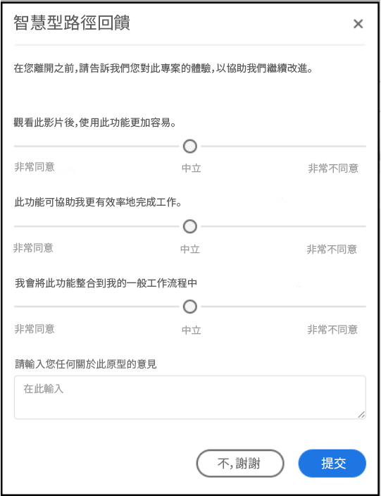

# [!UICONTROL Labs 使用指南]

[!UICONTROL Labs 可讓您更快速地建立早期構想的原型。]此功能結合了工具和程序，能夠以透明方式加速開發，並且以客戶為中心。 它讓用戶運用新興技術參與互動、發掘有價值的深入分析資料，並影響未來的功能開發與優先項目。透過 Labs，您可以搶先使用 Adobe Analytics 創新功能，並根據您自己的業務使用案例和資料的內容評估即將推出的功能。

## 要求

[!UICONTROL Labs 已為所有管理員設為自動啟用。] 其他團隊成員則必須連絡各自的產品管理員要求存取權。

如果您尚未閱讀並簽署適用的「保密協定」和「條款與條件」表單，請逕行相關動作。

## 存取 [!UICONTROL Labs] 入口網站

若要存取 [!UICONTROL Labs]：

1. 如果您尚無法存取[!UICONTROL 工作區]和 [!UICONTROL Labs]，請向您的管理員要求權限。

1. 按一下&#x200B;**[!UICONTROL 「Labs」]**&#x200B;標籤。

## 評估原型

如何啟動並評估原型：

1. 在 [!UICONTROL Labs] 畫面上，針對您要檢視的原型按一下&#x200B;**[!UICONTROL 啟動]**。 啟動原型時，您會在原型環境的左上角看到原型的名稱。

   

1. 按一下螢幕右上方的&#x200B;**[!UICONTROL 觀看影片]**，觀看重點說明原型的影片。影片結束時，請按一下&#x200B;**[!UICONTROL 關閉]**。

   

1. 使用原型進行作業。在原型環境中操作時：

* 在原型環境中建立的專案無法儲存或共用。

* 在原型中，您可以利用「工作區」中可存取的任何維度、量度、區段和視覺效果來評估資料。

* 您在原型中所做的任何變更都不會影響資料收集或處理。

* 透過建立或修改區段、計算量度和警報所做的變更，會持續沿用至原型環境之外。

## 提供意見回饋

1. 使用原型時，隨時按一下&#x200B;**[!UICONTROL 提供意見反應]**，即可在訊息方塊中輸入意見反應。

   

1. 按一下&#x200B;**[!UICONTROL 「提交」]**&#x200B;即可傳送您的意見。

1. 若要嘗試不同的原型，或要退出原型環境，請按一下畫面右上方的&#x200B;**[!UICONTROL 離開原型]**，並填寫與原型相關的簡短問卷調查。 退出原型環境後，對原型專案所做的任何更改都將遺失。

   

1. 按一下&#x200B;**[!UICONTROL 「提交」]**&#x200B;即可返回主預覽入口網站。

## 其他資訊

* [!UICONTROL Labs] 中的有些原型會成為 Analytics 功能，有些原型則否。您的意見回饋會影響我們的決策，因此請審視原型，讓 Adobe 知道您對各項原型的看法。
* Labs 可供所有 SKU 權限使用。
