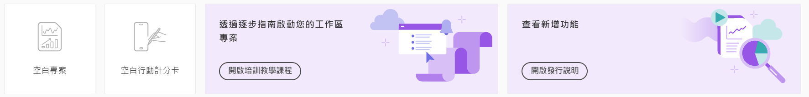

# Adobe Analytics 登陸頁面

Adobe Analytics 的登陸頁面會將 [!DNL Analysis Workspace] 和 [!DNL Reports & Analytics] (已終止服務) 整合在 [!DNL Workspace] 傘狀結構下的單一介面和存取點中。此頁面包含專案經理首頁、範本區段，以及可協助您更有效地快速入門的學習區段。

>[!BEGINSHADEBOX]

請參閱  [Adobe Analytics 登陸頁面](https://video.tv.adobe.com/v/334278/?quality=12&learn=on){target="_blank"}的示範影片。

>[!ENDSHADEBOX]

Adobe Analytics 登陸頁面含有以下子標籤：專案、範本和學習。

**[!UICONTROL 專案]**&#x200B;是自訂的設計，可結合您所建立或其他人所建立並與您共用的資料元件、表格和視覺效果。[!UICONTROL 專案]也指空白專案和空白移動計分卡。

**[!UICONTROL 範本]**&#x200B;包括 Adobe 所提供的範本以及任何特定於貴組織的範本。

「**[!UICONTROL 學習]**」標籤包含實作影片導覽、教學課程和文件連結。

## 瀏覽至「[!UICONTROL 專案]」索引標籤。 {#navigate-projects}

「[!UICONTROL 專案]」標籤可用作 [!UICONTROL Workspace] 首頁。「專案」索引標籤會顯示公司資料夾、您建立的任何個人資料夾、您的專案和 Mobile 計分卡。 使用此頁面來檢視、建立和修改資料夾、專案和行動計分卡。 如需詳細資訊，請參閱[關於 Analytics 資料夾](/help/analyze/analysis-workspace/build-workspace-project/workspace-folders/about-folders.md)。

>[!NOTE]
>
>下列數項設定會在工作階段和跨工作階段期間持續存在。例如，您選取的索引標籤、選取的篩選器、選取的欄，以及欄排序方向。 搜尋結果不會持續存在。

### 自訂表格欄

若要自訂欄寬，請拖曳分隔每欄的垂直列。

若要從專案清單中新增或移除欄，請按一下右上方的欄圖示 ()，然後選取或取消選取欄標題。

可用的欄為：

| 欄名稱 | 說明 |
|---------|----------|
| [!UICONTROL **名稱**] | 識別專案名稱。 |
| [!UICONTROL **類型**] | 指出此類型是工作區專案、行動計分卡或資料夾。 |
| [!UICONTROL **標籤**] | 標記專案，可方便分類整理。 |
| [!UICONTROL **已排程**] | 設定為[!UICONTROL 開啟] (若專案已排程) 或[!UICONTROL 關閉] (若專案未排程)。 按一下[!UICONTROL 開啟]連結可讓您查看排程專案的資訊。如果您是專案所有人，您還能[編輯專案排程](/help/analyze/analysis-workspace/curate-share/t-schedule-report.md)。 |
| [!UICONTROL **專案角色**] | 識別專案角色：您是否為專案所有者，以及您是否具有編輯或複製專案的權限。 |
| [!UICONTROL **報告套裝**] | 識別與專案相關聯的報告套裝。 面板內的表格和視覺效果是從面板右上角所選報告套裝衍生而得。該報告套裝也會決定左側邊欄內會有哪些元件。在專案中，您可以使用一或多個報告套裝，多寡視您的分析使用情形而定。報告套裝清單是根據相關性來分類。Adobe 是根據目前使用者最近使用套裝情形和多常使用套裝，以及組織內多常使用套裝等來定義關聯性。 |
| [!UICONTROL **所有者**] | 識別建立專案的人員。 |
| [!UICONTROL **共用對象**] | 顯示目前共用專案的人員。 |
| [!UICONTROL **上次修改日期**] | 上次修改專案的日期和時間。 |
| [!UICONTROL **上次開啟**] | 確定目前正在查看「專案」頁面的使用者上次開啟專案的日期。 |
| [!UICONTROL **上次使用**] | 透過顯示組織內任何使用者上次開啟專案的日期和時間，幫助確定專案對組織中的使用者是否重要。
檢視此欄時請考慮以下事項：
<ul><li>使用情況資訊從 2023 年 9 月開始提供。</li><li>本欄僅適用於系統管理員。</li></ul> |
| [!UICONTROL **專案 ID**] | 可用來為專案偵錯。 |
| [!UICONTROL **最大日期範圍**] | 更長的日期範圍會增加專案複雜性，並可能增加處理和載入次數。 |
| [!UICONTROL **查詢數**] | 專案載入時，向 Analytics 提出的請求總數。較高的專案查詢數會增加專案複雜性，並可能增加處理和載入次數。載入專案或傳送已排程專案後才能使用此資料。 |
| [!UICONTROL **位置**] | 顯示專案位置所在的資料夾。 |

### 專案頁面上的其他 UI 元素

| UI 元素 | 定義 |
| --- | --- |
| 編輯偏好設定 | 讓您[!UICONTROL 檢視教學課程]和[編輯使用者偏好設定](/help/analyze/analysis-workspace/user-preferences.md)。 |
| [!UICONTROL 新建] | 開啟專案模組，您可在此建立 Workspace 專案、Mobile 計分卡或開啟公司範本。 |
| [!UICONTROL 顯示較少 顯示較多] | 在不顯示和顯示橫幅之間切換： |
| [!UICONTROL Analysis Workspace 專案] | 建立空白[工作區專案](/help/analyze/analysis-workspace/home.md)，供您設計和建置。 |
| [!UICONTROL Mobile 計分卡] | 建立空白 [行動計分卡](/help/analyze/mobile-app/curator.md)，供您設計和建置。 |
| [!UICONTROL 開啟訓練教學課程] | 開啟工作區培訓教學課程，引導您完成逐步教學課程中建置新入門專案的流程。 |
| [!UICONTROL 開啟發行說明] | 開啟最新 Adobe Experience Cloud 發行說明的 Adobe Analytics 部分。 |
| 篩選器圖示 | 按標記、報告套裝、所有者、類型和其他篩選器 (「我的」、「已共用給我」、「我的最愛」和「已核准」) 來篩選 |
| 搜尋列 | 搜尋表格中的所有欄。 |
| 選取方塊 | 選取一個或多個專案，以顯示您可以執行的專案管理操作：**刪除**、**共用**、**重新命名**、**複製**、**取消釘選**、**上移**、**下移**、**標記**、**核准**、**匯出 CSV**，和&#x200B;**移至**。您可能沒有執行所列出所有操作的權限。 |
| [!UICONTROL 我的最愛] | 將星號新增至可用作篩選器的最喜愛專案或資料夾旁。 |
| [!UICONTROL 名稱] | 識別專案名稱。 |
| 釘選圖示 | 釘選項目，使其一直出現在清單的頂部，但您可以將其順序上下移動來重新調整順序。 使用省略符號選項選單，並選擇在清單中&#x200B;**上移** 或&#x200B;**下移**。 |
| 資訊 (i) 圖示 | 顯示以下有關專案的資訊：類型、專案角色、所有者、說明，以及共用對象。 此資訊也會指明誰可以[編輯或重複](/help/analyze/analysis-workspace/curate-share/share-projects.md)此專案。 |
| 省略 (...) | 顯示您可以執行的專案管理操作：**刪除**、**共用**、**重新命名**、**複製**、**取消釘選**、**上移**、**下移**、**標記**、**核准**、**匯出 CSV**，和&#x200B;**移至**。 您可能沒有執行所列出所有操作的權限。 |
| 顯示：資料夾與專案或所有專案 | 變更表格上的視圖設定，以根據資料夾組織顯示資料夾和專案&#x200B;**或**&#x200B;以無組織的清單顯示所有專案。 |
| &lt; (返回按鈕) | 將您傳回至工作區專案或壣表中最新的登陸頁面設定。 離開登陸頁面時您擁有頁面設定，會在您返回時持續留在該頁面。 |

## 瀏覽至「[!UICONTROL 範本]」索引標籤 {#navigate-reports}

如需關於在 Adobe Analytics 中使用客戶屬性的詳細資訊，請參閱下列資源：

* [使用範本](/help/analyze/analysis-workspace/templates/use-templates.md)

* [建立和管理範本](/help/analyze/analysis-workspace/templates/create-templates.md)

## 使用「學習」標籤。 {#navigate-learning}

「學習」頁面包含實作影片導覽、教學課程和文件連結。

使用 Adobe Analytics 中的「學習」頁面學習 Adobe Analytics 的初級、中級或進階功能和使用案例。

### 存取「學習」頁面

1. 在 Adobe Analytics 中，選取「[!UICONTROL **工作區**]」>「[!UICONTROL **學習**]」。

### 「學習」頁面功能

* **篩選內容：**&#x200B;左側欄中的「篩選器」圖示讓您按經驗級別 (初級、中級或進階) 以及按內容類型 (文件、影片或導覽和教學課程) 篩選學習內容。
* **追蹤進度：**&#x200B;在選取一段內容後，會出現「**[!UICONTROL 已檢視]**」標記。此標記可幫助您透過學習內容追蹤您的進度。您可以選取&#x200B;**[!UICONTROL 已檢視]**&#x200B;標記以將其從內容中刪除。
* **檢視其他的內容：**&#x200B;在觀看任何影片時，選取「**[!UICONTROL 深入了解]**」按鈕以檢視 Experience League 上的相關文件內容。或者，從「學習」頁面中選取以下任一選項，以檢視其他內容：
   * **[!UICONTROL 造訪 YouTube]：**&#x200B;檢視完整的 Analysis Workspace YouTube 播放清單。
   * [!UICONTROL **造訪 Experience League**]：檢視有關 Experience League 的全套 Adobe Analytics 文件。
* **適用於新使用者的基礎知識：**&#x200B;建議新使用者使用此「[!UICONTROL 工作區基礎知識]」導覽。此導覽將直接帶您進入工作區並引導您完成最常見的操作。也可以透過面板標題的工具提示快顯視窗，直接在工作區中重新啟動此導覽。

## 設定您的登陸頁面 {#set-landing}

使用者可以設定他們偏好的登陸頁面。

1. 前往「Analytics > [!UICONTROL 元件] > [!UICONTROL 偏好設定] > [!UICONTROL 一般]」。
1. 確認您偏好哪個登陸頁面：

   

## 登陸頁面常見問題 {#landing-faq}

| 問題 | 回答 |
| --- | --- |
| 我以前在[!UICONTROL 工作區]看到的範本在哪裡？ | 這些範本分類列在「[!UICONTROL 範本]」索引標籤下。 |
| 我在 Beta 版計劃 UI 中進行的工作是否會移轉至生產環境的[!UICONTROL 工作區]體驗？ | 是，在 Beta 版中完成的任何工作都會移轉至舊有/現有的[!UICONTROL 工作區]體驗。 |
| 我的上一個 Reports &amp; Analytics「我的最愛」是否會移轉過來？ | 否，這些不會移轉過來。但是，[!UICONTROL 工作區]中任何「我的最愛」會移轉過來。 |
| 我可釘選的專案數量是否有上限？ | 沒有，您可以釘選的專案數量沒有限制。 |
| 管理員是否可以為他們的使用者指定此登陸頁面？ | 否，管理員不可以代表他們的使用者指定此登陸頁面。 個人使用者必須自己開啟切換功能。 |
