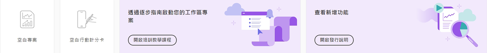
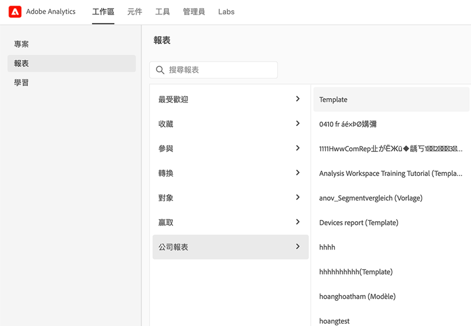

# Adobe Analytics 登陸頁面

Adobe Analytics 的登陸頁面將在工作區傘狀結構下的單一介面和存取點中，整合 Analysis Workspace 和 Reports &amp; Analytics。 此頁面包含專案經理首頁、更新的報告選單、現代化報告，以及可幫助您更有效地開始體驗的學習區段。

>[!IMPORTANT]
>
>此登陸頁面將會從 2021 年 7 月 21 日開始提供開放 Beta 版。 這是起始點選項。您也可以選擇使用原有的登陸頁面，無論是 Workspace 或 Reports 都可以。如果您確實決定選擇加入 Beta 版計劃，請瀏覽頁面並在螢幕上方按一下「**[!UICONTROL 提供回饋意見]**」，即可記錄您的回饋意見以及您發現的錯誤。您可以隨時選擇退出並返回 Beta 計劃。在 Beta 版用戶介面中完成的任何工作都會延續進入現有/目前的 Workspace 體驗中。

>[!VIDEO](https://video.tv.adobe.com/v/334278/?quality=12)

## 存取登陸頁面 {#access-landing}

在您登入 Adobe Experience Cloud 和 Analytics 後，可在左下角啟用「[!UICONTROL 全新登陸頁面 - Beta 版]」的切換按鈕。 對此切換按鈕的存取權是每個組織的使用者所專屬，而非公司所專屬。

## 選單結構

* Analytics 最上方選單：大多數報表現在都在左側欄的「[!UICONTROL 報表]」選單中。
* 左側欄有三個索引標籤：[!UICONTROL 專案]、[!UICONTROL 報表]和[!UICONTROL 學習]。

### 術語

* **[!UICONTROL 專案]**&#x200B;是您已建立或其他人已建立並供您分享的事物。[!UICONTROL 專案]也指空白專案和空白移動計分卡。
* **[!UICONTROL 報表]**&#x200B;是指由 Adobe 預先建立的任何內容，例如在 Reports &amp; Analytics 和 Workspace 範本中的這類報表。[!UICONTROL 報表]也是指您公司為您建立的報表範本。
* **[!UICONTROL 範本]**&#x200B;不再用來作為 Adobe 預先建立的 Workspace 專案術語。範本現在歸類在「[!UICONTROL 報表]」下面。

## 瀏覽至「[!UICONTROL 專案]」索引標籤。 {#navigate-projects}

「[!UICONTROL 專案]」可用作  [!UICONTROL Workspace] 首頁。任何 Workspace 專案會顯示在此處，包含行動計分卡。

>[!NOTE]
>
>以下幾項設定會在本工作階段並跨多個工作階段中持續使用 (被記住)。範例：您開啟的標記、選取的篩選器、選取的欄項，以及欄項排序方向。但是，搜尋結果不會持續存在。

| UI 元素 | 定義 |
| --- | --- |
| ... 更多 | 讓您[!UICONTROL 檢視教學課程]和[編輯用戶偏好設定](/help/analyze/analysis-workspace/user-preferences.md)。 |
| 建立專案 | 下拉式功能表可讓您建立 [!UICONTROL Workspace 專案]或[!UICONTROL 行動專案]。 |
| 顯示較少/較多 | 在不顯示和顯示橫幅之間切換： |
| 空白專案 | 建立空白的 [Workspace 專案](https://experienceleague.adobe.com/docs/analytics/analyze/analysis-workspace/home.html?lang=en)供您填入。 |
| 空白行動計分卡 | 建立空白的[行動計分卡](https://experienceleague.adobe.com/docs/analytics/analyze/mobapp/curator.html?lang=en)供您填入。 |
| 開啟培訓教學課程 | 開啟 Workspace 培訓教學課程，可指導新用戶按步驟來建立專案。 |
| 開啟發行說明 | 開啟最新 Adobe Experience Cloud 發行說明的 Adobe Analytics 部分。 |
| 篩選器圖示 | 您可按標記、報表套裝、所有者、類型和其他篩選器 (「我的」、「已共用給我」、「我的最愛」和「已核准」) 來篩選 |
| 搜尋列 | 現在的搜尋包含表中的所有欄項。 |
| 選取方塊 | 按一下一個或多個專案旁邊的這個方塊，會顯示您可以執行的專案管理操作：刪除、標記、釘選、核准、共用、重新命名、複製和匯出至 CSV。您可能沒有執行所有這些操作的權限。 |
| 我的最愛 | 將專案設為「我的最愛」會讓專案取得一顆星，且會將其標記為您可篩選的「我的最愛」。 |
| 名稱 | 專案名稱。 |
| 釘選圖示 | 您可以釘選項目，好讓這些項目&#x200B;*始終*&#x200B;都顯示在您清單的最上方。 |
| 資訊 (i) 圖示 | 按一下資訊圖示會顯示以下有關此專案的資訊：類型、專案角色、所有者、說明，以及供分享的對象。此資訊也會指明誰可以[編輯或重複](https://experienceleague.adobe.com/docs/analytics/analyze/analysis-workspace/curate-share/share-projects.html)此專案。 |
| 省略 (...) | 按一下專案旁邊的省略符號，會顯示您可以執行的專案管理操作：刪除、標記、釘選、核准、共用、重新命名、複製和匯出至 CSV。注意，您可能沒有執行所有這些操作的權限。 |
| 類型 | 指示此類型是 Workspace 專案還是行動計分卡。  |
| 標記 | 您可以標記報表，可方便分類整理。 |
| 專案角色 | 專案角色是指您是專案所有者，以及您是否具有編輯或複製專案的權限。 |
| 報表套裝 | 面板內的表格和視覺效果是從面板右上角所選報表套裝衍生而得。該報表套裝也會決定左側邊欄內會有哪些元件。在專案中，您可以使用一或多個報表套裝，多寡視您的分析使用情形而定。報表套裝清單是根據相關性來分類。Adobe 是根據目前用戶最近使用套裝情形和多常使用套裝，以及組織內多常使用套裝等來定義關聯性。 |
| 所有者 | 建立專案的人。 |
| 上次開啟時間 | 您上次開啟此專案的時間。 |
| 欄項選擇器 | 如果要從專案清單新增或刪除欄項，您可以透過選取或取消選取來執行此操作。 |
| &lt; (返回按鈕) | Workspace 專案或報表中的這個按鈕將帶您回到最近登陸頁面的設定。無論您離開登陸頁面時在哪個頁面設定，當您返回時將會持續留在該頁面。 |

## 瀏覽至「[!UICONTROL 報表]」標記。 {#navigate-reports}

「[!UICONTROL 報表]」標記可整合三套報表：

* 預先建立的 [!UICONTROL Workspace] 範本；即先前位於「[!UICONTROL Workspace] > [!UICONTROL 專案] > [!UICONTROL 全新]」的範本。Adobe 不再於此內容中使用「範本」一字。
* 多數預先建立的報表在先前 Adobe Analytics [!UICONTROL 報表]上方功能表的下面。這些報表現在顯示在 [Analysis Workspace](https://experienceleague.adobe.com/docs/analytics/analyze/analysis-workspace/home.html?lang=en) 中。
* 您公司已為您建立的任何內容。

>[!IMPORTANT]
>
>在「報表」下，只有當您將新報表標記為「我的最愛」時，才會顯示「我的最愛」檔案夾。沒有預先存在的 Reports &amp; Analytics「我的最愛」移轉過來。

如前面所提，此處只提供先前在 Reports &amp; Analytics 中分類的最常用報告。一小部分很少使用或不再相關的報表未移轉過來。如需詳細資訊，請參閱以下的常見問題。

### 功能表和子功能表

以下是選單及其子選單。 如果找不到特定報表，請執行「搜尋頁面」後尋找。

| 功能表項目 | 在此功能表項目下的報表 |
| --- | --- |
| **[!UICONTROL 最受歡迎]** | <ul><li>培訓教學課程 (預存的 Workspace 範本)</li><li>頁面 (哪些是我的主要頁面？)</li><li>頁面瀏覽數 (我產生多少的網頁流量？)</li><li>造訪數 (我有多少造訪數？)</li><li>訪客數 (我有多少位訪客？)</li><li>關鍵量度 (我的最重要量度表現如何？)</li><li>網站區段 (我的網站哪些區段產生最多頁面瀏覽數？)</li><li>下一頁 (我的訪客前往下一頁是什麼？)</li><li>前一頁 (我的訪客回到前一頁是什麼？)</li><li>行銷活動 (哪些行銷活動在驅動我的關鍵量度？)</li><li>產品 (哪些產品在驅動我的關鍵量度？)</li><li>上次接觸管道 (哪些特定的上次接觸管道表現最佳？)</li><li>上次接觸管道詳細資訊 (哪些特定的上次接觸管道表現優於其他管道？)</li><li>收入 (我的收入表現如何？)</li><li>訂單 (我的訂單表現如何？)</li><li>單位 (我售出多少單位？)</li></ul> |
| **[!UICONTROL 參與]** | <ul><li>關鍵量度 (我的最重要量度表現如何？)</li><li>頁面瀏覽數 (我產生多少頁面瀏覽數？)</li><li>頁面 (哪些是我的主要頁面？)</li><li>造訪數 (我有多少造訪數？)</li><li>訪客數 (我有多少位訪客？)</li><li>每次造訪所花時間 (我的用戶最新造訪時會花多久時間？)</li><li>事件前停留的時間 (我的用戶在成功事件前會停留多久時間？)</li><li>網站區段 (我的網站哪些區段產生最多頁面流量？)</li><li>Web 內容使用 (最常使用且吸引用戶的哪些內容？)</li><li>媒體內容使用 (最常使用且吸引用戶的哪些內容？)</li><li>接下來和先前的頁面流量 (我的訪客接下來/之前走過哪些路徑？)</li><li>流失 (我可以從哪裡看出數位財產的流失？)</li><li>跨裝置分析 (使用 Analysis Workspace 中的跨裝置分析)</li><li>網頁保留率 (我的忠實用戶是哪些人？他們都進行什麼活動？)</li><li>媒體音訊使用量 (音訊使用量有哪些趨勢？最佳量度是哪些？)</li><li>媒體、造訪間隔、頻率、忠誠度 (誰是我的忠實讀者？)</li><li>頁面分析 > 重新載入 (哪些頁面產生最多重新載入？)</li><li>頁面分析 > 每個頁面所花時間 (我的用戶在我的頁面會花多久時間？)</li><li>登入和退出 > 登入頁面 (哪些是我的熱門登入頁面？)</li><li>登入和退出 > 原始登入頁面 (我的用戶最初從哪個面登入？)</li><li>登入和退出 > 單頁存取 (哪些頁面產生最多單頁存取？)</li><li>登入和離開 > 退出頁面 (哪些是我的熱門退出頁面？)</li></ul> |
| **[!UICONTROL 轉換]** | <ul><li>產品 > 產品 (哪些產品可驅動我的關鍵量度？)</li><li>產品 > 產品績效 (哪些產品績效最好？)</li><li>產品 ＞ 類別 (哪些是我的最佳績效產品類別？)</li><li>購物車 ＞ 購物車 (有多少用戶會將產品加入購物車？)</li><li>購物車 > 購物車檢視 (我的訪客會檢視幾次他們的購物車？)</li><li>購物車 > 購物車產品加入 (用戶會多常將產品加入購物車？)</li><li>購物車 > 購物車產品移除 (用戶會多常從購物車移除產品？)</li><li>購買 > 收入 (我的收入表現如何？)</li><li>購買 > 訂單 (我的訂單表現如何？)</li><li>購買 > 單位 (我售出多少單位？)</li><li>[Magento：行銷和商務](https://experienceleague.adobe.com/docs/analytics/analyze/analysis-workspace/build-workspace-project/starter-projects.html?lang=en#commerce)</li></ul> |
| **[!UICONTROL 對象]** | <ul><li>人數量度 (有多少人正與我的品牌互動？)</li><li>訪客資料 > 地點概覽 (哪些地點會促使用戶的最多使用量)</li><li>訪客資料 > 地理區段 > 地理國家、地理美國、地理區域、地理城市、地理美國 DMA (我的訪客來自哪些地理位置？)</li><li>訪客資料 > 語言 (我的用戶偏好哪種語言？)</li><li>訪客資料 > 時區 (造訪我網站的用戶來自哪些時區？)</li><li>訪客資料 > 網域 (我的訪客使用哪些 ISP 來存取我的網站？)</li><li>訪客資料 > 頂層網域 (哪些網域在驅動流量存取我的網站？)</li><li>訪客資料 > 技術 > 技術概覽 (人們使用哪些技術來存取我的網站？)</li><li>訪客資料 > 技術 > 瀏覽器、瀏覽器類型、瀏覽器寬度、瀏覽器高度 (人們使用哪家公司的瀏覽器、哪個瀏覽器版本、哪個瀏覽器寬度和高度來存取我的網站？)</li><li>訪客資料 > 技術 ＞ 作業系統、作業系統類型 (我的訪客使用哪個作業系統和哪個作業系統版本？)</li><li>訪客資料 > 技術 > 行動電信業者 (我的訪客使用哪些行動電信業者來存取我的網站？)</li><li>訪客保留率 > 回訪頻率 (我的用戶在最近造訪和上次造訪之間相隔多久時間？)</li><li>訪客保留率 > 回訪造訪 (我的網站有多少回訪用戶？)</li><li>訪客保留率 > 造訪次數 (哪個造訪次數貯體可驅動我的大部分關鍵量度？)</li><li>訪客保留率 > 銷售週期 > 客戶忠誠度 (我的用戶屬於哪種忠誠度等級？)</li><li>訪客保留率 > 銷售週期 > 第一次購買以前的天數 (我的用戶在首次造訪和首次購買之間相隔多少天？)</li><li>訪客保留率 > 銷售週期 > 自上次購買以來的天數 (我的用戶在最近造訪和上次購買之間相隔多少天？))</li><li>訪客保留率 > 行動 > 裝置和裝置類型 (我的訪客使用哪些裝置和裝置類型？)</li><li>訪客保留率 > 行動 > 製造商 (我的訪客使用哪些行動裝置廠商？)</li><li>訪客保留率 > 行動 > 螢幕尺寸、螢幕高度、螢幕寬度 (我的訪客使用哪種行動螢幕尺寸/高度/寬度？)</li><li>訪客保留率 > 行動 > [行動應用程式使用情形](https://experienceleague.adobe.com/docs/analytics/analyze/analysis-workspace/build-workspace-project/starter-projects.html?lang=en#mobile)</li><li>訪客保留率 > 行動 > [行動應用程式旅程](https://experienceleague.adobe.com/docs/analytics/analyze/analysis-workspace/build-workspace-project/starter-projects.html?lang=en#mobile)</li><li>訪客保留率 > 行動 > [行動應用程式量度](https://experienceleague.adobe.com/docs/analytics/analyze/analysis-workspace/build-workspace-project/starter-projects.html?lang=en#mobile)</li><li>訪客保留率 > 行動 > [行動應用程式傳送訊息](https://experienceleague.adobe.com/docs/analytics/analyze/analysis-workspace/build-workspace-project/starter-projects.html?lang=en#mobile)</li><li>訪客保留率 > 行動 > [行動應用程式效能](https://experienceleague.adobe.com/docs/analytics/analyze/analysis-workspace/build-workspace-project/starter-projects.html?lang=en#mobile)</li><li>訪客保留率 > 行動 > [行動應用程式保留率](https://experienceleague.adobe.com/docs/analytics/analyze/analysis-workspace/build-workspace-project/starter-projects.html?lang=en#mobile)</li></ul> |
| **[!UICONTROL 贏取]** | <ul><li>行銷管道 > 首次接觸管道、首次接觸管道詳細資料 (首次接觸管道，以及哪個特定的首次接觸管道表現最好？)</li><li>行銷管道 > 首次的上次接觸管道、首次的上次接觸管道詳細資料 (哪個上次接觸管道，以及哪個特定的上次接觸管道表現最好？)</li><li>行銷活動 > 行銷活動 (哪些行銷活動在驅動我的關鍵量度？)</li><li>行銷活動 > 行銷活動績效 (哪些行銷活動帶來最多收入？)</li><li>行銷活動 > 追蹤程式碼 (哪些行銷活動追蹤程式碼表現最好？)</li><li>[網頁收購](https://experienceleague.adobe.com/docs/analytics/analyze/analysis-workspace/build-workspace-project/starter-projects.html?lang=en#web)</li><li>[行動收購](https://experienceleague.adobe.com/docs/analytics/analyze/analysis-workspace/build-workspace-project/starter-projects.html?lang=en#mobile)</li><li>[Advertising Analytics：付費搜尋](https://experienceleague.adobe.com/docs/analytics/analyze/analysis-workspace/build-workspace-project/starter-projects.html?lang=en#advertising)</li><li>搜尋關鍵字 - 全部、付費、免費 (哪個搜尋關鍵字和付費/免費搜尋關鍵字可讓我的關鍵量度效果最好？)</li><li>搜尋引擎 - 全部、付費、免費 (哪個搜尋引擎和付費/免費搜尋引擎可讓我的關鍵量度效果最好？)</li><li>全部搜尋頁面排名 (我的用戶從哪個搜尋頁面造訪我的網站？)</li><li>反向連結網域 (哪些網域會增進我的網站流量？)</li><li>原始反向連結網域 (用戶造訪我的網站前會去的第一個網域是哪裡？)</li><li>反向連結 (用戶從哪些網址點進我的網站？)</li><li>反向連結類型 (我的參照 URL 屬於哪個類別？)</li></ul> |
| **[!UICONTROL 公司報表]** | 您的公司建立供您使用的報表。請參閱下方的「建立公司報表」。 |

### 範本的位置（現在稱為報表）

| 報表（範本）名稱 | 報表位置 |
| --- | --- |
| 培訓教學課程 | 最受歡迎>培訓教學課程 |
| 網路內容使用量 | 參與>網路內容耗用量 |
| 媒體內容耗用量 | 參與>媒體內容耗用量 |
| 跨裝置分析 | 參與>跨裝置分析 |
| Web保留 | 參與> Web保留 |
| 媒體音訊消耗 | 參與>媒體音訊消耗 |
| 媒體造訪間隔、頻率、忠誠度 | 參與>媒體造訪間隔、頻率、忠誠度 |
| ITP 影響 | 參與> ITP影響 |
| 產品效能 | 轉換>產品>產品效能 |
| Magento:行銷與商務 | 轉換>Magento:行銷與商務 |
| 人員量度 | 受眾>人員量度 |
| 位置概述 | 讀者>訪客資料>位置概述 |
| 技術概述 | 讀者>訪客資料>技術>技術概觀 |
| 行動應用程式使用情形 | 對象>行動>行動應用程式使用量 |
| 行動應用程式歷程 | 受眾>行動>行動應用程式歷程 |
| 行動應用程式量度 | 對象>行動>行動應用程式傳訊 |
| 行動應用程式效能 | 受眾>行動>行動應用程式效能 |
| 行動應用程式保留率 | 受眾>行動>行動應用程式保留率 |
| 促銷活動績效 | 贏取>促銷活動>促銷活動績效 |
| 行動贏取 | 贏取>行動贏取 |
| 網站贏取 | 贏取>網路贏取 |
| Advertising Analytics:付費搜尋 | 贏取> Advertising Analytics:付費搜尋 |

### 使用「報表」標記。

若您是 Reports &amp; Analytics 的現有用戶，這裡將簡單介紹如何使用您習慣使用的報表以及 Workspace 現在顯示的報表。報表類似於現有的範本：如果您對報表進行變更，則在離開或前往其他報表時，您會看到要儲存/捨棄報表的提示。如果您確實想要儲存變更，則報表會儲存為新專案。

1. 前往「[!UICONTROL 報表]」標記。
1. 選取您要檢視的報表，例如，在「[!UICONTROL 最受歡迎]」下方，選取「[!UICONTROL 頁面]」報表。
1. 在右邊，按一下「**[!UICONTROL 開啟報表]**」。

   

1. 「頁面」報表 (如 Analysis Workspace 中所顯示) 會顯示兩種[視覺效果](/help/analyze/analysis-workspace/visualizations/freeform-analysis-visualizations.md) ([橫條圖](/help/analyze/analysis-workspace/visualizations/bar.md)和[摘要數字](/help/analyze/analysis-workspace/visualizations/summary-number-change.md)) 和一個 [自由表格](/help/analyze/analysis-workspace/visualizations/freeform-table/freeform-table.md)。使用的量度為發生次數。
1. 在此處，您有多個選項。以下是其中一些選項：

   * 您可照原樣使用報表。
   * 您可以將一個或多個區段拖到上方的區段放置區。例如，拖動[!UICONTROL 行動客戶]區段，然後查看最後會如何變化。
   * 您可以前往右上方的行事暦並變更日期範圍。
   * 您可以新增維度劃分、在其他量度中拖動，並且通常可以您希望的方式自訂報表。

### 建立（自訂）公司報表

自訂報表稱為公司報表，可在公司報表功能表中找到（請參閱下方）。 此處會列出先前建立的任何項目和任何新項目。

若要建立新公司報表，

1. 將工作區建置到您想要的狀態。
1. 開啟[!UICONTROL Project]菜單，然後按一下&#x200B;**[!UICONTROL 另存為公司報告……]**。

   

1. 將所有需要的欄位新增至強制回應視窗並儲存。

   該報表會新增至「公司報表」清單，供您公司中的人員使用。

更多學習選項：

* 請注意，在您開啟的任何報表左上方，您可以觀看關於 Analysis Workspace 概覽的 20 分鐘影片。
* 我們建議新用戶觀看[培訓教學課程](https://www.youtube.com/watch?v=lCH1Kl1q9Wk)視頻，以逐步了解如何建立新專案。
* 以下為[完成 Analysis Workspace 文件](/help/analyze/analysis-workspace/home.md)的連結。
* 以下是 [Analysis Workspace 的 YouTube 完整播放清單](https://www.youtube.com/playlist?list=PL2tCx83mn7GuNnQdYGOtlyCu0V5mEZ8sS)。

## 瀏覽「學習」標記。 {#navigate-learning}

「學習」頁面包含實作影片導覽和教學課程，還含有多個文件連結。

* [!UICONTROL Workspace 基礎課程]導覽可讓您直接進入 Workspace，並逐步了解 Workspace 版面以及在何處尋找/執行最常用的操作。 此導覽也可以直接在 Workspace 中重新啟動，方法是透過面板標題的工具提示快覽視窗進行。
* 按一下影片/導覽，可新增「**[!UICONTROL 已檢視]**」標記。此標記可幫助您透過學習內容追蹤您的進度。您可以按一下此標記，然後標記會消失，以防您尚未完成內容。
* 影片模式的「**[!UICONTROL 了解更多]**」按鈕可帶您進入 Adobe Experience League 文件頁面，其中有關於您剛才觀看影片的更多內容。 **[!UICONTROL 觀看更多影片]**&#x200B;可帶您前往 Analysis Workspace YouTube 完整播放清單。

## 登陸頁面常見問答 {#landing-faq}

| 問題 | 回答 |
| --- | --- |
| 我以前在 Workspace 看到的範本在哪裡了？ | 這些範本分類列在「[!UICONTROL 報表]」標記下。 |
| 我是否可以選擇退出 Beta 版計劃？ | 您可以隨時選擇退出 Beta 版計劃。 |
| 我在 Beta 版計劃 UI 中進行的工作是否會移轉至生產 Workspace 體驗中？ | 是，在 Beta 版中完成的任何工作都會移轉至舊有/現有的 Workspace 體驗中。 |
| 我現有的 Reports &amp; Analytics「我的最愛」是否可移轉過來？ | 否，這些不會移轉過來。但是，Workspace 中任何「我的最愛」會移轉過來。 |
| 我可釘選的專案數量是否有上限？ | 沒有，您可以釘選的專案數量沒有限制。 |
| 管理員是否可以為他們的用戶指定此登陸頁面？ | 否，管理員不可以代表他們的用戶指定此登陸頁面。 個人用戶必須自己開啟切換功能。 |
| Reports &amp; Analytics 已有的全部報告是否仍然可用？ | 否，以下報告已根據整體使用資料逐步淘汰： <ul><li>任何用戶 eVars/props/events/classifications<li>我的建議報表</li><li>每小時/每日/每週/每月/每季/每年不重複訪客</li><li>每日每週/每月/每季/每年不重複訪客</li><li>操作名稱深度</li><li>操作名稱摘要</li><li>新增儀表板</li><li>年齡</li><li>音訊支援</li><li>帳單資訊</li><li>頁面點按次數</li><li>色彩深度</li><li>Cookie 支援</li><li>Cookie</li><li>連線類型</li><li>創作元素</li><li>信用卡類型</li><li>交叉銷售</li><li>自訂事件漏斗</li><li>自訂連結</li><li>Customer ID</li><li>週中的日</li><li>登入操作名稱</li><li>退出操作名稱</li><li>退出連結</li><li>流失</li><li>下載檔案</li><li>在商店中尋找</li><li>完整路徑</li><li>性別</li><li>點擊 ype VISTA 規則</li><li>影像支援</li><li>Java</li><li>JavaScript</li><li>JavaScript 版</li><li>管理書籤</li><li>管理儀表板</li><li>監控色彩深度</li><li>監控解決方案</li><li>電子報註冊</li><li>下一步操作名稱</li><li>下一步操作名稱流程</li><li>Null 搜尋</li><li>作業系統</li><li>訂購檢閱</li><li>一天頁面</li><li>找不到頁面</li><li>Pathfinder</li><li>路徑長度</li><li>上一步操作名稱</li><li>上一步操作名稱流程</li><li>產品活動</li><li>產品費用</li><li>產品部門</li><li>產品詳細目錄類別</li><li>產品名稱</li><li>產品評論</li><li>產品季節</li><li>產品分享</li><li>產品縮放</li><li>重新載入</li><li>搜尋</li><li>伺服器</li><li>單頁造訪次數</li><li>運送資訊</li><li>網站階層</li><li>社交提及次數</li><li>每日時間</li><li>在操作名稱上逗留的時間</li><li>影片支援</li><li>訪客狀態</li></ul> |
