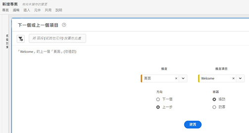

# Adobe Analytics 登陸頁面

Adobe Analytics 的登陸頁面會將 [!DNL Analysis Workspace] 和 [!DNL Reports & Analytics] 整合在 [!DNL Workspace] 傘狀結構下的單一介面和存取點中。此頁面包含專案經理首頁、更新的報表選單、現代化報表，以及可幫助您更有效地開始體驗的學習區段。以下是影片概觀：

>[!VIDEO](https://video.tv.adobe.com/v/334278/?quality=12)

## 全新登陸頁面功能 {#new-features}

| 功能 | 說明 | 螢幕擷圖 |
| --- | --- | --- |
| 展開[!UICONTROL 專案]表格至全螢幕 | 若要展開表格，僅需按一下漢堡選單圖示。這個動作將收合左側欄索引標籤。 |  |
| 自訂欄寬 | 以前欄寬是固定的。現在您可以透過拖曳欄分隔元來調整它。 |  |
| 重新排序釘選項目 | 若要將釘選項目上下移動，請按一下釘選項目旁的省略符號，並選取&#x200B;**[!UICONTROL 向上移動]**&#x200B;或是&#x200B;**[!UICONTROL 向下移動]**。 |  |
| 新表格欄位 | 按一下表格右上角的[!UICONTROL 自訂表格]圖示。新表格欄位包括： <ul><li>**[!UICONTROL 排程]**：設定為[!UICONTROL 開啟] (若專案已排程) 或[!UICONTROL 關閉] (若專案未排程)。按一下[!UICONTROL 開啟]連結可讓您查看排程專案的資訊。如果您是專案所有人，您還能[編輯專案排程](/help/analyze/analysis-workspace/curate-share/t-schedule-report.md)。</li><li>**[!UICONTROL 專案 ID]**：專案 ID 可用於偵錯專案。</li><li>**[!UICONTROL 最大日期範圍]**：更長的日期範圍會增加專案複雜性，並可能增加處理和載入次數。 </li><li>**[!UICONTROL 查詢數]**：專案載入時，向 Analytics 提出的請求總數。較高的專案查詢數會增加專案複雜性，並可能增加處理和載入次數。載入專案或傳送已排程專案後才能使用此資料。 </li></ul> |  |
| 按一下即可開啟報表。 | 之前您必須按兩下。 |  |
| **[!UICONTROL Report &amp; Analytics]** 報表的新連結 | <ul><li>**[!UICONTROL 報表]** > **[!UICONTROL 受眾]** > **[!UICONTROL 機器人]**</li><li>**[!UICONTROL 報表]** > **[!UICONTROL 受眾]** > **[!UICONTROL 機器人頁面]**<li>**[!UICONTROL 報表]** > **[!UICONTROL 參與度]** > **[!UICONTROL 即時]**</li></ul> |  |
| 全新現成可用的報表 | <ul><li>**[!UICONTROL 報表]** > **[!UICONTROL 最受歡迎]** > **[!UICONTROL 下一頁]**</li><li>**[!UICONTROL 報表]** > **[!UICONTROL 最受歡迎]** > **[!UICONTROL 上一頁]**</li><li>**[!UICONTROL 報表]** > **[!UICONTROL 參與杜]** > **[!UICONTROL 頁面分析]** > **[!UICONTROL 頁面摘要]**</li></ul>注意，這些報表為[!UICONTROL 工作區]格式，並需要設定和建置。輸出由高層級量度的面板、趨勢資料、[!UICONTROL 流量]視覺化等組成。您可修改這些報表並變更維度、維度項目等。這些報表也能在工作區面板下以面板的方式提供。 |  |
| **[!UICONTROL 建立專案]** 強制回應 | 當您按一下 **[!UICONTROL 建立專案]** 在工作區中，您可再次在 [!UICONTROL 空白專案] 和 [!UICONTROL 空白行動計分卡]. 您還可以從您公司已建立的任何範本中進行選擇。 |  |
| 也提供Customer Journey Analytics | CJA中也提供此登錄頁面，格式為已修改。 |  |

{style=&quot;table-layout:auto&quot;}

## 最上方選單結構 {#top-menu}

* Analytics 最上方選單：大多數報表現在都在左側欄的「[!UICONTROL 報表]」選單中。
* 左側欄有三個索引標籤：[!UICONTROL 專案]、[!UICONTROL 報表]和[!UICONTROL 學習]。

### 術語

* **[!UICONTROL 專案]** 是自訂的設計，可結合您所建立或其他人所建立及與您共用的資料元件、表格和視覺效果。 [!UICONTROL 專案]也指空白專案和空白移動計分卡。
* **[!UICONTROL 報表]**&#x200B;是指由 Adobe 預先建立的任何內容，例如在 Reports &amp; Analytics 中的報表和工作區中的範本。
* **[!UICONTROL 範本]**&#x200B;不再用作 Adobe 預先建立的工作區專案的詞彙。範本現在歸類在[!UICONTROL 報表]下面。[!UICONTROL 範本]這個詞彙仍用於您的公司建立的範本。

## 瀏覽至「[!UICONTROL 專案]」索引標籤。 {#navigate-projects}

「[!UICONTROL 專案]」可用作  [!UICONTROL 工作區] 首頁。「專案」索引標籤會顯示公司資料夾、您建立的任何個人資料夾、您的專案和行動計分卡。 使用此頁面來檢視、建立和修改資料夾、專案和行動計分卡。 如需詳細資訊，請參閱 [關於Analytics中的資料夾](/help/analyze/analysis-workspace/build-workspace-project/workspace-folders/about-folders.md).

>[!NOTE]
>
>下列數項設定會在工作階段期間和跨工作階段持續存在。 例如，您選取的索引標籤、選取的篩選器、選取的欄，以及欄排序方向。 搜索結果不是永久的。

| UI 元素 | 定義 |
| --- | --- |
| 編輯偏好設定 | 讓您[!UICONTROL 檢視教學課程]和[編輯使用者偏好設定](/help/analyze/analysis-workspace/user-preferences.md)。 |
| [!UICONTROL 新建] | 開啟專案模組，您可在此建立Analysis Workspace專案、Mobile計分卡或開啟公司範本。 |
| [!UICONTROL 顯示較少  顯示更多] | 在不顯示和顯示橫幅之間切換： |
| [!UICONTROL Analysis Workspace 專案] | 建立空白 [工作區專案](https://experienceleague.adobe.com/docs/analytics/analyze/analysis-workspace/home.html) 供您設計和建置。 |
| [!UICONTROL 行動計分卡] | 建立空白 [行動計分卡](https://experienceleague.adobe.com/docs/analytics/analyze/mobapp/curator.html) 供您設計和建置。 |
| [!UICONTROL 開啟訓練教學課程] | 開啟工作區訓練教學課程，引導您完成逐步教學課程中建立新入門專案的程式。 |
| [!UICONTROL 開啟版本注意事項] | 開啟最新 Adobe Experience Cloud 版本注意事項的 Adobe Analytics 部分。 |
| 篩選器圖示 | 依標籤、報表套裝、擁有者、類型和其他篩選器（我的、與我共用、我的最愛和已核准）進行篩選 |
| 搜尋列 | 搜索表中的所有列。 |
| 選取方塊 | 選擇一個或多個項目以顯示可執行的項目管理操作： **刪除**, **共用**, **重新命名**, **複製**, **取消固定**, **上移**, **下移**, **標籤**, **核准**, **匯出CSV**，和 **移至**. 您可能沒有執行所有列出動作的權限。 |
| [!UICONTROL 我的最愛] | 將星號新增至最喜愛的專案或資料夾旁，以用作篩選。 |
| [!UICONTROL 名稱] | 識別專案的名稱。 |
| 釘選圖示 | 固定項目，使它們始終出現在清單的頂部，但您可以按順序上下移動它們來重新調整順序。 使用刪節號選項菜單並選擇 **上移** 或 **下移** 在清單中。 |
| 資訊 (i) 圖示 | 顯示有關項目的以下資訊：類型、專案角色、擁有者、說明，以及共用給誰。 此資訊也會指明誰可以[編輯或重複](https://experienceleague.adobe.com/docs/analytics/analyze/analysis-workspace/curate-share/share-projects.html)此專案。 |
| 省略 (...) | 顯示您可以執行的項目管理操作： **刪除**, **共用**, **重新命名**, **複製**, **取消固定**, **上移**, **下移**, **標籤**, **核准**, **匯出CSV**，和 **移至**. 您可能沒有執行所有列出動作的權限。 |
| [!UICONTROL 類型] | 指出此類型是工作區專案、行動計分卡還是資料夾。 |
| [!UICONTROL 標記] | 標籤專案以將其組織成群組。 |
| [!UICONTROL 專案角色] | 標識項目角色：您是專案擁有者，以及您是否擁有編輯或複製專案的權限。 |
| [!UICONTROL 報告套裝] | 識別與專案相關聯的報表套裝。 面板內的表格和視覺效果是從面板右上角所選報表套裝衍生而得。該報表套裝也會決定左側邊欄內會有哪些元件。在專案中，您可以使用一或多個報表套裝，多寡視您的分析使用情形而定。報表套裝清單是根據相關性來分類。Adobe 是根據目前使用者最近使用套裝情形和多常使用套裝，以及組織內多常使用套裝等來定義關聯性。 |
| [!UICONTROL 所有者] | 識別建立專案的人員。 |
| [!UICONTROL 上次開啟時間] | 識別您上次開啟專案的日期。 |
| 自訂表格圖示 | 選擇要在表中查看的列。 若要從專案清單中新增或移除欄，請按一下欄圖示( )，然後選取或取消選取欄標題。 |
| 顯示：資料夾與專案或所有專案 | 更改表格上的視圖設定，以根據資料夾組織顯示資料夾和項目 **或** 以無組織的清單顯示所有專案。 |
| &lt; (返回按鈕) | 將您傳回至工作區專案或報表中最新的登錄頁面設定。 離開登錄頁面時您擁有的頁面設定會在您返回時持續存在。 |

### 不再使用專案管理員頁面 {#deprecate-pm-page}

隨著新登錄頁面的發行，我們不再提供「元件管理員」下方所列的專案管理員。 新的登錄頁面會處理舊「專案管理員」頁面的所有功能，以及更多功能。

「專案管理員」頁面的一個常見使用案例是檢視您的所有專案。 若要使用篩選邊欄在新登陸頁面上檢視所有專案，請選取 **其他篩選** 然後選取 **全部顯示**.

如果您位於「資料夾與專案」檢視中，會出現一個強制回應視窗，詢問您是否要切換至「所有專案」檢視，這可讓您在可能組織的任何資料夾之外，更輕鬆地檢視所有專案。   選擇 **切換至「所有專案」檢視** 以便更好地檢視您有權存取的所有專案。

## 瀏覽至「[!UICONTROL 報表]」標記。 {#navigate-reports}

「[!UICONTROL 報表]」標記可整合三套報表：

* 預先建立的[!UICONTROL 工作區] 範本；即先前位於「[!UICONTROL 工作區] > [!UICONTROL 專案] > [!UICONTROL 全新]」的範本。Adobe 不再於此內容中使用「範本」一字。
* 多數預先建立的報表在先前 Adobe Analytics [!UICONTROL 報表]上方功能表的下面。這些報表現在顯示在 [Analysis Workspace](https://experienceleague.adobe.com/docs/analytics/analyze/analysis-workspace/home.html?lang=zh-Hant) 中。

>[!IMPORTANT]
>
>在「報表」下，只有當您將新報表標記為「我的最愛」時，才會顯示「我的最愛」檔案夾。沒有預先存在的 Reports &amp; Analytics「我的最愛」移轉過來。

如前面所提，此處只提供先前在 Reports &amp; Analytics 中分類的最常用報告。一小部分很少使用或不再相關的報表未移轉過來。如需詳細資訊，請參閱以下的常見問題。

### 選單和子選單 {#menus}

以下是選單及其子選單。 如果找不到特定報表，請執行「搜尋頁面」後尋找。

| 功能表項目 | 在此功能表項目下的報表 |
| --- | --- |
| **[!UICONTROL 最受歡迎]** | <ul><li>訓練教學課程 (預存的工作區範本)</li><li>頁面 (哪些是我的主要頁面？)</li><li>頁面瀏覽數 (我產生多少的網頁流量？)</li><li>造訪數 (我有多少造訪數？)</li><li>訪客數 (我有多少位訪客？)</li><li>關鍵量度 (我的最重要量度表現如何？)</li><li>網站區段 (我的網站哪些區段產生最多頁面瀏覽數？)</li><li>下一頁 (我的訪客前往下一頁是什麼？)</li><li>前一頁 (我的訪客回到前一頁是什麼？)</li><li>行銷活動 (哪些行銷活動在驅動我的關鍵量度？)</li><li>產品 (哪些產品在驅動我的關鍵量度？)</li><li>上次接觸管道 (哪些特定的上次接觸管道表現最佳？)</li><li>上次接觸管道詳細資訊 (哪些特定的上次接觸管道表現優於其他管道？)</li><li>收入 (我的收入表現如何？)</li><li>訂單 (我的訂單表現如何？)</li><li>單位 (我售出多少單位？)</li></ul> |
| **[!UICONTROL 參與]** | <ul><li>關鍵量度 (我的最重要量度表現如何？)</li><li>頁面瀏覽數 (我產生多少頁面瀏覽數？)</li><li>頁面 (哪些是我的主要頁面？)</li><li>造訪數 (我有多少造訪數？)</li><li>訪客數 (我有多少位訪客？)</li><li>每次造訪所花時間 (我的使用者最新造訪時會花多久時間？)</li><li>事件前停留的時間 (我的使用者在成功事件前會停留多久時間？)</li><li>網站區段 (我的網站哪些區段產生最多頁面流量？)</li><li>Web 內容使用 (最常使用且吸引使用者的哪些內容？)</li><li>媒體內容使用 (最常使用且吸引使用者的哪些內容？)</li><li>接下來和先前的頁面流量 (我的訪客接下來/之前走過哪些路徑？)</li><li>流失 (我可以從哪裡看出數位財產的流失？)</li><li>跨裝置分析 (使用 Analysis Workspace 中的跨裝置分析)</li><li>網頁保留率 (我的忠實使用者是哪些人？他們都進行什麼活動？)</li><li>媒體音訊使用量 (音訊使用量有哪些趨勢？最佳量度是哪些？)</li><li>媒體、造訪間隔、頻率、忠誠度 (誰是我的忠實讀者？)</li><li>頁面分析 > 重新載入 (哪些頁面產生最多重新載入？)</li><li>頁面分析 > 每個頁面所花時間 (我的使用者在我的頁面會花多久時間？)</li><li>登入和退出 > 登入頁面 (哪些是我的熱門登入頁面？)</li><li>登入和退出 > 原始登入頁面 (我的使用者最初從哪個面登入？)</li><li>登入和退出 > 單頁存取 (哪些頁面產生最多單頁存取？)</li><li>登入和離開 > 退出頁面 (哪些是我的熱門退出頁面？)</li></ul> |
| **[!UICONTROL 轉換]** | <ul><li>產品 > 產品 (哪些產品可驅動我的關鍵量度？)</li><li>產品 > 產品績效 (哪些產品績效最好？)</li><li>產品 ＞ 類別 (哪些是我的最佳績效產品類別？)</li><li>購物車 ＞ 購物車 (有多少使用者會將產品加入購物車？)</li><li>購物車 > 購物車檢視 (我的訪客會檢視幾次他們的購物車？)</li><li>購物車 > 購物車產品加入 (使用者會多常將產品加入購物車？)</li><li>購物車 > 購物車產品移除 (使用者會多常從購物車移除產品？)</li><li>購買 > 收入 (我的收入表現如何？)</li><li>購買 > 訂單 (我的訂單表現如何？)</li><li>購買 > 單位 (我售出多少單位？)</li><li>[Magento：行銷和商務](https://experienceleague.adobe.com/docs/analytics/analyze/analysis-workspace/build-workspace-project/starter-projects.html#commerce)</li></ul> |
| **[!UICONTROL 對象]** | <ul><li>人數量度 (有多少人正與我的品牌互動？)</li><li>訪客資料 > 地點概覽 (哪些地點會促使使用者的最多使用量)</li><li>訪客資料 > 地理區段 > 地理國家、地理美國、地理區域、地理城市、地理美國 DMA (我的訪客來自哪些地理位置？)</li><li>訪客資料 > 語言 (我的使用者偏好哪種語言？)</li><li>訪客資料 > 時區 (造訪我網站的使用者來自哪些時區？)</li><li>訪客資料 > 網域 (我的訪客使用哪些 ISP 來存取我的網站？)</li><li>訪客資料 > 頂層網域 (哪些網域在驅動流量存取我的網站？)</li><li>訪客資料 > 技術 > 技術概覽 (人們使用哪些技術來存取我的網站？)</li><li>訪客資料 > 技術 > 瀏覽器、瀏覽器類型、瀏覽器寬度、瀏覽器高度 (人們使用哪家公司的瀏覽器、哪個瀏覽器版本、哪個瀏覽器寬度和高度來存取我的網站？)</li><li>訪客資料 > 技術 ＞ 作業系統、作業系統類型 (我的訪客使用哪個作業系統和哪個作業系統版本？)</li><li>訪客資料 > 技術 > 行動電信業者 (我的訪客使用哪些行動電信業者來存取我的網站？)</li><li>訪客保留率 > 回訪頻率 (我的使用者在最近造訪和上次造訪之間相隔多久時間？)</li><li>訪客保留率 > 回訪造訪 (我的網站有多少回訪使用者？)</li><li>訪客保留率 > 造訪次數 (哪個造訪次數貯體可驅動我的大部分關鍵量度？)</li><li>訪客保留率 > 銷售週期 > 客戶忠誠度 (我的使用者屬於哪種忠誠度等級？)</li><li>訪客保留率 > 銷售週期 > 第一次購買以前的天數 (我的使用者在首次造訪和首次購買之間相隔多少天？)</li><li>訪客保留率 > 銷售週期 > 自上次購買以來的天數 (我的使用者在最近造訪和上次購買之間相隔多少天？))</li><li>訪客保留率 > 行動 > 裝置和裝置類型 (我的訪客使用哪些裝置和裝置類型？)</li><li>訪客保留率 > 行動 > 製造商 (我的訪客使用哪些行動裝置廠商？)</li><li>訪客保留率 > 行動 > 螢幕尺寸、螢幕高度、螢幕寬度 (我的訪客使用哪種行動螢幕尺寸/高度/寬度？)</li><li>訪客保留率 > 行動 > [行動應用程式使用情形](https://experienceleague.adobe.com/docs/analytics/analyze/analysis-workspace/build-workspace-project/starter-projects.html#mobile)</li><li>訪客保留率 > 行動 > [行動應用程式旅程](https://experienceleague.adobe.com/docs/analytics/analyze/analysis-workspace/build-workspace-project/starter-projects.html#mobile)</li><li>訪客保留率 > 行動 > [行動應用程式量度](https://experienceleague.adobe.com/docs/analytics/analyze/analysis-workspace/build-workspace-project/starter-projects.html#mobile)</li><li>訪客保留率 > 行動 > [行動應用程式傳送訊息](https://experienceleague.adobe.com/docs/analytics/analyze/analysis-workspace/build-workspace-project/starter-projects.html#mobile)</li><li>訪客保留率 > 行動 > [行動應用程式效能](https://experienceleague.adobe.com/docs/analytics/analyze/analysis-workspace/build-workspace-project/starter-projects.html#mobile)</li><li>訪客保留率 > 行動 > [行動應用程式保留率](https://experienceleague.adobe.com/docs/analytics/analyze/analysis-workspace/build-workspace-project/starter-projects.html#mobile)</li></ul> |
| **[!UICONTROL 贏取]** | <ul><li>行銷管道 > 首次接觸管道、首次接觸管道詳細資料 (首次接觸管道，以及哪個特定的首次接觸管道表現最好？)</li><li>行銷管道 > 首次的上次接觸管道、首次的上次接觸管道詳細資料 (哪個上次接觸管道，以及哪個特定的上次接觸管道表現最好？)</li><li>行銷活動 > 行銷活動 (哪些行銷活動在驅動我的關鍵量度？)</li><li>行銷活動 > 行銷活動績效 (哪些行銷活動帶來最多收入？)</li><li>行銷活動 > 追蹤程式碼 (哪些行銷活動追蹤程式碼表現最好？)</li><li>[網頁收購](https://experienceleague.adobe.com/docs/analytics/analyze/analysis-workspace/build-workspace-project/starter-projects.html#web)</li><li>[行動收購](https://experienceleague.adobe.com/docs/analytics/analyze/analysis-workspace/build-workspace-project/starter-projects.html#mobile)</li><li>[Advertising Analytics：付費搜尋](https://experienceleague.adobe.com/docs/analytics/analyze/analysis-workspace/build-workspace-project/starter-projects.html#advertising)</li><li>搜尋關鍵字 - 全部、付費、免費 (哪個搜尋關鍵字和付費/免費搜尋關鍵字可讓我的關鍵量度效果最好？)</li><li>搜尋引擎 - 全部、付費、免費 (哪個搜尋引擎和付費/免費搜尋引擎可讓我的關鍵量度效果最好？)</li><li>全部搜尋頁面排名 (我的使用者從哪個搜尋頁面造訪我的網站？)</li><li>反向連結網域 (哪些網域會增進我的網站流量？)</li><li>原始反向連結網域 (使用者造訪我的網站前會去的第一個網域是哪裡？)</li><li>反向連結 (使用者從哪些網址點進我的網站？)</li><li>反向連結類型 (我的參照 URL 屬於哪個類別？)</li></ul> |

### 範本 (現在稱之為報表) 位置 {#templates}

| 報表 (範本) 名稱 | 報表位置 |
| --- | --- |
| 訓練教學課程 | 最受歡迎 > 訓練教學課程 |
| 網頁內容使用量 | 參與度 > 網頁內容使用量 |
| 媒體內容使用量 | 參與度 > 媒體內容使用量 |
| 跨裝置分析 | 參與度 > 跨裝置分析 |
| 網頁留存率 | 參與度 > 網頁留存率 |
| 媒體音訊使用量 | 參與度 > 媒體音訊使用量 |
| 媒體造訪間隔、頻率、忠誠度 | 參與度 > 媒體造訪間隔、頻率、忠誠度 |
| ITP 影響 | 參與度 > ITP 影響 |
| 產品績效 | 轉換率 > 產品 > 產品績效 |
| Magento: 行銷與商務 | 轉換率 > Magento: 行銷與商務 |
| 人員量度 | 受眾 > 使用者量度 |
| 位置概覽 | 受眾 > 訪客設定檔 > 位置概覽 |
| 技術概覽 | 受眾 > 訪客設定檔 > 技術 > 技術概覽 |
| 行動應用程式使用情形 | 受眾 > 行動裝置 > 行動應用程式使用情況 |
| 行動應用程式歷程 | 受眾 > 行動裝置 > 行動應用程式歷程 |
| 行動應用程式量度 | 受眾 > 行動裝置 > 行動應用程式訊息 |
| 行動應用程式績效 | 受眾 > 行動裝置 > 行動應用程式績效 |
| 行動應用程式留存率 | 受眾 > 行動裝置 > 行動應用程式留存率 |
| 促銷活動績效 | 獲取 > 促銷活動 > 促銷活動績效 |
| 行動裝置獲取 | 獲取 > 行動裝置獲取 |
| 網頁獲取 | 獲取 > 網頁獲取 |
| Advertising Analytics: 付費搜尋 | 獲取 > Advertising Analytics: 付費搜尋 |

### 使用「報表」標記。 {#use-reports}

若您是 Reports &amp; Analytics 的現有使用者，這裡將簡單介紹如何使用您習慣使用的報表以及工作區中現在顯示的報表。報表類似於現有的範本：如果您對報表進行變更，則在離開或前往其他報表時，您會看到要儲存/捨棄報表的提示。如果您確實想要儲存變更，則報表會儲存為新專案。

1. 前往「[!UICONTROL 報表]」標記。
1. 選取您要檢視的報表，例如，在「[!UICONTROL 最受歡迎]」下方，選取「[!UICONTROL 頁面]」報表。
1. 在右邊，按一下「**[!UICONTROL 開啟報表]**」。

   

1. 「頁面」報表 (如 Analysis Workspace 中所顯示) 會顯示兩種[視覺效果](/help/analyze/analysis-workspace/visualizations/freeform-analysis-visualizations.md) ([橫條圖](/help/analyze/analysis-workspace/visualizations/bar.md)和[摘要數字](/help/analyze/analysis-workspace/visualizations/summary-number-change.md)) 和一個 [自由表格](/help/analyze/analysis-workspace/visualizations/freeform-table/freeform-table.md)。使用的量度為發生次數。
1. 在此處，您有多個選項。以下是其中一些選項：

   * 您可照原樣使用報表。
   * 您可以將一個或多個區段拖到上方的區段放置區。例如，拖動[!UICONTROL 行動客戶]區段，然後查看最後會如何變化。
   * 您可以前往右上方的行事暦並變更日期範圍。
   * 您可以新增維度劃分、在其他量度中拖動，並且通常可以您希望的方式自訂報表。

### 建立自訂公司報表 {#company-report}

為登入公司中供其他人使用而建立和儲存的自訂報表，稱為公司報表。 先前建立的公司報表和新建立的公司報表會列在建立專案模式中，如下所示。

若要建立新的公司報表，

1. 將工作區建置為您想要的狀態。
1. 開啟「[!UICONTROL 專案]」選單，並按一下「**[!UICONTROL 另存為公司報表…]**」。

   

1. 將所有想要的欄位新增到模組並儲存。

   此報表會新增至「建立專案」模式中的「公司報表」清單中，供登入公司的使用者使用。

更多學習選項：

* 請注意，在您開啟的任何報表左上方，您可以觀看關於 Analysis Workspace 概覽的 20 分鐘影片。
* 我們建議新使用者觀看[訓練教學課程](https://www.youtube.com/watch?v=lCH1Kl1q9Wk)視頻，以逐步了解如何建立新專案。
* 以下為[完成 Analysis Workspace 文件](/help/analyze/analysis-workspace/home.md)的連結。
* 以下是 [Analysis Workspace 的 YouTube 完整播放清單](https://www.youtube.com/playlist?list=PL2tCx83mn7GuNnQdYGOtlyCu0V5mEZ8sS)。

## 瀏覽「學習」標記。 {#navigate-learning}

「學習」頁面包含實作影片導覽和教學課程，還含有多個文件連結。

* [!UICONTROL 工作區基礎課程]導覽可讓您直接進入工作區，並逐步了解工作區版面以及在何處尋找/執行最常用的操作。 此導覽也可以直接在工作區中重新啟動，方法是透過面板標題的工具提示快覽視窗進行。
* 按一下影片/導覽，可新增「**[!UICONTROL 已檢視]**」標記。此標記可幫助您透過學習內容追蹤您的進度。您可以按一下此標記，然後標記會消失，以防您尚未完成內容。
* 影片模式的「**[!UICONTROL 了解更多]**」按鈕可帶您進入 Adobe Experience League 文件頁面，其中有關於您剛才觀看影片的更多內容。 **[!UICONTROL 觀看更多影片]**&#x200B;可帶您前往 Analysis Workspace YouTube 完整播放清單。

## 設定您的登錄頁面 {#set-landing}

使用者可以設定他們偏好的登陸頁面。

1. 前往「Analytics > [!UICONTROL 元件] > [!UICONTROL 偏好設定] > [!UICONTROL 一般]」。
1. 確認您偏好哪個登陸頁面：

   

## 隱藏報表標籤 {#hide-reports}

管理員可以為其組織內的所有使用者隱藏「報表」標籤。

1. 前往「[!UICONTROL Analytics] > [!UICONTROL 元件] > [!UICONTROL 偏好設定] > [!UICONTROL 公司]」。
1. 檢查&#x200B;**[!UICONTROL 隱藏報表標籤]**。

## 登陸頁面常見問答 {#landing-faq}

| 問題 | 回答 |
| --- | --- |
| 我以前在[!UICONTROL 工作區]看到的範本在哪裡？ | 這些範本分類列在「[!UICONTROL 報表]」標記下。 |
| 我在 Beta 版計劃 UI 中進行的工作是否會移轉至生產環境的[!UICONTROL 工作區]體驗？ | 是，在 Beta 版中完成的任何工作都會移轉至舊有/現有的[!UICONTROL 工作區]體驗。 |
| 我現有的 [!DNL Reports & Analytics]「我的最愛」是否可移轉過來？ | 否，這些不會移轉過來。但是，[!UICONTROL 工作區]中任何「我的最愛」會移轉過來。 |
| 我可釘選的專案數量是否有上限？ | 沒有，您可以釘選的專案數量沒有限制。 |
| 管理員是否可以為他們的使用者指定此登陸頁面？ | 否，管理員不可以代表他們的使用者指定此登陸頁面。 個人使用者必須自己開啟切換功能。 |
| [!DNL Reports & Analytics] 已有的全部報表是否仍然可用？ | 否，以下報表已根據整體使用資料逐步淘汰： <ul><li>任何使用者 eVars/props/events/classifications<li>我的建議報表</li><li>每小時/每日/每週/每月/每季/每年不重複訪客</li><li>每日每週/每月/每季/每年不重複訪客</li><li>操作名稱深度</li><li>操作名稱摘要</li><li>新增儀表板</li><li>年齡</li><li>音訊支援</li><li>帳單資訊</li><li>頁面點按次數</li><li>色彩深度</li><li>Cookie 支援</li><li>Cookie</li><li>連線類型</li><li>創作元素</li><li>信用卡類型</li><li>交叉銷售</li><li>自訂事件漏斗</li><li>自訂連結</li><li>Customer ID</li><li>週中的日</li><li>登入操作名稱</li><li>退出操作名稱</li><li>退出連結</li><li>流失</li><li>下載檔案</li><li>在商店中尋找</li><li>完整路徑</li><li>性別</li><li>點擊 ype VISTA 規則</li><li>影像支援</li><li>Java</li><li>JavaScript</li><li>JavaScript 版本</li><li>管理書籤</li><li>管理儀表板</li><li>監控色彩深度</li><li>監控解決方案</li><li>電子報註冊</li><li>下一步操作名稱</li><li>下一步操作名稱流程</li><li>Null 搜尋</li><li>作業系統</li><li>訂購檢閱</li><li>一天頁面</li><li>找不到頁面</li><li>Pathfinder</li><li>路徑長度</li><li>上一步操作名稱</li><li>上一步操作名稱流程</li><li>產品活動</li><li>產品費用</li><li>產品部門</li><li>產品詳細目錄類別</li><li>產品名稱</li><li>產品評論</li><li>產品季節</li><li>產品分享</li><li>產品縮放</li><li>重新載入</li><li>搜尋</li><li>伺服器</li><li>單頁造訪次數</li><li>運送資訊</li><li>網站階層</li><li>社交提及次數</li><li>每日時間</li><li>在操作名稱上逗留的時間</li><li>影片支援</li><li>訪客狀態</li></ul> |
