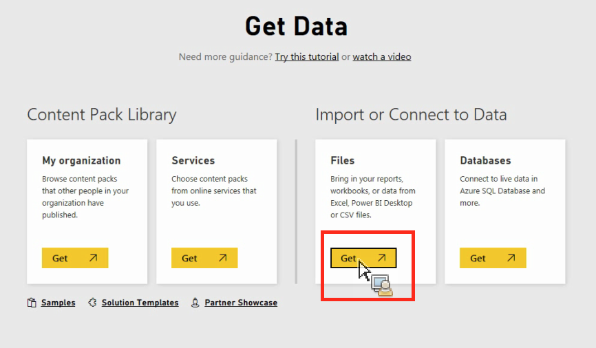

# 手動將資料匯入 Power BI

{{legacy-arb}}

如果您要透過 Power BI 手動匯入 Analytics 資料，請依照下列指示操作。

1. 在Power BI中，按一下左下角畫面中的&#x200B;**[!UICONTROL 取得資料]**。
1. 在&#x200B;**[!UICONTROL 匯入或連線至資料]** > **[!UICONTROL 檔案]**&#x200B;下，按一下&#x200B;**[!UICONTROL 取得]**。

   

1. 按一下「本機檔案」。

   

1. 選擇要上傳的檔案，然後按一下&#x200B;**[!UICONTROL 開啟]**。
1. 按一下&#x200B;**[!UICONTROL 將您的Excel檔案上傳至Power BI]**&#x200B;下的&#x200B;**[!UICONTROL 上傳]**。

   

1. 畫面應會出現「檔案已上傳」的訊息。
