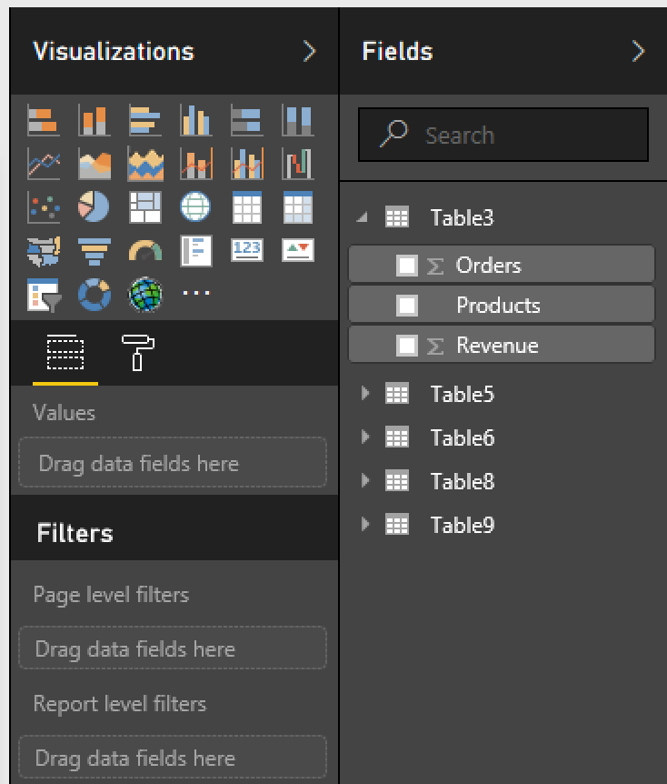
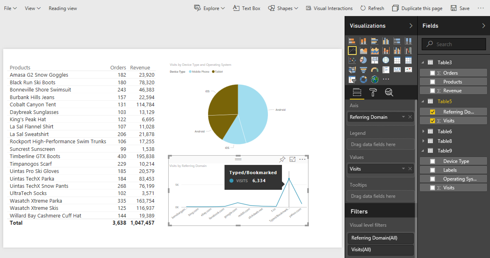

# 發佈至 Power BI - 概觀

{{legacy-arb}}

Microsoft Power BI 是一套商業分析儀表板，可分析資料及共用分析結果。Adobe Analytics 與 Power BI 整合可讓您將 Microsoft Power BI 內的 Report Builder 分析資料視覺化，並在整個組織中輕鬆共用該資料。

身為分析師，您可使用電子郵件或 ftp 為 Report Builder 活頁簿分發建立排程。現在，您可以讓企業相關人士在各種平台與裝置皆可使用的網頁式環境中，存取 (從其 Power BI 帳戶內部) 精確且最新的資料。

結合 Report Builder 的報告產生功能與 Power BI 的視覺效果功能後，組織中的所有人便能更容易取得資訊。使用 Power BI，您還可以將 Adobe Analytics 與其他資料來源整合 (例如銷售點、CRM 來源)，以發掘不重複客戶分析資料、關聯及商機。

## 系統要求 {#section_0B71092D853446F38FA36447DAC0D32B}

* [已安裝](/help/analyze/legacy-report-builder/setup/t-install-arb.md) Adobe Report Builder 5.5
* 可讓您登入 Power BI 的有效 Microsoft 帳戶

## 將活頁簿發佈至 Power BI {#section_21CA66229EC240D49594A9A7D3FBA687}

已排程的活頁簿為格式化的 Excel 試算表，其中填入來自 Adobe Analytics 的資料，並以定期排程的方式分發。

**在 Report Builder 中發佈活頁簿**

1. 在 Report Builder 中產生活頁簿並加以儲存。
1. 在 Report Builder 工具列上，按一下&#x200B;**[!UICONTROL 「排程]** > **[!UICONTROL 新增」]**。

1. 在「基本排程精靈」中，勾選&#x200B;**[!UICONTROL 「將活頁簿發佈至 Microsoft Power BI」]**&#x200B;旁邊的核取方塊。

   

1. 指定您的電子郵件並立即傳送，或者指定排程頻率 (每小時、每日等等)。
1. 按一下&#x200B;**[!UICONTROL 「確定」]**&#x200B;即可發佈。
1. 系統會要求您登入 Microsoft 帳戶。請提供您的憑證。
1. Report Builder 活頁簿隨即列入排程並發佈至 Power BI。

   在 Report Builder 排程程序使用更新的 Analytics 資料重新整理活頁簿後，透過每個已排程的例項，系統就會將活頁簿發佈至 Microsoft Power BI。

**在 Power BI 中檢視 Report Builder 活頁簿資料**

1. 在 Power BI 中，連按兩下[!UICONTROL 「活頁簿」]功能表下的活頁簿。

   

1. 您現在可以檢視活頁簿儀表板資料。

1. 您可以接著釘選此活頁簿的某個區域，以將其包含在任何 Power BI 儀表板中。

## 將活頁簿中所有格式化表格以 Power BI 資料集表格形式發佈。 {#section_7C54A54E75184DD6BAEF4ACCE241239A}

>[!NOTE]
>
> 如果活頁簿含有巨集，系統將會停用「以 Power BI 資料集表格形式發佈活頁簿中所有格式化表格」功能。

您可以只匯入活頁簿中所有格式化表格的內容，不能匯入整個活頁簿。

**使用案例**：您有 Excel 活頁簿，可從多個 Report Builder 請求帶入資料，也可建立含有大量公式的摘要表格。您可以只將摘要表格匯入 Power BI 中，並為其建立視覺效果。

**在 Report Builder 中發佈格式化表格**

1. 在 Report Builder 中，產生含有標題列且其後接著一列資料的資料表格。
1. 選取該表格，然後從[!UICONTROL 「首頁」]功能表選取&#x200B;**[!UICONTROL 「格式化為表格」]**。表格依預設會有名稱 (表格 1、表格 2 等等)，但您可以在[!UICONTROL 「設計」]功能中變更表格名稱。

1. 在 Report Builder 工具列上，按一下&#x200B;**[!UICONTROL 「排程]** > **[!UICONTROL 新增」]**。

1. 在「基本排程精靈」中，按一下&#x200B;**[!UICONTROL 「進階排程選項」]**。
1. 在[!UICONTROL 「排程精靈 – 進階」]中的&#x200B;**[!UICONTROL 「發佈選項」]**&#x200B;索引標籤上，勾選&#x200B;**[!UICONTROL 「以 Power BI 資料集表格形式發佈所有格式化表格」]**&#x200B;旁邊的核取方塊。

   

1. (選用) 在 Power BI 中，您可以自訂已發佈資產的名稱。如果您使用版本編號作為活頁簿名稱的一部分 (例如 myworkbook_v1.1.xlsx)，但不希望版本號碼出現在已發佈之 Power BI 資產的名稱中，就可以使用這個方式。這樣做的好處是，當版本號碼改變時，已發佈的資產不會變更(您可前往[這裡](/help/analyze/legacy-report-builder/c-publish-power-bi/specifications-limits.md)檢視規格)。

**在 Power BI 中檢視表格資料**

1. 在 Power BI 中，前往&#x200B;**[!UICONTROL 「工作區]** > **[!UICONTROL 資料集」]**&#x200B;功能表。

   

1. 選取您已發佈的資料集，然後按一下旁邊的[!UICONTROL 「建立報告」]圖示。請注意，表格將會以「欄位」的形式顯示。

   

1. 選取表格以及與其相關的欄。

   

1. 從[!UICONTROL 「視覺效果」]功能表，您可以選取要在 Power BI 中將表格視覺化的方式。例如，您可以選擇以折線圖呈現資料：

   

1. 從這裡，您可以透過此資料集表格建立視覺效果。

## 以 Power BI 資料集表格形式發佈所有 Report Builder 請求 {#section_0C26057C7DBB4068A643FDD688F6E463}

您可以將所有請求轉換成資料集表格，並在這些表格上方建立視覺效果。

>[!IMPORTANT]
>
>如果活頁簿含有超過 100 個請求，系統只會將前 100 個請求發佈至 Power BI。另外，對於每個發佈至 Power BI 的請求，系統將只會發佈前 10,000 列資料。因此，雖然這些請求會順利透過排程傳遞，但可發佈至 Power BI 的範圍是有限的。

1. 在 Report Builder 中，使用 Report Builder 請求開啟或建立活頁簿。
1. 在 Report Builder 工具列上，按一下&#x200B;**[!UICONTROL 「排程]** > **[!UICONTROL 新增」]**。

1. 在「基本排程精靈」中，按一下&#x200B;**[!UICONTROL 「進階排程選項」]**。
1. 在「[!UICONTROL 排程精靈 – 進階]」中 (在「**[!UICONTROL 發佈選項]**」標籤上)，勾選後述旁邊的核取方塊：**[!UICONTROL 以 Power BI 資料集表格形式發佈所有 Report Builder 請求]** 

1. 按一下&#x200B;**[!UICONTROL 「確定」]**。

**在 Power BI 中檢視請求資料**

系統將會以資料集中的表格發佈每個已排程的 Report Builder 請求。每個請求表格皆以請求中的主要維度命名，且具有一個[!UICONTROL 「報告套裝」]和一個[!UICONTROL 「區段」]欄。

1. 在 Power BI 中，前往&#x200B;**[!UICONTROL 「工作區]** > **[!UICONTROL 資料集」]**&#x200B;功能表。

1. 選取您已發佈的請求，然後按一下旁邊的[!UICONTROL 「建立報告」]圖示。

   請注意，請求會以表格的形式顯示在[!UICONTROL 「欄位」]功能表中。

   

   >[!NOTE]
   >
   >不論如何設定活頁簿中 Report Builder 請求的編排方式 (樞紐配置、自訂配置、隱藏部分欄)，Report Builder 會一律以相同的二維單一標題列格式發佈請求：「日期」、「維度」、「量度」、「報告套裝」、「區段」。

1. 另請注意，其中有一個名為&#x200B;**[!UICONTROL 「圖例」]**&#x200B;的額外表格。如果您從 Report Builder 上下文擷取請求，可能很難記住每個請求各代表什麼。而「圖例」表格的作用就是可讓您看到「表格 ID」中每個請求的名稱。您也可以新增其他「圖例」欄，以便完整檢視請求。

   
