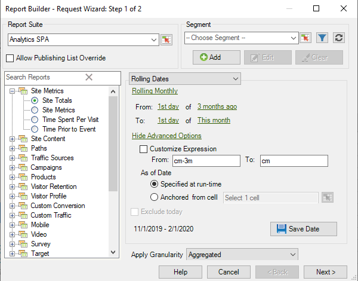

# 自訂的日期運算式

{{legacy-arb}}

您可以建立自訂運算式來指定複雜的日期範圍。

當您建立運算式時，請參閱日曆以正確指定周數和天數。 Excel 有數種內建的功能可讓您計算日期間的天數、工作日數、月數及年份數。您可以在公式中使用這些功能來計算其他間隔，如週數和季數。

**啟用自訂運算式**

下列範例顯示如何啟用&#x200B;**[!UICONTROL 遞延日期]**&#x200B;的自訂運算式。

1. 在[!UICONTROL 請求精靈：步驟1]，不要使用&#x200B;**[!UICONTROL 預設日期]**，請選取&#x200B;**[!UICONTROL 遞延日期]**。

   

1. 切換為每週、每月、每季或每年滾動。 請注意下列選項如何變更。
1. 如需更多自訂選項，請按一下[顯示進階選項]。****

   ![熒幕擷圖反白顯示[顯示進階選項]。](assets/rolldates2.png)

1. 例如，如果您將上述日期變更為每月滾動，從三個月前的第一天變更為本月的第一天，則進階選項部分的日期會自我更新以反映這一點：

   

1. 啟用&#x200B;**[!UICONTROL 自訂運算式]**。 選取&#x200B;**[!UICONTROL 遞延日期]**&#x200B;下的選項，即可輕鬆檢視自訂日期運算式的語法。

   

   您可以使用進階選項來混合及比對自訂日期運算式。 例如，如果您想檢視從一年的第一天到最後一個滿月的月底的資料，可以輸入下列內容： `From: cy` `To: cm-1d`。 在精靈中，這些日期會顯示為1/1/2020-1/31/2020。
