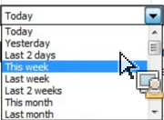
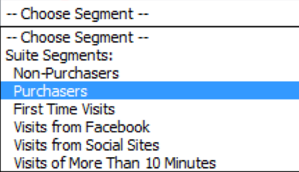

# 互動式控制項

{{legacy-arb}}

「互動式控制項」可讓您直接從工作表編輯一或多個請求的區段與日期範圍。這可讓您在更新Report Builder請求時擁有更多彈性。

分析師通常會建立活頁簿，並將這些活頁簿與行銷組織共用。互動式控制項的建立就是為了因應這項常見的工作流程。互動式控制項讓行銷人員不需深入瞭解Report Builder的運作方式，也能夠修改及重新整理請求。 (請注意，若要重新整理請求，活頁簿收件者必須是Report Builder使用者。) 這些控制項可在排程活頁簿內運作。 目前有兩種互動式控制項可供使用：

* 滾動日期範圍
* 區段

>[!IMPORTANT]
>
>您必須先安裝 Report Builder v5.0，互動式控制項才能正常運作。>
>* 如果您在Windows上執行Microsoft Excel，但執行較低版本的Report Builder，或如果您未安裝Report Builder：您可以變更互動式控制項中的值，但控制項不會重新整理相關請求，也不會更新請求的相關引數。
>* 如果您在 Mac 上執行 Excel，變更控制項中的值後，畫面會顯示以下訊息：「找不到巨集 ‘Adobe.ReportBuilder.Bridge.FormControlClick.Event’。」
>

>[!WARNING]
>
>請勿竄改控制項名稱(若要查看名稱，請將焦點設定在控制項上，控制項名稱便會出現在 Excel 格線的左上角上方)。

## 實作互動式日期範圍控制項 {#section_39B228F2D2C44985863D31424C953280}

1. 在請求精靈的步驟 1 選取項目，例如&#x200B;**[!UICONTROL 「頁面」]**&#x200B;報表。
1. 在&#x200B;**[!UICONTROL 「常用的日期」]**&#x200B;下拉式清單旁，按一下&#x200B;**[!UICONTROL 「控制設定」]**&#x200B;圖示：

   

1. 在「控制設定」對話方塊中，選取所有您想要在互動式控制項中顯示的日期範圍項目。此外，請指定控制項的左上方儲存格位置。

   

1. 請注意「項目選取時自動重新整理連結的請求」選項。

   * 如果勾選此選項，所有使用該控制項的請求都會重新整理。
   * 如果未勾選此選項，則會更新相關的請求參數，但不會重新整理請求。

1. 按一下&#x200B;**[!UICONTROL 「確定」]**。控制項會出現在您指定的儲存格位置：

1. 您現在可以變更日期範圍，請求會依據該日期範圍重新整理。

   

1. 您也可以複製請求，然後按一下滑鼠右鍵，使用下列其中一個「貼上請求」選項：

   * **[!UICONTROL 「貼上請求]** > **[!UICONTROL 使用絕對輸入儲存格」]**。這表示複製的請求會指向與原始請求相同的互動式日期範圍控制項。

   * **[!UICONTROL 「貼上請求]** > **[!UICONTROL 使用相對輸入儲存格」]**。這表示複製的請求會指向自身的控制項。

     >[!NOTE]
     >
     >您可以使用 Microsoft Excel 原生的「剪下」/「複製」/「貼上」控制功能。Report Builder 會自動辨識新增的控制項。

## 實作互動式區段控制項 {#section_5003D3F724644280BF1BCD6E1B0CB784}

實作互動式區段控制項與實作日期範圍控制項大同小異。

1. 在請求精靈的步驟 1 中，在&#x200B;**[!UICONTROL 「區段」]**&#x200B;下拉式清單旁，選取「區段控制設定」圖示：

   

1. 在「區段控制設定」對話方塊中，選取您要包含在下拉式清單中的區段。此外，請指定控制項的左上方儲存格位置。

   

1. 新的互動式控制項便會顯示在活頁簿中：

   
