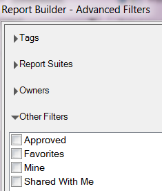

# 計算量度

Report Builder5.2支援Adobe Analytics統一的計算量度。 除了其他創新項目以外，現在所有計算量度都有全域 ID，不再侷限於單一報表套裝。

>[!NOTE]
>
>現有活頁簿可能會指向使用舊式量度 ID 的請求。當您使用 Report Builder 5.2 時，這些舊式量度 ID 會轉換為新的全域 ID。如果將此活頁簿與使用 Report Builder 5.1 或更舊版本的使用者共用，該名使用者將看不到計算量度。

若想深入了解如何使用新的計算量度產生器和計算量度管理員來建立和管理計算量度，請參閱[計算量度](https://experienceleague.adobe.com/docs/analytics/components/calculated-metrics/cm-overview.html)指南。

在請求精靈的步驟 2 中，您可以篩選和套用計算量度。

## 篩選計算量度 {#section_376E986D3E684999A7CDB08E53854159}

**按一下「篩選」圖示來篩選**&#x200B;計算量度： 

「進階篩選器」對話方塊會同時填入標準和計算量度。

可用的篩選條件包括：

| 篩選器名稱 | 說明 |
|---|---|
| 標記 | 可讓您利用特定標記來篩選計算量度。請注意，「標記」篩選條件使用 AND 運算子。如果您勾選兩個標記，右側窗格會顯示同時擁有&#x200B;**兩個**&#x200B;標記的量度。 |
| 報表套裝 | 如果您在 *的「計算量度產生器」中套用「僅*&#x200B;報表套裝名稱[!DNL Adobe Analytics]」篩選條件，接著在 [!DNL Report Builder] 中顯示「進階篩選器」，則進階篩選器只會顯示所選報表套裝的計算量度。 |
| 擁有者 | 可讓您依擁有者篩選量度。請注意，「擁有者」篩選條件使用 OR 運算子。如果您勾選兩個擁有者，右側窗格會顯示&#x200B;**其中一位**&#x200B;擁有者擁有的量度。 |
| 其他篩選條件 > 批准 | 顯示所有正式核准的量度。 |
| 其他篩選條件 > 我的最愛 | 顯示所有標記為「我的最愛」的量度。 |
| 其他篩選器 > 我的 | 顯示您擁有的所有量度。 |
| 其他篩選器 > 與我共用 | 顯示其他人與您共用的所有量度。 |

## 套用計算量度 {#section_DF5CF349460A45FDA4B6E6BB8B52F18E}

選取篩選器後，按一下「**[!UICONTROL 套用]**」可將量度套用至您的請求。選取的量度現在會新增至報表配置。

