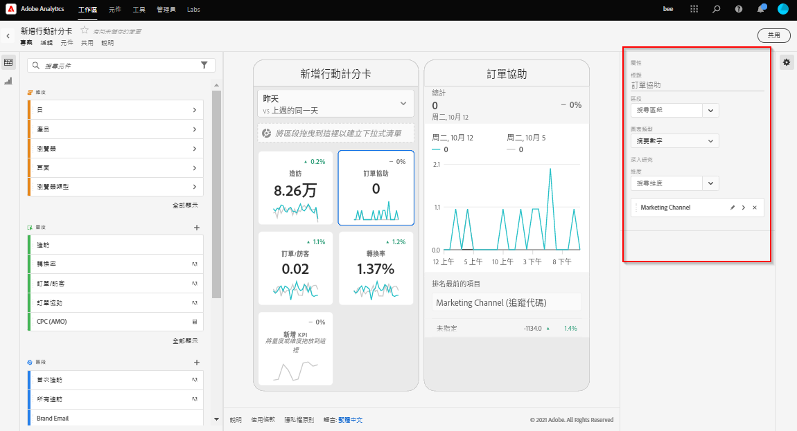

# 建立計分卡

Adobe Analytics計分卡以圖磚式版面配置呈現，為執行使用者顯示視覺化的關鍵資料，如下所示：

此計分卡的組織者可使用計分卡產生器，為執行消費者設定計分卡上顯示的圖磚。 您也可以設定點選圖磚後，詳細檢視或劃分可如何調整。 計分卡建立程式的介面如下：

若要建立計分卡，請執行以下操作：

1. 存取[!UICONTROL 「空白行動計分卡」]範本。
2. 使用資料設定計分卡並儲存。

## 存取[!UICONTROL 「空白行動計分卡」]範本

您可以透過下列任一種方式來存取[!UICONTROL 「空白行動計分卡」]範本：

**建立新專案**

1. 開啟 Adobe Analytics，然後按一下&#x200B;**[!UICONTROL 「工作區」]**&#x200B;標籤。
1. 按一下「**[!UICONTROL 建立專案]**」，然後選取「**[!UICONTROL 空白行動計分卡]**」專案範本。
1. 按一下&#x200B;**[!UICONTROL 「建立」]**。

或

1. 在「**[!UICONTROL 工具]**」選單中，選取「**[!UICONTROL Analytics 儀表板 (行動應用程式)]**」。
1. 在隨即顯示的畫面上，按一下&#x200B;**[!UICONTROL 「建立新計分卡」]**&#x200B;按鈕。

## 使用資料設定計分卡並儲存

實施計分卡範本：

1. 在右側邊欄的&#x200B;**[!UICONTROL 「屬性」]**&#x200B;下方，指定您要使用資料的&#x200B;**[!UICONTROL 專案報表套裝]**。

   

1. 若要為計分卡新增圖磚，請從左側面板拖曳量度，放置到顯示&#x200B;**[!UICONTROL 「將量度拖放至此」]**&#x200B;的區域。您也可以使用類似的工作流程，跨圖磚插入量度。

   

   *您可以從每個圖磚存取顯示該量度其他資訊的詳細檢視畫面，例如前幾名相關維度的清單。*

1. 若要為量度新增相關維度，請從左側面板將維度拖曳至圖磚上。例如，將適當的維度 (像是此範例中的 **[!DNL DMA Region]**) 拖曳至圖磚上，即可將其新增至&#x200B;**[!UICONTROL 「不重複訪客」]**&#x200B;量度；新增的維度會顯示在圖磚專用&#x200B;**[!UICONTROL 「屬性」]**&#x200B;的劃分區段底下。每個圖磚可新增多個維度。

   

   按一下計分卡建立程式中的圖磚，右側邊欄會顯示與該圖磚相關聯的屬性和特性。在此邊欄中，您可以為該圖磚提供新的&#x200B;**[!UICONTROL 標題]**，或是透過指定元件來設定圖磚，而不必從左側邊欄拖放元件。

   

   此外，如果按一下圖磚，動態快顯視窗會顯示應用程式向執行使用者呈現劃分檢視畫面的方式。如果沒有將任何維度套用至圖磚，劃分維度會是&#x200B;**小時**&#x200B;或&#x200B;**天數**，視預設日期範圍而定。

   

   新增至圖磚的每個維度，都會顯示在應用程式詳細檢視的下拉式清單中。執行使用者可從下拉式清單中選擇選項。

1. 若要將區段套用至個別圖磚，請從左側面板將區段直接拖曳至圖磚上。如果要將區段套用至計分卡中的所有圖磚，請將圖磚放置在計分卡上。或者，您也可以在日期範圍下方的篩選功能表中選取區段，以套用區段。您可以比照 Adobe Analytics Workspace 中的相同方式，來[設定並套用計分卡的篩選器](https://experienceleague.adobe.com/docs/analytics-learn/tutorials/analysis-workspace/using-panels/using-drop-down-filters.html?lang=zh-Hant)。

   

1. 同樣地，若要移除套用至整個計分卡的元件，請在計分卡上按一下圖磚之外的任意位置，然後按一下將游標停留在元件上時顯示的 **x**，即可將其移除，如下方「**初次瀏覽**」區段所示：

   

1. 新增和移除日期範圍組合，該組合可在計分卡中從日期範圍下拉式清單中選取。

   

   每個新計分卡都始於 6 個以今日和昨日的資料為主日期範圍組合。您可以按一下 x 來移除不必要的日期範圍，也可以按一下鉛筆來編輯每個日期範圍組合。

   

   若要建立或變更主要日期，使用下拉式選單並選擇可用的日期範圍，或將右側邊欄的日期組合拖放至下拉區。

   

   若要建立比較日期，可以在下拉式選單中選擇方便的預設集以便進行共同時間比較。您還可以從右側邊欄拖放一個日期元件。

   

   如果您想要的日期範圍還沒有建立，可以按一下日曆圖示建立一個新的。

   

1. 這會帶您到日期範圍產生器，在其中可以建立和儲存新的日期範圍元件。若要為計分卡命名，請按一下畫面左上角的命名空間，並輸入新名稱。

   

## 共用計分卡

若要與執行使用者共用計分卡：

1. 按一下&#x200B;**[!UICONTROL 「共用」]**&#x200B;功能表，然後選取&#x200B;**[!UICONTROL 「共用計分卡」]**。

1. 在&#x200B;**[!UICONTROL 「共用行動計分卡」]**&#x200B;表單中，依照以下說明填寫欄位：

   * 提供計分卡的名稱
   * 提供計分卡的說明
   * 新增相關標籤
   * 指定計分卡的收件者

1. 按一下&#x200B;**[!UICONTROL 「共用」]**。

共用計分卡後，收件者可在其Analytics控制面板上存取該計分卡。 如果您後續在計分卡建立程式中變更計分卡，共用的計分卡會自動更新。 到時，執行使用者在應用程式中重新整理計分卡後，就能看見變更。

如果是以新增新元件的方式更新計分卡，您可再次共用計分卡 (並勾選&#x200B;**[!UICONTROL 共用內嵌元件]**&#x200B;選項)，以確保您的執行使用者有權存取這些變更。