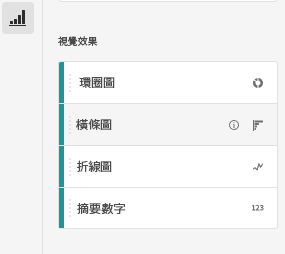
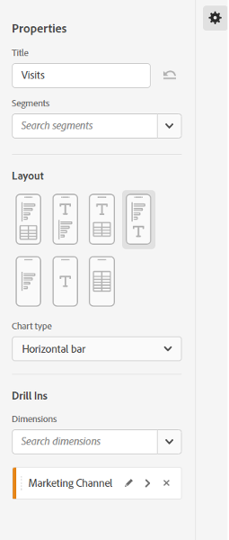
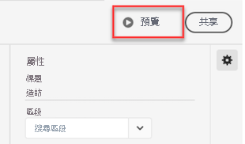

# 建立行動計分卡 {#create-a-mobile-scorecard}

>[!CONTEXTUALHELP]
>id="mobilescorecard_annotations"
>title="註解"
>abstract="註解可在元件管理員或工作區專案內部建立。"

<!-- markdownlint-enable MD034 -->

下列資訊可為 Adobe Analytics 資料的組織者說明如何為主管使用者設定和說明行動計分卡。若要開始使用，您可檢視 Adobe Analytics 儀表板計分卡產生器的影片：

>[!BEGINSHADEBOX]

請參閱  [行動計分卡產生器](https://video.tv.adobe.com/v/34544?quality=12&learn=on){target="_blank"}的示範影片。

>[!ENDSHADEBOX]

Adobe Analytics 計分卡會以圖磚式版面為高階主管使用者顯示關鍵資料的視覺效果，如下所示：

此計分卡的組織者可利用計分卡產生器為高階主管消費者設定計分卡上要顯示哪些圖磚。您也能設定，消費者點選圖磚後，詳細檢視或劃分可能如何調整。計分卡產生器的介面如下所示：

若要建立計分卡，您需要執行以下內容：

1. 存取 [!UICONTROL 空白行動計分卡] 範本。
1. 使用資料設定計分卡並儲存。

## 存取 [!UICONTROL 空白行動計分卡] 範本 {#template}

您可透過建立新專案或從「工具」選單中存取 [!UICONTROL 空白行動計分卡] 範本。

### 建立新專案 {#create}

1. 開啟 Adobe Analytics，然後按一下 **[!UICONTROL 工作區]** 索引標籤。
1. 按一下「**[!UICONTROL 建立專案]**」，然後選取「**[!UICONTROL 空白行動計分卡]**」專案範本。
1. 按一下 **[!UICONTROL 建立]**。

### 「工具」選單

1. 從 **[!UICONTROL 工具]** 選單中選取 **[!UICONTROL Analytics 儀表板 (行動應用程式)]**。
1. 在隨即顯示的畫面中，按一下 **[!UICONTROL 建立新計分卡]**。

## 使用資料設定計分卡並儲存 {#configure}

若要實施計分卡範本：

1. 在右側邊欄的&#x200B;**[!UICONTROL 「屬性」]**&#x200B;下方，指定您要使用資料的&#x200B;**[!UICONTROL 專案報表套裝]**。

   

1. 若要新增圖磚至計分卡，請從左側面板拖曳量度，並放置到「**[!UICONTROL 將量度拖放至此]**」的區域。您也可以使用類似的工作流程，跨圖磚插入量度。

   

1. 您可以從每個圖磚存取顯示該量度其他資訊的詳細檢視畫面，例如相關維度清單排名最前的項目。

## 新增維度或量度 {#dimsmetrics}

若要為量度新增相關維度，請從左側面板將維度拖放至圖磚上。

例如，若要將適當的維度 (如本範例中的 **[!DNL Marketing Channel]**) 新增至&#x200B;**[!UICONTROL 不重複訪客]**&#x200B;量度，您可將其拖放至圖磚上。維度劃分會顯示在 [!UICONTROL Drill Ins] 區段 (詳細投影片特定的&#x200B;**[!UICONTROL 屬性]**) 下。 每個圖磚可新增多個維度。

## 套用區段 {#segments}

若要將區段套用至個別圖磚，請從左側面板將區段直接拖放至圖磚上方。

如果要將區段套用至計分卡中的所有圖磚，請將圖磚放置在計分卡上。或者，您也可以在日期範圍下方的篩選器選單中選取區段，以套用區段。您可以 Adobe Analytics Workspace 中的相同方式，來[設定並套用計分卡的篩選器](https://experienceleague.adobe.com/docs/analytics-learn/tutorials/analysis-workspace/using-panels/using-drop-down-filters.html?lang=zh-hant)。

## 新增日期範圍 {#dates}

新增和移除日期範圍組合，該組合可在計分卡中從日期範圍下拉式清單中選取。

每個新計分卡都始於 6 個以今日和昨日的資料為主日期範圍組合。您可以按一下 x 來移除不必要的日期範圍，也可以按一下鉛筆來編輯每個日期範圍組合。

若要建立或變更主要日期，使用下拉式選單並選擇可用的日期範圍，或將右側邊欄的日期組合拖放至空投區。

若要建立比較日期，可以在下拉式選單中選擇方便的預設集以便進行共同時間比較。您還可以從右側邊欄拖放一個日期元件。

如果您想要的日期範圍尚未建立，可以按一下行事曆圖示建立一個新的日期範圍。

這會將您帶到日期範圍產生器，您可在其中建立和儲存新的日期範圍元件。

### 顯示/隱藏比較日期範圍 {#show-comparison-dates}

若要顯示或隱藏比較日期範圍，請切換&#x200B;**包含比較日期**&#x200B;設定。

此設定預設為&#x200B;*開啟*。如果您不想查看比較日期，請取消選取該選項。

## 套用視覺效果 {#viz}

>[!BEGINSHADEBOX]

請參閱  [視覺效果](https://video.tv.adobe.com/v/3445777?quality=12&learn=on&captions=chi_hant){target="_blank"} 的示範影片。

>[!ENDSHADEBOX]

Analytics 儀表板可提供四種視覺效果，讓您對維度項目和量度取得絕佳解析。若要變更為不同的視覺效果，只需改變圖磚[!UICONTROL 屬性]的[!UICONTROL 圖表類型]。只要選取正確的圖磚，然後變更圖表類型。

或者，按一下左側欄中的 [!UICONTROL 視覺效果] 圖示，並將正確的視覺效果拖放至圖磚上：

### [!UICONTROL 摘要數字]

使用「摘要數字」視覺效果來強調專案中重要的大數字。

### [!UICONTROL 環形圖]

此視覺效果類似圓形圖，以整體的部分或區段顯示資料。若要比較總數的百分比時，可使用環形圖。例如，假設您要了解哪個廣告平台對不重複訪客的總數有助益：

### [!UICONTROL 折線圖]

折線圖視覺效果會使用線條代表量度，以顯示一段時間中值的變化。折線圖會顯示一段時間中的量度，但適用於任何視覺效果。您在此範例中將產品類別維度視覺化。

### [!UICONTROL 橫條圖]

此視覺效果會顯示代表一或多個量度多個值的橫條。例如，若想輕鬆了解您的熱賣產品是什麼，可將 [!UICONTROL 橫條圖] 用作您的首選視覺效果。

### 移除「[!UICONTROL 未指定]」維度項目

如果您想從資料中移除「[!UICONTROL 未指定]」維度項目，請執行以下作業：

1. 選取正確圖磚。
1. 在右側欄中，在 **[!UICONTROL Drill ins]** 下選取維度項目 (包含您想移除的 **[!UICONTROL 未指定]** 項目) 旁的右箭頭。

   

1. 按一下 **[!UICONTROL 未指定]** 旁的圖示，即可從報表中移除未指定的資料。(您也可移除任何其他的維度項目。)

## 檢視和設定圖磚屬性 {#tiles}

當您按一下計分卡產生器中的圖磚，右側欄會顯示與該圖磚相關聯的屬性和特性以及其詳細投影片。在此邊欄中，您可以為該圖磚提供新的&#x200B;**標題**，或是透過套用區段來設定圖磚。

## 檢視詳細投影片 {#view-detail-slides}

若您按一下圖磚，動態快顯視窗會顯示應用程式中向高階主管使用者呈現詳細投影片的方式。您可新增維度以針對您的特定需求劃分資料。如果尚未套用任何維度，劃分維度會是&#x200B;**小時**&#x200B;或&#x200B;**天數**，視預設日期範圍而定。

劃分會按維度項目細分量度，以精進您的分析，例如以下情況：

* 依廣告平台 (AMO ID) 劃分的不重複訪客量度
* 依產品類別 (零售) 劃分的造訪
* 依產品名稱劃分的總營收

新增到詳細投影片的每個維度都將顯示在應用程式詳細投影片檢視中的下拉式選單中。 高階主管使用者可從下拉式清單中選擇選項。

## 自訂詳細投影片 {#customize-detail-slide}

自訂詳細投影片可讓您與客群分享的資訊更有針對性。

>[!BEGINSHADEBOX]

請參閱 [自訂詳細資料檢視](https://video.tv.adobe.com/v/3422732?quality=12&learn=on&captions=chi_hant){target="_blank"}的示範影片。

>[!ENDSHADEBOX]

您可以修改每個詳細投影片的版面並新增文字，以更清楚地說明一般使用者可在資料中看到的內容。您還可以使用下拉式選單變更圖表類型。

### 變更投影片版面

變更投影片版面以專注於最重要的資訊。例如，您可以變更版面，僅顯示圖表或僅顯示表格。若要變更投影片版面，請選取其中一種預先設計的格式。

您還可以透過將視覺化元件從左側邊欄拖放到畫布上來變更投影片版面。每個詳細投影片一次只能提供兩種視覺化。

### 為投影片新增描述性文字

您可以新增文字以提供有關圖表中所包含內容或有關資料的細微差別的有意義資訊。

若要新增文字到詳細投影片，請選取顯示 `T` 符號的版面，或將文字視覺化元件從左側欄拖放到上方。新增新的文字視覺化或選擇包含文字的投影片版面時，文字編輯器將自動開啟。文字編輯器會提供格式化文字的所有標準選項。您可以套用段落、標題和副標題等文字樣式，並套用粗體和斜體字體。您可以對齊文字、新增項目符號和編號清單以及新增連結。完成編輯後，請選取文字編輯器右上角的最小化按鈕將其關閉。若要編輯已新增的文字，請選取鉛筆圖示，以再次開啟文字編輯器。

## 移除元件 {#remove}

同樣地，若要移除已套用至整個計分卡的元件，請在計分卡上按一下圖磚之外的任意位置，然後按一下將游標停留在元件上時顯示的 **x**，即可將其移除，如下方「**初次造訪數**」區段所示：

## 建立資料故事 {#create-data-story}

資料故事是圍繞中心主題或量度建置的支援資料點、業務內容和相關量度的集合。

例如，如果您關注網路流量，您最重要的量度可能會是造訪次數，但您可能也對新訪客、不重複訪客感興趣，並且您可能希望查看按網頁或流量來源的裝置類型來細分的資料。行動記分卡專案中的資料故事可讓您將最重要的量度放在首位和中心位置，並透過多個詳細資訊幻燈片描述量度背後的完整故事。

>[!BEGINSHADEBOX]

請參閱 [建立資料故事](https://video.tv.adobe.com/v/3416392?quality=12&learn=on){target="_blank"}的示範影片。

>[!ENDSHADEBOX]

**建立資料故事的方式**

將多個詳細資訊幻燈片新增到磚來建置資料故事。

1. 從行動記分卡專案開始。
1. 選取要從中建立故事的磚。

   

   {width=".50%"}

1. 新增幻燈片以建置資料故事。第一張幻燈片是預設產生的。

   要新增新幻燈片，請將滑鼠懸停在幻燈片上或按一下幻燈片，然後從可用選項中進行選擇：

   * 點選 [!UICONTROL +] 號建立新幻燈片。

   * 點選複製圖示以複製現有幻燈片。

1. 如果您建立了一張空白幻燈片，請從左側邊欄拖放元件，或選擇一個版面以使用磚中的資料自動填入幻燈片。

   

若要刪除幻燈片，請點選垃圾桶圖示。

### 自訂資料故事 {#customize-data-story}

資料故事可讓您自訂所有內容，好讓您可以共用資訊，並排除您不需要的所有內容。您可以自訂磚和個別幻燈片以新增篩選器、顯示細分、變更版面和變更視覺效果。

**自訂磚的方法**

1. 點選磚。所選取的磚會顯示藍色邊框，右側面板則會顯示磚的屬性。
1. 變更標題、圖表類型和其他磚選項。
1. 將元件拖曳到磚上。

   

   把元件 (如視覺效果) 拖曳到磚上時，該元件將套用至所有資料故事幻燈片。

1. 要只對標題套用變更，請按住 Shift 鍵來套用變更。

   

>[!NOTE]
>幻燈片會從圖磚繼承元件，但圖磚不會從幻燈片繼承元件。

**自訂個別幻燈片**

您可以變更資料故事中個別幻燈片的視覺效果。例如，您可以將特定幻燈片的水平列變更為環圈圖。您也可以變更版面。請參閱[自訂詳細幻燈片](#customize-detail-slide)。

### 預覽資料故事 {#preview-data-story}

建立資料故事後，使用「**預覽**」按鈕查看資料故事並與之互動，就像您是應用程式使用者一樣。有關預覽資料故事的資訊，請參閱[預覽記分卡](#preview)

### 在磚和幻燈片之間導覽 {#navigate-tiles-slides}

導覽列會顯示代表各張幻燈片內容的圖示。如果有多張幻燈片，導覽列可讓您輕鬆瀏覽到特定幻燈片。

要在磚和幻燈片之間移動，請點選導覽列。

{width="25%"}

您也可以使用鍵盤上的箭頭來回導覽，或選取元件並將它拉到螢幕的左側或右側來滾動。

## 預覽計分卡 {#preview}

在 Analytics 儀表板應用程式中發佈計分卡後，您可以預覽計分卡的外觀和功能。

1. 按一下螢幕右上角的 **[!UICONTROL 預覽]**。

   

1. 若要檢視計分卡在不同裝置上的外觀，請從「[!UICONTROL 裝置預覽]」下拉式選單選取裝置。

   

1. 若要與預覽互動，您可以：

   * 按一下左鍵以模擬手機螢幕上的點選。

   * 使用電腦的捲動功能來模擬用手指捲動手機螢幕。

   * 長按以模擬用手指長按手機螢幕。 這對於與詳細檢視中的視覺效果互動非常有用。

## 命名計分卡 {#name}

若要為計分卡命名，請按一下畫面左上角的命名空間，並輸入新名稱。

## 共用計分卡 {#share}

若要與主管使用者共用計分卡：

1. 按一下 **[!UICONTROL 共用]** 功能表，然後選取 **[!UICONTROL 共用計分卡]**。

1. 在 **[!UICONTROL 共用行動計分卡]** 表單中，依照以下說明填寫欄位：

   * 提供計分卡的名稱
   * 提供計分卡的說明
   * 新增相關標記
   * 指定計分卡的收件者

1. 按一下 **[!UICONTROL 共用]**。

在您共用計分卡後，您的收件者可在其 Analytics 儀表板中存取該計分卡。如果您在計分卡產生器中對計分卡進行後續變更，共用的計分卡會自動更新。則高階主管使用者在應用程式中重新整理計分卡後，即可看見變更。

如果您是以新增元件的方式更新計分卡，可再次共用計分卡 (並勾選&#x200B;**[!UICONTROL 共用嵌入式元件]**&#x200B;選項)，以確保您的高階主管使用者有權存取這些變更。

### 使用可共享連結共用計分卡 {#shareable-link}

使用可共用連結可以輕鬆地在電子郵件、文件或簡訊應用程式中共用計分卡。可共用的連結讓收件者可以在他們的桌面或儀表板行動應用程式上開啟計分卡。可共用的深度連結使得共用專案以及與利害關係人提升參與度變得更加輕鬆。

若要使用可共用連結共用計分卡

1. 按一下「**[!UICONTROL 共用]**」選單，然後選取「**[!UICONTROL 共用計分卡]**」。

   

1. 複製連結並將其貼上至電子郵件、文件或 IM 應用程式中。

   當收件者使用桌面應用程式或瀏覽器開啟此連結，行動計分卡專案將會在 Workspace 中開啟。

   當收件者在行動裝置上開啟此連結，計分卡將直接在 Analytics 儀表板應用程式中開啟。

   如果收件者尚未下載此行動應用程式，他們將被引導至 App Store 或 Google Play Store 中的應用程式列表，即可在此下載。

