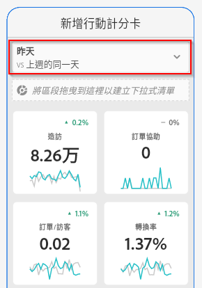

# 建立行動計分卡

下列資訊可為 Adobe Analytics 資料的組織者說明如何為主管使用者設定和說明行動計分卡。若要開始使用，您可觀看 Adobe Analytics 儀表板計分卡產生器的影片：

>[!VIDEO](https://video.tv.adobe.com/v/34544)

Adobe Analytics 計分卡會以圖磚式版面為主管使用者顯示關鍵資料的視覺效果，如下所示：

此計分卡的組織者可利用計分卡產生器為高階主管消費者設定計分卡上要顯示哪些圖磚。您也能設定，消費者點選圖磚後，詳細檢視或劃分可能如何調整。計分卡建立程式的介面如下：

若要建立計分卡，您需要執行以下作業：

1. 存取[!UICONTROL 「空白行動計分卡」]範本。
2. 使用資料設定計分卡並儲存。

## 存取[!UICONTROL 「空白行動計分卡」]範本 {#template}

您可透過建立新專案或從「工具」選單中存取[!UICONTROL 「空白行動計分卡」]範本。

### 建立新專案 {#create}

1. 開啟 Adobe Analytics，然後按一下&#x200B;**[!UICONTROL 「工作區」]**&#x200B;索引標籤。
1. 按一下&#x200B;**[!UICONTROL 「建立專案」]**，然後選取&#x200B;**[!UICONTROL 「空白行動計分卡」]**&#x200B;專案範本。
1. 按一下&#x200B;**[!UICONTROL 「建立」]**。

### 「工具」選單

1. 從&#x200B;**[!UICONTROL 「工具」]**&#x200B;選單中選取&#x200B;**[!UICONTROL 「Analytics 儀表板 (行動應用程式)]**。
1. 在隨即顯示的畫面中，按一下「**[!UICONTROL 建立新計分卡]**」。

## 使用資料設定計分卡並儲存 {#configure}

實施計分卡範本：

1. 在右側邊欄的&#x200B;**[!UICONTROL 「屬性」]**&#x200B;下方，指定您要使用資料的&#x200B;**[!UICONTROL 專案報表套裝]**。

   

1. 若要為計分卡新增圖磚，請從左側面板拖曳量度，放置到顯示&#x200B;**[!UICONTROL 「將量度拖放至此」]**&#x200B;的區域。您也可以使用類似的工作流程，跨圖磚插入量度。

   

1. 您可以從每個圖磚存取顯示該量度其他資訊的詳細檢視畫面，例如相關維度清單排名最前的項目。

## 新增維度或量度 {#dimsmetrics}

若要為量度新增相關維度，請從左側面板將維度拖放至圖磚上。

例如，若要將適當的維度 (如本範例中的 **[!DNL Marketing Channel]**) 新增至&#x200B;**[!UICONTROL 不重複訪客]**&#x200B;量度，您可將其拖放至圖磚上。維度劃分會顯示在圖磚特定&#x200B;**[!UICONTROL 屬性]**&#x200B;的 [!UICONTROL Drill Ins] (劃分) 區段中。 每個圖磚可新增多個維度。

## 套用區段 {#segments}

若要將區段套用至個別圖磚，請從左側面板將區段直接拖放至圖磚上方。

如果要將區段套用至計分卡中的所有圖磚，請將圖磚放置在計分卡上。或者，您也可以在日期範圍下方的篩選功能表中選取區段，以套用區段。您可以比照 Adobe Analytics Workspace 中的相同方式，來[設定並套用計分卡的篩選器](https://experienceleague.adobe.com/docs/analytics-learn/tutorials/analysis-workspace/using-panels/using-drop-down-filters.html)。

## 新增日期範圍 {#dates}

新增和移除日期範圍組合，該組合可在計分卡中從日期範圍下拉式清單中選取。

每個新計分卡都始於 6 個以今日和昨日的資料為主日期範圍組合。您可以按一下 x 來移除不必要的日期範圍，也可以按一下鉛筆來編輯每個日期範圍組合。

若要建立或變更主要日期，使用下拉式選單並選擇可用的日期範圍，或將右側邊欄的日期組合拖放至空投區。

若要建立比較日期，可以在下拉式選單中選擇方便的預設集以便進行共同時間比較。您還可以從右側邊欄拖放一個日期元件。

如果您想要的日期範圍還沒有建立，可以按一下日曆圖示建立一個新的。

這會將您帶到日期範圍產生器，您可在其中建立和儲存新的日期範圍元件。

## 套用視覺效果 {#viz}

觀看行動計分卡視覺效果的影片：

>[!VIDEO](https://video.tv.adobe.com/v/337570/?quality=12&learn=on)

Analytics 儀表板可提供四種視覺效果，讓您對維度項目和量度取得絕佳解析。若要變更為不同的視覺效果，只需改變圖磚[!UICONTROL 屬性]的[!UICONTROL 圖表類型]。只要選取正確的圖磚，然後變更圖表類型。

或者，按一下左側欄中的「[!UICONTROL 視覺效果]」圖示，並將正確的視覺效果拖放至圖磚上：

### [!UICONTROL 摘要數字]

使用「摘要數字」視覺效果來強調專案中重要的大數字。

### [!UICONTROL 環形圖]

此視覺效果類似圓形圖，以整體的部分或區段顯示資料。若要比較總數的百分比時，可使用環形圖。例如，假設您要了解哪個廣告平台對不重複訪客的總數有助益：

### [!UICONTROL 折線圖]

折線圖視覺效果會使用線條代表量度，以顯示一段時間中值的變化。折線圖會顯示一段時間中的量度，但適用於任何視覺效果。您在此範例中將產品類別維度視覺化。

### [!UICONTROL 橫條圖]

此視覺效果會顯示代表一或多個量度多個值的橫條。例如，若想輕鬆了解您的熱賣產品是什麼，可將「[!UICONTROL 橫條圖]」用作您的首選視覺效果。

### 移除「[!UICONTROL 未指定]」維度項目

如果您想從資料中移除「[!UICONTROL 未指定]」維度項目，請執行以下作業：

1. 選取正確圖磚。
1. 在右側欄中，在「**[!UICONTROL Drill ins]**」下選取維度項目 (包含您想移除的「**[!UICONTROL 未指定]**」項目) 旁的右箭頭。

   

1. 按一下「**[!UICONTROL 未指定]**」旁的圖示，即可從報表中移除未指定的資料。(您也可移除任何其他的維度項目。)

## 檢視和設定圖磚屬性 {#tiles}

按一下計分卡產生器中的圖磚，右側欄會顯示與該圖磚相關聯的屬性和特性。在此邊欄中，您可以為該圖磚提供新的&#x200B;**[!UICONTROL 標題]**，或是透過指定元件來設定圖磚，而不必從左側邊欄拖放元件。

若您按一下圖磚，動態快顯視窗會顯示應用程式中向主管使用者呈現 Drill ins (劃分) 的方式。如果沒有對圖磚套用任何維度，劃分維度會是&#x200B;**小時**&#x200B;或&#x200B;**天數**，視預設日期範圍而定。

劃分會透過以下其他量度和維度來細分量度和維度，以精進您的分析，在此零售範例中包括：

* 依廣告平台 (AMO ID) 劃分的不重複訪客量度
* 依產品類別 (零售) 劃分的造訪
* 依產品名稱劃分的總營收

新增至圖磚的每個維度，都會顯示在應用程式詳細檢視的下拉式清單中。高階主管使用者可從下拉式清單中選擇選項。

## 移除元件 {#remove}

同樣地，若要移除套用至整個計分卡的元件，請在計分卡上按一下圖磚之外的任意位置，然後按一下將游標停留在元件上時顯示的 **x**，即可將其移除，如下方「**初次瀏覽**」區段所示：

## 預覽記分卡 {#preview}

在分析儀表板應用中發佈記分卡後，您可以預覽記分卡的外觀和功能。

1. 按一下 **[!UICONTROL 預覽]** 在螢幕右上角。

   

1. 要查看記分卡在不同設備上的外觀，請從 [!UICONTROL 設備預覽] 的下界。

   

1. 要與預覽交互，您可以：

   * 左鍵按一下以模擬電話螢幕上的敲擊。

   * 使用電腦的滾動功能模擬用手指滾動電話螢幕。

   * 按一下並按住，模擬按住手機螢幕上的手指。 這對於與詳細視圖中的可視化效果交互非常有用。

## 命名計分卡 {#name}

若要為計分卡命名，請按一下畫面左上角的命名空間，並輸入新名稱。

## 共用計分卡 {#share}

若要與高階主管使用者共用計分卡：

1. 按一下&#x200B;**[!UICONTROL 「共用」]**&#x200B;功能表，然後選取&#x200B;**[!UICONTROL 「共用計分卡」]**。

1. 在&#x200B;**[!UICONTROL 「共用行動計分卡」]**&#x200B;表單中，依照以下說明填寫欄位：

   * 提供計分卡的名稱
   * 提供計分卡的說明
   * 新增相關標記
   * 指定計分卡的收件者

1. 按一下&#x200B;**[!UICONTROL 「共用」]**。

在您共用計分卡後，您的收件者可在其 Analytics 儀表板中存取該計分卡。如果您在計分卡產生器中對計分卡進行後續變更，共用的計分卡會自動更新。到時，高階主管使用者在應用程式中重新整理計分卡後，就能看見變更。

如果您是以新增元件的方式更新計分卡，可再次共用計分卡 (並勾選「**[!UICONTROL 共用內嵌元件]**」選項)，以確保您的高階主管使用者有權存取這些變更。
