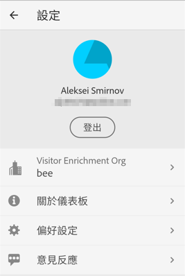
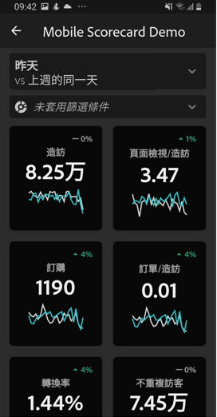

# Adobe Analytics 控制面板的組織者指南

以下資訊可為 Adobe Analytics 資料的組織者說明如何設定控制面板並將其對執行使用者呈現。若要觀看示範此資訊的影片，請參閱Adobe Analytics儀表板Scorecard Builder影片：

>[!VIDEO](https://video.tv.adobe.com/v/34544)

## 簡介

Adobe Analytics 控制面板可隨時隨地提供 Adobe Analytics 的深入分析。此應用程式可讓使用者透過行動裝置存取您從 Adobe Analytics 桌面 UI 建立和共用的直覺式計分卡。計分卡是關鍵量度和其他元件的集合，以圖磚式版面配置呈現，點選上面的項目即可取得詳細劃分資料和趨勢報表。您可以考量哪些資料對您最為重要，量身打造專屬計分卡。iOS 和 Android 作業系統均支援 Analytics 控制面板。

## 本指南的詳細資訊

本指南旨在協助 Adobe Analytics 資料組織者為控制面板的執行使用者設定計分卡。組織者可以是組織管理員，也可以是負責設定應用程式計分卡的其他角色；計分卡可讓執行使用者在自己的行動裝置上，輕鬆快速地檢視以概要形式呈現的重要摘要資料。雖然執行使用者是 Analytics 控制面板的一般使用者，不過本指南的重點在於協助資料組織者為這些使用者有效設定應用程式。

## 術語表

下表解釋各個術語，協助使用者了解 Analytics 控制面板的對象、功能和操作方式。

| 詞語 | 定義 |
|--- |--- |
| 消費者 | 在行動裝置上檢視 Analytics 關鍵量度和深入分析的執行人員 |
| 組織者 | 從 Analytics 尋找及分發深入分析，以及設定計分卡以供消費者檢視的資料識讀人員 |
| 組織 | 為消費者建立或編輯行動計分卡的行為，計分卡內容包含相關量度、維度和其他項目 |
| 計分卡 | 包含一或多個圖磚的控制面板畫面 |
| 圖磚 | 計分卡檢視畫面呈現量度的形式 |
| 劃分 | 輔助性質的檢視畫面，點選計分卡中的圖磚即可顯示。此檢視畫面會在圖磚所顯示的量度上展開，並依使用者的選擇顯示其他劃分維度。 |
| 日期範圍 | 控制面板報表的主要日期範圍 |
| 比較日期範圍 | 與主要日期範圍相比較的日期範圍 |

## 為執行使用者建立計分卡

計分卡以圖磚式版面配置呈現，為執行使用者顯示視覺化的關鍵資料，如下所示：

此計分卡的組織者可利用計分卡建立程式，設定要在消費者的計分卡上顯示哪些圖磚，此外也能設定消費者點選圖磚後，詳細檢視或劃分可如何調整。計分卡建立程式的介面如下：

若要建立計分卡，請執行以下操作：

1. 存取空白行動計分卡範本。
2. 使用資料設定計分卡並儲存。

### 存取空白行動計分卡範本

您可以透過以下其中一種方式來存取空白行動計分卡範本：

**建立新專案**

1. 開啟 Adobe Analytics，然後按一下&#x200B;**「工作區」**&#x200B;標籤。
2. 按一下&#x200B;**「建立新專案」**&#x200B;按鈕，然後選擇&#x200B;**「空白行動計分卡」**&#x200B;專案範本。
3. 按一下&#x200B;**「建立」**&#x200B;按鈕。

**新增專案**

在&#x200B;**專案**&#x200B;畫面的&#x200B;**「元件」**&#x200B;標籤底下，按一下&#x200B;**「新增」**&#x200B;按鈕並選取&#x200B;**「行動計分卡」**。

**使用 Analytics 工具**

進入 Analytics，按一下&#x200B;**「工具」**&#x200B;功能表，然後選取&#x200B;**「控制面板」**。在隨即顯示的畫面上，按一下&#x200B;**「建立計分卡」**&#x200B;按鈕。

### 使用資料設定計分卡並儲存

實施計分卡範本：

1. 在右側邊欄的&#x200B;**「屬性」**&#x200B;下方，指定您要使用資料的&#x200B;**專案報表套裝**。

   

2. 若要為計分卡新增圖磚，請從左側面板拖曳量度，放置到顯示&#x200B;**「將量度拖放至此」**&#x200B;的區域。您也可以使用類似的工作流程，跨圖磚插入量度。

   

   *您可以從每個圖磚存取顯示該量度其他資訊的詳細檢視畫面，例如前幾名相關維度的清單。*

3. 若要為量度新增相關維度，請從左側面板將維度拖曳至圖磚上。例如，將適當的維度 (像是此範例中的 **DMA 地區**) 拖曳至圖磚上，即可將其新增至&#x200B;**不重複訪客**&#x200B;量度；新增的維度會顯示在圖磚專用&#x200B;**「屬性」**&#x200B;的劃分區段底下。每個圖磚可新增多個維度。

   

   您也可以將維度拖放到計分卡畫布上，將維度新增至所有圖磚。

   按一下計分卡建立程式中的圖磚，右側邊欄會顯示與該圖磚相關聯的屬性和特性。在此邊欄中，您可以為該圖磚提供新的&#x200B;**標題**，或是透過指定元件來設定圖磚，而不必從左側邊欄拖放元件。

   此外，如果按一下圖磚，動態快顯視窗會顯示應用程式向執行使用者呈現劃分檢視畫面的方式。如果沒有將任何維度套用至圖磚，劃分維度會是&#x200B;**小時**&#x200B;或&#x200B;**天數**，視預設日期範圍而定。

   

   新增至圖磚的每個維度，都會顯示在應用程式詳細檢視的下拉式清單中。執行使用者可從下拉式清單中選擇選項。

4. 若要將區段套用至個別圖磚，請從左側面板將區段直接拖曳至圖磚上。如果要將區段套用至計分卡中的所有圖磚，請將圖磚放置在計分卡上。或者，您也可以在日期範圍下方的篩選功能表中選取區段，以套用區段。您可以比照 Adobe Analytics Workspace 中的相同方式，來[設定並套用計分卡的篩選器](https://docs.adobe.com/content/help/en/analytics-learn/tutorials/analysis-workspace/using-panels/using-drop-down-filters.html)。

   

5. 同樣地，若要移除套用至整個計分卡的元件，請在計分卡上按一下圖磚之外的任意位置，然後按一下將游標停留在元件上時顯示的 **x**，即可將其移除，如下方&#x200B;**「行動客戶」**&#x200B;區段所示：

   

6. 在計分卡&#x200B;**「屬性」**&#x200B;底下，還可以自行選擇指定以下項目：

   * **預設日期範圍**。在此處指定的範圍，會與執行使用者在應用程式中首次存取計分卡時所套用的範圍相同。

   * **比較日期範圍**

   * 預計要套用至整個計分卡的任何&#x200B;**區段**

7. 若要為計分卡命名，請按一下畫面左上角的命名空間，並輸入新名稱。

   

## 共用計分卡

與執行使用者共用計分卡：

1. 按一下&#x200B;**「共用」**&#x200B;功能表，然後選擇&#x200B;**「共用計分卡」**。

2. 在&#x200B;**「共用」**&#x200B;表單中，依照以下說明填寫欄位：

   * 提供計分卡的名稱
   * 提供計分卡的說明
   * 新增相關標籤
   * 指定計分卡的收件者

3. 按一下&#x200B;**「共用」**。

在您共用計分卡後，收件者便可在其 Analytics 控制面板中存取該計分卡。如果您之後在計分卡建立程式中變更計分卡，共用的計分卡會自動更新。到時，執行使用者在應用程式中重新整理計分卡後，就能看見變更。

If you update the Scorecard by adding new components, you may want to share the scorecard again (and check the **Share embedded components** option) in order to make sure that your executive users have access to these changes.

## 使用應用程式設定主管使用者

某些情況下，執行使用者可能需要額外的協助，才能存取及使用應用程式。本節提供相關資訊，幫助您提供這類協助。

### 協助執行使用者取得存取權

若要協助執行使用者在應用程式上存取計分卡，請確認：

* 使用者裝置的行動作業系統需為 iOS 10 (含) 以上版本或 Android 4.4 (KitKat) (含) 以上版本
* 使用者處於 Adobe Analytics 的有效登入狀態
* 您已為使用者正確建立行動計分卡，並與他們共用這些計分卡。
* 使用者可存取 Analysis Workspace 和計分卡所依據的報表套裝
* 使用者可存取計分卡中的元件。Note that you can select an option when sharing your Scorecards to **Share embedded components**.

### 協助執行使用者使用應用程式

若要協助執行使用者：

1. 協助他們下載並安裝應用程式。方法是提供下列步驟來延伸執行使用者的存取權，步驟會依其使用 iOS 或 Android 裝置而有所不同。

   **若執行使用者使用 iOS：**

   * 按一下以下連結 (也可從 Analytics 中的&#x200B;**工具** > **控制面板**&#x200B;底下存取)，然後依照提示下載、安裝和開啟應用程式：

      [iOS 連結](https://apple.co/2zXq0aN)
   **若執行使用者使用 Android：**

   * 按一下以下連結 (也可從 Analytics 中的&#x200B;**工具** > **控制面板**&#x200B;底下存取)，然後依照提示下載、安裝和開啟應用程式：

      [Android 連結](https://bit.ly/2LM38Oo)
   下載並安裝完畢後，執行使用者就可使用現有的 Adobe Analytics 憑證登入應用程式；系統可支援 Adobe 和 Enterprise/Federated ID。

   

2. 協助使用者存取您的計分卡。執行使用者登入應用程式後，**選擇公司**&#x200B;畫面會隨即顯示。此畫面會列出執行使用者所屬的登入公司。協助使用者前往計分卡：

   * 點選套用至您所共用計分卡的登入公司或 Experience Cloud 組織名稱。接著，計分卡清單會顯示該登入公司與執行使用者共用的所有計分卡。
   * 如果情況適用，請協助他們依&#x200B;**最近修改的項目**&#x200B;將清單排序。
   * 點選計分卡的名稱即可檢視。

   

   如果執行使用者登入後看到未共用任何內容的訊息：

   * 執行使用者可能選擇了錯誤的 Analytics 例項

   * 可能沒有任何計分卡與該執行使用者共用

      

   * 確認執行使用者能否登入正確的 Analytics 例項，以及是否已共用計分卡。

3. Explain to the executive user how tiles appear in the Scorecards you share (the first Scorecard below is set in dark mode; see **Preferences** below if you think your executive user prefers this viewing opt-on):

   

   

   圖磚的其他資訊：

   * 走勢圖的粒度取決於日期範圍的長度：
      * 若長度為一天，圖表會顯示每小時趨勢
      * 若長度為一天以上、一年以下，則會顯示每日趨勢
      * 若長度為一年 (含) 以上，圖表會顯示每週趨勢
   * 百分比值變更公式為量度合計 (目前日期範圍) - 量度合計 (比較日期範圍) / 量度合計 (比較日期範圍)。
   * 下拉畫面即可重新整理計分卡。

4. 點選圖磚，即可顯示圖磚劃分的詳細運作資訊。

   

   * 點選走勢圖上的任一點，可查看與線上該點相關聯的資料。

   * 其中包含一個表格，會顯示新增至圖磚的維度資料。點選向下箭頭可選取維度。如果未將任何維度新增至圖磚，表格將會顯示圖表資料。

5. 變更計分卡日期範圍：

   

   * 您也可以使用相同方式，變更上述「劃分」檢視中的日期範圍。

   * 根據您點選的時間間隔 (**日**、**週**、**月**&#x200B;或&#x200B;**年**)，畫面會顯示兩個日期範圍選項：目前的時間範圍和上一個日期範圍。點選其中一個選項，並選取第一個範圍。在&#x200B;**比較對象**&#x200B;清單底下，點選顯示的任何一個選項，比較此時段的資料與您選取的第一個日期範圍。點選畫面右上方的&#x200B;**「完成」**。**「日期範圍」**&#x200B;欄位和計分卡圖磚會隨著您所選取新範圍的新比較資料而更新。

6. 在此應用程式上提供意見回饋：

   1. 點選應用程式畫面右上方的設定圖示。
   2. 在&#x200B;**我的帳戶**&#x200B;畫面上，點選&#x200B;**意見反應**&#x200B;選項。
   3. 點選並查看提供意見回饋的選項。

      

7. 若要變更偏好設定，請點選上方顯示的&#x200B;**偏好設定**&#x200B;選項。在偏好設定中，您可以開啟生物特徵辨識登入，或是將應用程式設定為深色模式，如下所示：

   

**回報錯誤**：

點選需要的選項，再選擇適合錯誤的子類別。在錯誤回報表單的頂端欄位中提供您的電子郵件地址，並在下方欄位中說明錯誤。帳戶資訊的螢幕擷取畫面會自動附加至訊息，但如有需要，點選附件影像的 **X** 即可刪除此影像。您也可以選擇錄製螢幕、新增更多螢幕擷取畫面或附加檔案。若要傳送報表，請點選表單右上方的紙飛機圖示。

**建議改進事項**：

點選需要的選項，再選擇適合建議的子類別。在建議表單的頂端欄位中提供您的電子郵件地址，並在下方欄位中說明錯誤。帳戶資訊的螢幕擷取畫面會自動附加至訊息，但如有需要，點選附件影像的 **X** 即可刪除此影像。您也可以選擇錄製螢幕、新增更多螢幕擷取畫面或附加檔案。若要傳送建議，請點選表單右上方的紙飛機圖示。

**提出問題**：

點選需要的選項，在頂端欄位中提供您的電子郵件地址，並在下方欄位中說明問題。螢幕擷取畫面會自動附加至訊息，但如有需要，點選附件影像的 **X** 即可刪除此影像。您也可以選擇錄製螢幕、新增更多螢幕擷取畫面或附加檔案。若要傳送問題，請點選表單右上方的紙飛機圖示。

>[!IMPORTANT]
>
>從2020年10月開始，Adobe將逐步推出一系列增強功能，以最佳化「Adobe Analytics儀表板」應用程式的效能。 這些增強功能以快取歷史Analytics資料為中心，用來以日期（不包括當天）填入記分卡。 此資料將在安全的Microsoft Azure公用雲端儲存帳戶中快取最多24小時。 如果您想要退出這些效能增強功能，請連絡您的CSM。
