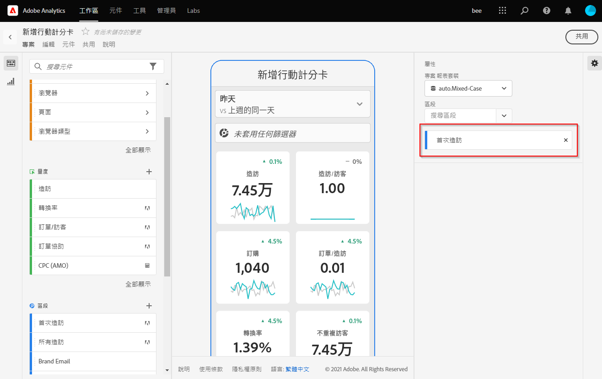

# 測試版：Analytics行動應用程式策展人指南

## 簡介

Adobe Analytics行動應用程式可隨時隨地從Adobe Analytics提供深入資訊。   此應用程式可讓使用者透過行動裝置存取直覺式記分卡，供您從Adobe Analytics的案頭UI建立和共用。 記分卡是關鍵量度和其他元件的集合，顯示在平鋪版面中，您可以點選這些元件以取得更詳細的劃分和趨勢報表。 您可以根據對您最重要的資料定制記分卡。 iOS和Android作業系統都支援行動應用程式。

## 關於本指南

本指南旨在協助Adobe Analytics資料的策展人在Analytics行動應用程式上為其執行使用者設定記分卡。 策展人可能是組織管理員或其他角色的人員，負責設定應用程式記分卡，可讓執行使用者在自己的行動裝置上快速輕鬆地檢視重要摘要資料的廣泛呈現。 雖然主管使用者是Analytics行動應用程式的使用者，但本指南將協助資料管理員為這些使用者有效設定應用程式。

## 術語辭彙表

下表說明了瞭解Analytics行動應用程式的對象、函式和操作的術語。

| 術語 | 定義 |
|--- |--- |
| 消費者 | 在行動裝置上檢視Analytics關鍵指標和見解的主管人員角色 |
| 策展人 | 從Analytics尋找並分發見解並設定記分卡以供消費者檢視的資料素養角色 |
| 組織 | 為消費者建立或編輯包含相關度量、維度和其他元件的移動記分卡的操作 |
| 計分卡 | 包含一或多個圖格的行動應用程式檢視 |
| 拼貼 | 記分卡視圖中度量的轉換 |
| 劃分 | 輔助視圖，可通過點選記分卡中的表徵圖來訪問。 此檢視會展開方塊上顯示的量度，並選擇性地報告其他劃分維度。 |
| 日期範圍 | 行動應用程式報表的主要日期範圍 |
| 比較日期範圍 | 與主要日期範圍比較的日期範圍 |

 
## 為主管用戶建立記分卡

Mobile Scorecard會在並排版面中為主管使用者顯示關鍵資料視覺化，如下所示：

作為此記分卡的管理員，您可以使用記分卡生成器來配置在消費者的記分卡上顯示哪些表徵圖。 您也可以設定在點選圖格後，如何調整詳細檢視或劃分。 Scorecard Builder介面如下所示：

要建立記分卡，您需要執行以下操作：

1. 訪問空白的Mobile Scorecard模板。
2. 使用資料配置記分卡並保存它。

### 訪問空白的Mobile Scorecard模板

您可以通過以下方式之一訪問空白Mobile Scorecard模板：

**建立新專案**

1. 開啟Adobe Analytics，然後按一下「工 **作區** 」標籤。
2. 按一下「 **Create New Project** (建立新項目 **)」按鈕，然後選擇「** Blank Mobile Scorecard」項目模板。
3. Click the **Create** button.

*注意：如果您未看到空白的Mobile Scorecard範本（如下所示），則您的公司尚未啟動測試版。 請連絡您的客戶服務經理。*

**新增專案**

在「項 **目** 」螢幕的「元件 **」頁籤下，按一下「添加」** 按鈕並選 ********&#x200B;擇Mobile Scorecard Alignment。

**使用Analytics工具**

在Analytics中，按一下「工 **具」選單** ，然後選取「 **行動應用程式」**。 在後續螢幕上，按一下「創 **建記分卡** 」按鈕。

### 使用資料配置記分卡並保存它

要實施記分卡模板，請執行以下操作：

1. 在「 **屬性** 」（位於右側邊欄中）下方，指定您要使用資料的 **專案報表套裝** 。

   

2. 若要將新圖格新增至記分卡，請從左側面板拖曳量度，並拖曳至拖曳 **量度至此處** 區。 您也可以使用類似的工作流程，在兩個圖格之間插入量度。

   

   *您可以從每個方塊存取詳細檢視，其中顯示度量的其他資訊，例如相關維度清單的排名最前的項目。*

3. 若要新增相關維度至量度，請從左側面板拖曳維度至圖格。 例如，您可以將適當的維度(如本例中的 **DMA地區**)拖放至「獨特訪客 **** 」量度中，將其拖曳至方塊上；您新增的維度會顯示在拼貼特定「屬性」的劃分區 **段下**。 您可以為每個圖格新增多個維度。

   

   *注意：您也可以將維拖放到記分卡畫布上，將維添加到所有表徵圖。*

   當您按一下「記分卡產生器」中的方塊時，右側邊欄會顯示與該方塊關聯的屬性和特性。 在此邊欄中，您可以為圖格提供新的 **Title** ，或是透過指定元件來設定圖格，而不是從左側邊欄拖放元件。

   此外，如果您按一下圖格，動態快顯會顯示「劃分」檢視在應用程式中對執行使用者的顯示方式。 如果未將維度套用至方塊，則劃分維度會是 **小時****或天**，視預設日期範圍而定。

   

   *請注意，新增至圖格的每個維度，在應用程式詳細檢視的下拉式清單中會如何顯示。 然後，執行使用者可從下拉式清單中選擇選項。*

4. 若要將區段套用至個別圖格，請從左側面板拖曳區段，並直接拖曳至圖格上方。 如果要將段應用於記分卡中的所有表徵圖，請將表徵圖放在記分卡的頂部。

5. 同樣地，要刪除應用於整個記分卡的元件，請按一下拼貼外部記分卡上的任意位置，然後按一下將滑鼠暫留在元件上時顯示的 **x** ，將其刪除，如 **** Mobile Customers段所示：

   

6. 在「記分卡 **屬性**」下，還可以選擇指定以下內容：

   * 預設 **日期範圍**。 您在此處指定的範圍與主管使用者在其應用程式中首次存取記分卡時所套用的範圍相同。

   * 比 **較日期範圍**

   * 要套 **用至** 整個記分卡的任何區段

7. 要命名記分卡，請按一下螢幕左上角的名稱空間並鍵入新名稱。

   

## 共用記分卡

要與主管用戶共用記分卡，請執行以下操作：

1. 按一下「共 **享** 」菜單，然後選擇 **「共用記分卡」**。

2. 在「共 **用** 」表單中，填寫欄位的方式：

   * 提供記分卡的名稱
   * 提供記分卡的說明
   * 新增相關標籤
   * 指定記分卡的收件人
   * 選擇與收件者共 **享嵌入元件的選項** ，以確保執行用戶有權訪問記分卡中的所有元件。

3. 按一下&#x200B;**共用**。

共用記分卡後，收件者可以在其Analytics行動應用程式中存取該記分卡。 如果您在記分卡生成器中對記分卡進行後續更改，則共用記分卡中會自動更新這些更改。 然後，主管使用者在其應用程式中重新整理記分卡後，就會看到變更。

*注意：如果通過添加新元件來更新記分卡，您可能希望再次共用記分卡(並選中「自動與收件者共用嵌入元件&#x200B;****」選項)，以確保您的執行用戶有權訪問這些更改。*

## 使用應用程式設定主管使用者

在某些情況下，主管使用者可能需要額外的協助才能存取和使用應用程式。 本節提供協助您提供該協助的資訊。

### 協助主管使用者存取

若要協助主管使用者存取應用程式上的記分卡，請確定：

* 其裝置上的行動作業系統最低需求為iOS 10版或更新版本，或Android 4.4版(KitKat)或更新版本
* 他們有有效的Adobe Analytics登入
* 您已為他們正確建立了移動記分卡，並與他們共用這些記分卡。
* 他們可存取分析工作區和記分卡所依據的報表套裝
* 他們可以訪問記分卡包含的元件。 注意：在與收件者共用記分卡以自動共用嵌 **入元件時，可以選擇一個選項**。

### 協助主管使用者使用應用程式

在測試階段，以及應用程式公開之前，您可以控制誰可以存取應用程式。

1. 協助主管使用者下載並安裝應用程式。 若要這麼做，請提供下列步驟，以擴充對主管使用者的存取權，視其使用iOS或Android裝置而定。

   **針對iOS的主管使用者：**

   1. 按一下下列公用連結(也可在「工具&gt;行動應用程式 **」下方的Analytics****中取得**):

      [iOS連結](https://testflight.apple.com/join/WtXMQxlI): `https://testflight.apple.com/join/WtXMQxlI`

      按一下連結後，會出現下列Testflight畫面：

      

   2. 點選畫面 **上的「在App Store中檢視** 」連結，以下載Testflight應用程式。

   3. 安裝Testflight應用程式後，請在Testflight中尋找並安裝Adobe Analytics行動應用程式，如下所示：

      
   **針對Android的主管使用者：**

   1. 點選使用者裝置上的下列「播放商店」連結(也可在「工具 **&gt;行動應用程式******」下的Analytics中取得):

      [Android](https://play.google.com/apps/testing/com.adobe.analyticsmobileapp): `https://play.google.com/apps/testing/com.adobe.analyticsmobileapp`

      點選連結後，點選下列螢幕上的「成為測試者」連結：

      

   2. 點選下 **列螢幕上的Google play連結** ，下載它：

      

   3. 下載並安裝應用程式。
   一旦下載並安裝後，主管使用者就可使用現有的Adobe Analytics認證登入應用程式；我們同時支援Adobe和Enterprise/Federated ID。

   

2. 幫助他們訪問您的記分卡。 主管使用者登入應用程式後，會出 **現「選擇公司** 」畫面。 此螢幕列出執行用戶所屬的登錄公司。 要幫助他們進入記分卡：

   * 點選登入公司或Experience cloud組織的名稱，此名稱會套用至您共用的記分卡。 然後，「記分卡」清單將顯示與該登錄公司下的主管共用的所有記分卡。
   * 如果適用，請協助他們依「最近修 **改的項目**」來排序此清單。
   * 點選記分卡的名稱可加以檢視。
   

   注意：如果執行使用者登入並看見訊息指出未共用任何內容：

   * 執行使用者可能選擇了錯誤的Analytics例項
   * Scorecard可能未與執行用戶共用

      
   驗證執行使用者是否可登入正確的Analytics例項，以及記分卡已共用。

3. 向主管用戶解釋拼貼在您共用的記分卡中的顯示方式。

   

   拼貼的其他資訊：

   * 走勢圖的精細度取決於日期範圍的長度：
      * 一天顯示每小時趨勢
      * 一天以上一年以下會顯示每日趨勢
      * 一年或更多時間顯示每週趨勢
   * 百分比值變更公式是量度總計（目前日期範圍）-量度總計（比較日期範圍）/量度總計（比較日期範圍）。
   * 您可以下拉螢幕以刷新記分卡。

4. 點選圖格以顯示圖格的詳細劃分如何運作。

   

5. 要更改記分卡的日期範圍，請執行以下操作：

   

   *注意：您也可以以相同方式變更上述「劃分」檢視中的日期範圍。*

   根據您點選(**Day**、 **Week**、 **Month******&#x200B;或Year間隔)的不同，您會看到兩個日期範圍的選項——目前時間範圍或緊接在前一個日期範圍。 點選這兩個選項之一以選取第一個範圍。 在「 **COMPARE TO** 」（比較對象）清單下，點選其中一個顯示的選項，以比較此時段的資料與您選取的第一個日期範圍。 點選 **畫面右上** 方的「完成」。 「日 **期範圍** 」欄位和「記分卡」圖格會以您選取之新範圍的新比較資料更新。

6. 若要在此應用程式上保留意見回應：

   1. 點選應用程式畫面右上方的使用者圖示。
   2. 在「My **Account** （我的帳戶）」畫面上 **，點選「** Feedback（回饋）」選項。
   3. 點選以檢視留下意見的選項。
   
   

**要報告錯誤**:

點選選項，並選擇錯誤的子類別。 在報告錯誤的表單中，請在頂端欄位中提供您的電子郵件地址，並在下方欄位中提供錯誤說明。 帳戶資訊的螢幕擷取畫面會自動附加至訊息，但如果您想要，請點選附件影像中的 **X** ，即可刪除此畫面。 您也可以選擇錄制螢幕、新增更多螢幕擷取畫面或附加檔案。 若要傳送報表，請點選表格右上方的紙本平面圖示。

**建議改進**:

點選選項，然後為建議選擇子類別。 在建議表單中，請在頂端欄位中提供您的電子郵件地址，並在下方欄位中說明錯誤。 帳戶資訊的螢幕擷取畫面會自動附加至訊息，但如果您想要，請點選附件影像中的 **X** ，即可刪除此畫面。 您也可以選擇錄制螢幕、新增更多螢幕擷取畫面或附加檔案。 若要傳送建議，請點選表格右上方的紙本平面圖示。

**要提問**:

點選此選項，並在頂端欄位中提供您的電子郵件地址，並在下方欄位中提供您的問題。 螢幕擷取畫面會自動附加至訊息，但如果您想要，請點選附件影像中的 **X** ，即可刪除此畫面。 您也可以選擇錄制螢幕、新增更多螢幕擷取畫面或附加檔案。 若要傳送問題，請點選表格右上方的紙本平面圖示。
