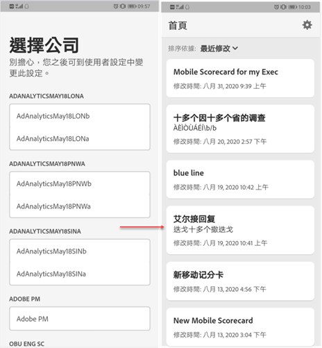
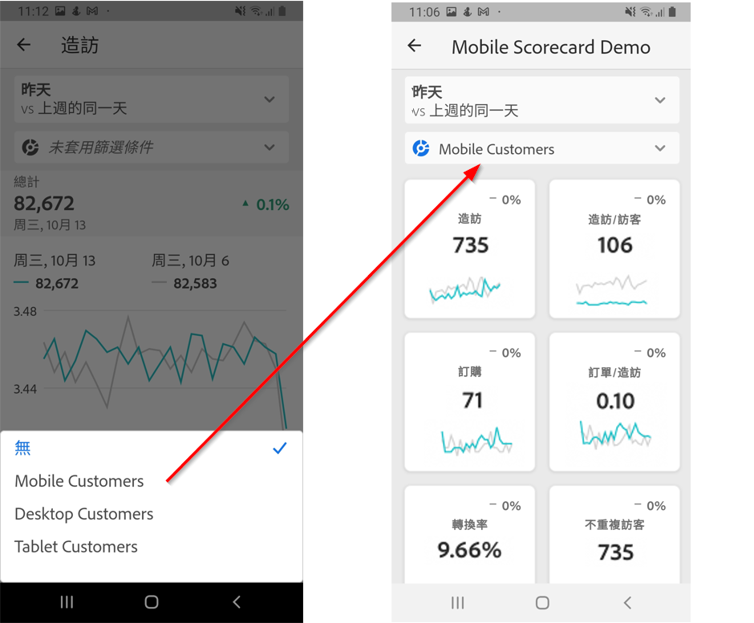

# Adobe Analytics 控制面板：執行使用者快速入門手冊

下列資訊可讓執行使用者瞭解使用和檢視 Adobe Analytics 控制面板的最佳作法。若要觀看講解這項資訊的影片，請參閱 [Adobe Analytics 控制面板程式內動作體驗](https://youtu.be/QXqQ_PkArbA)。

## 簡介

Adobe Analytics 控制面板可隨時隨地提供 Adobe Analytics 的深入分析。此應用程式可讓使用者透過行動裝置存取計分卡，享有符合直覺的操作方式。計分卡是關鍵量度和其他元件的集合，以圖磚式版面配置呈現，點選上面的項目即可取得詳細劃分資料和趨勢報表。iOS 和 Android 作業系統均支援控制面板。

## 本指南的詳細資訊

本指南旨在協助執行使用者閱讀和理解 Analytics 控制面板的計分卡。此應用程式可讓執行使用者在自己的行動裝置上，輕鬆快速地檢視廣泛演算的重要摘要資料。

## 術語表

| 詞語 | 定義 |
|--- |--- |
| 消費者 | 在行動裝置上檢視 Analytics 關鍵量度和深入分析的執行人員 |
| 組織者 | 從 Analytics 尋找及分發深入分析，以及設定計分卡以供消費者檢視的資料識讀人員 |
| 組織 | 為消費者建立或編輯行動計分卡的行為，計分卡內容包含相關量度、維度和其他項目 |
| 計分卡 | 包含一或多個圖磚的控制面板畫面 |
| 圖磚 | 計分卡檢視畫面呈現量度的形式 |
| 劃分 | 輔助性質的檢視畫面，點選計分卡中的圖磚即可顯示。此檢視畫面會在圖磚所顯示的量度上展開，並依使用者的選擇顯示其他劃分維度。 |
| 日期範圍 | 控制面板報表的主要日期範圍 |
| 比較日期範圍 | 與主要日期範圍相比較的日期範圍 |

## 在裝置上設定控制面板

為了有效使用控制面板，您需要請計分卡組織者協助您設定控制面板。本節提供相關資訊，幫助您在組織者的協助下完成設定。

### 取得存取權

若要在控制面板上存取計分卡，請確認：

* 您處於 Adobe Analytics 的有效登入狀態
* 您的組織者已正確建立行動計分卡並與您共用

### 下載並安裝控制面板

若要下載及安裝應用程式，請根據裝置的作業系統，依步驟操作。

**若執行使用者使用 iOS：**

按一下以下連結 (也可從 Analytics 中的&#x200B;**[!UICONTROL 「工具]** > **[!UICONTROL Analytics 控制面板 (行動應用程式)」]**&#x200B;底下存取)，然後依照提示下載、安裝和開啟應用程式：

[iOS 連結](https://apple.co/2zXq0aN)

**若執行使用者使用 Android：**

按一下以下連結 (也可從 Analytics 中的&#x200B;**[!UICONTROL 「工具]** > **[!UICONTROL Analytics 控制面板 (行動應用程式)」]**&#x200B;底下存取)，然後依照提示下載、安裝和開啟應用程式：

[Android 連結](https://bit.ly/2LM38Oo)

下載並安裝完畢後，執行使用者就可使用現有的 Adobe Analytics 憑證登入應用程式。

## 使用控制面板

控制面板使用步驟：

1. 登入應用程式。控制面板啟動後，登入畫面會隨即顯示。使用您現有的 Adobe Analytics 憑證，依提示操作。此應用程式同時支援 Adobe 和 Enterprise/Federated ID。

   

2. 選擇公司。登入控制面板後，**[!UICONTROL 「選擇公司」]**&#x200B;畫面會隨即顯示。此畫面會列出您所屬的登入公司。點選與您所共用計分卡相關聯的公司名稱。

3. 接著，計分卡清單會顯示已與您共用的所有計分卡。點選要檢視的計分卡。

   

   如果您登入後看到未共用任何內容的訊息，請向組織者確認下列事項：

   * 您可以登入正確的 Analytics 例項
   * 已與您共用計分卡

   

4. 檢查圖磚在計分卡中的顯示情形 (第一個計分卡會以深色模式顯示；請參閱下方的&#x200B;**[!UICONTROL 偏好設定]**&#x200B;以取得詳細資訊)。

   

   圖磚的其他資訊：

   * 走勢圖的粒度取決於日期範圍的長度：

      * 若長度為一天，圖表會顯示每小時趨勢
      * 若長度為一天以上、一年以下，則會顯示每日趨勢
      * 若長度為一年 (含) 以上，圖表會顯示每週趨勢
   * 百分比值變更公式為量度合計 (目前日期範圍) - 量度合計 (比較日期範圍) / 量度合計 (比較日期範圍)。

   * 下拉畫面即可重新整理計分卡。

   下列計分卡範例以一般模式顯示：

   

5. 點選圖磚，以查看圖磚劃分的詳細運作資訊。

   

6. 變更計分卡日期範圍：

   

   * 您也可以使用相同方式，變更上述「劃分」檢視中的日期範圍。

   * 根據您點選的時間間隔 (**日**、**週**、**月**&#x200B;或&#x200B;**年**)，畫面會顯示兩個日期範圍選項：目前的時間範圍和上一個日期範圍。點選其中一個選項，並選取第一個範圍。在&#x200B;**[!UICONTROL 比較對象]**&#x200B;清單底下，點選顯示的任何一個選項，比較此時段的資料與您選取的第一個日期範圍。點選畫面右上方的&#x200B;**[!UICONTROL 「完成」]**。**[!UICONTROL 「日期範圍」]**&#x200B;欄位和計分卡圖磚會隨著您所選取新範圍的新比較資料而更新。

7. 若要將區段篩選套用至您的計分卡，請點選篩選下拉式清單，然後選取組織者已設定的區段。應用程式中的[篩選器](https://docs.adobe.com/content/help/en/analytics-learn/tutorials/analysis-workspace/using-panels/using-drop-down-filters.html)運作方式與 Analytics Workspace 中相同。

   

8. 更新計分卡。如果計分卡中沒有您可能感興趣的所有度量或劃分，請連絡您的 Analytics 團隊以更新計分卡。更新後，您可以下拉畫面上的資訊卡，重新整理並載入最近新增的資料。

9. 在此應用程式上提供意見回饋：

   1. 點選應用程式畫面右上方的設定圖示。
   2. 在&#x200B;**[!UICONTROL 我的帳戶]**&#x200B;畫面上，點選&#x200B;**[!UICONTROL 意見反應]**&#x200B;選項。
   3. 點選並查看提供意見回饋的選項。

      

10. 若要變更偏好設定，請點選上方顯示的&#x200B;**[!UICONTROL 偏好設定]**&#x200B;選項。在偏好設定中，您可以開啟生物特徵辨識登入，或是將應用程式設定為深色模式，如下所示：

   

**回報錯誤**：

點選需要的選項，再選擇適合錯誤的子類別。在錯誤回報表單的頂端欄位中提供您的電子郵件地址，並在下方欄位中說明錯誤。帳戶資訊的螢幕擷取畫面會自動附加至訊息，但如有需要，點選附件影像的 **X** 即可刪除此影像。您也可以選擇錄製螢幕、新增更多螢幕擷取畫面或附加檔案。若要傳送報表，請點選表單右上方的紙飛機圖示。

**建議改進事項**：

點選需要的選項，再選擇適合建議的子類別。在建議表單的頂端欄位中提供您的電子郵件地址，並在下方欄位中說明錯誤。帳戶資訊的螢幕擷取畫面會自動附加至訊息，但如有需要，點選附件影像的 **X** 即可刪除此影像。您也可以選擇錄製螢幕、新增更多螢幕擷取畫面或附加檔案。若要傳送建議，請點選表單右上方的紙飛機圖示。

**提出問題**：

點選需要的選項，在頂端欄位中提供您的電子郵件地址，並在下方欄位中說明問題。螢幕擷取畫面會自動附加至訊息，但如有需要，點選附件影像的 **X** 即可刪除此影像。您也可以選擇錄製螢幕、新增更多螢幕擷取畫面或附加檔案。若要傳送問題，請點選表單右上方的紙飛機圖示。
