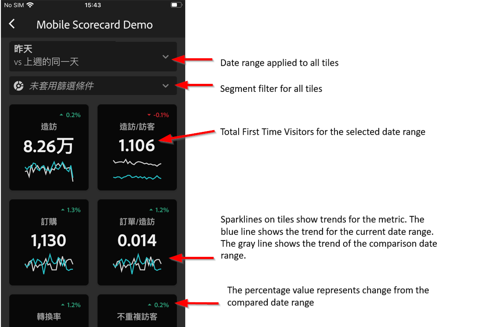
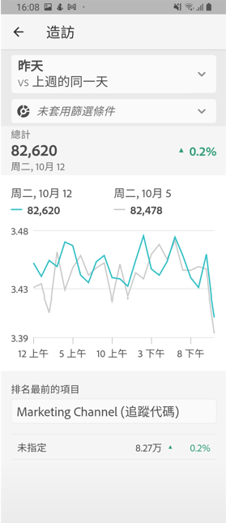

# Analytics行動應用程式：執行使用者快速入門手冊

## 簡介

Adobe Analytics行動應用程式可隨時隨地從Adobe Analytics提供深入資訊。  應用程式可讓使用者透過行動裝置存取直覺式記分卡。 記分卡是關鍵量度和其他元件的集合，顯示在平鋪版面中，您可以點選這些元件以取得更詳細的劃分和趨勢報表。 iOS和Android作業系統都支援行動應用程式。

## 關於本指南

本指南旨在協助主管使用者閱讀和解譯Analytics行動應用程式上的記分卡。 此應用程式可讓主管使用者在自己的行動裝置上，快速輕鬆地檢視重要摘要資料的廣泛轉譯。

## 術語辭彙表

| 術語 | 定義 |
|--- |--- |
| 消費者 | 在行動裝置上檢視Analytics關鍵指標和見解的主管人員角色 |
| 策展人 | 從Analytics尋找並分發見解並設定記分卡以供消費者檢視的資料素養角色 |
| 組織 | 為消費者建立或編輯包含相關度量、維度和其他元件的移動記分卡的操作 |
| 計分卡 | 包含一或多個圖格的行動應用程式檢視 |
| 拼貼 | 記分卡視圖中度量的轉換 |
| 劃分 | 輔助視圖，可通過點選記分卡中的表徵圖來訪問。 此檢視會展開方塊上顯示的量度，並選擇性地報告其他劃分維度。 |
| 日期範圍 | 行動應用程式報表的主要日期範圍 |
| 比較日期範圍 | 與主要日期範圍比較的日期範圍 |

## 在您的裝置上設定應用程式

為了有效使用應用程式，您需要讓記分卡策展人協助您設定應用程式。 本節提供相關資訊，協助您在策展人的協助下進行設定。

### 取用

若要存取應用程式上的記分卡，請確定：

* 您有有效的登入Adobe Analytics
* 策展人已正確建立行動記分卡，並與您共用

### 下載並安裝應用程式

若要下載並安裝應用程式，請依照裝置上的作業系統，依照步驟進行。

**若是iOS裝置：**

1. 按一下下列公用連結(也可在「工具&gt;行動應用程式 **」下的** Analytics **中取得**):

   [iOS連結](https://testflight.apple.com/join/WtXMQxlI): `https://testflight.apple.com/join/WtXMQxlI`

   按一下連結後，會出現下列Testflight畫面：

   

2. 點選畫面 **上的「在App Store中檢視** 」連結，以下載Testflight應用程式。

3. 安裝Testflight應用程式後，請在Testflight中尋找並安裝Adobe Analytics行動應用程式，如下所示：

   

**對於Android裝置：**

1. 點選使用者裝置上的下列「播放商店」連結(也可在「工具 **&gt;行動應用程式******」下的Analytics中取得):

   [Android](https://play.google.com/apps/testing/com.adobe.analyticsmobileapp): `https://play.google.com/apps/testing/com.adobe.analyticsmobileapp`

   點選連結後，點選下列螢幕上的「成為測試者」連結：

   

2. 點選下 **列螢幕上的Google play連結** ，下載它：

   

## 使用應用程式

若要使用應用程式：

1. 登入應用程式。 啟動應用程式時，會出現登入畫面。 使用您現有的Adobe Analytics認證，依照提示進行。 我們同時支援Adobe和Enterprise/Federated ID。

   

2. 選擇公司. 當您登入應用程式後，會出 **現「選擇公司** 」畫面。 此畫面會列出您所屬的登入公司。 點選與您共用之記分卡相關聯的公司名稱。

3. 然後，「記分卡」清單將顯示已與您共用的所有記分卡。 點選您要檢視的記分卡。

   

   *注意：如果您登入並看到訊息指出未共用任何內容，請與策展人確認下列事項：*

   * *您可以登入正確的Analytics例項*
   * *記分卡已與您共用*

      

4. 檢查拼貼在記分卡中的顯示方式。

   

   拼貼的其他資訊：

   * 走勢圖的精細度取決於日期範圍的長度：
   * 一天顯示每小時趨勢
   * 一天以上一年以下會顯示每日趨勢
   * 一年或更多時間顯示每週趨勢
   * 百分比值變更公式是量度總計（目前日期範圍）-量度總計（比較日期範圍）/量度總計（比較日期範圍）。
   * 您可以下拉螢幕以刷新記分卡。

5. 點選圖格以顯示圖格的詳細劃分如何運作。

   

6. 要更改記分卡的日期範圍，請執行以下操作：

   

   *注意：您也可以以相同方式變更上述「劃分」檢視中的日期範圍。*

   根據您點選(**Day**、 **Week**、 **Month******&#x200B;或Year間隔)的不同，您會看到兩個日期範圍的選項——目前時間範圍或緊接在前一個日期範圍。 點選這兩個選項之一以選取第一個範圍。 在「 **COMPARE TO** 」（比較對象）清單下，點選其中一個顯示的選項，以比較此時段的資料與您選取的第一個日期範圍。 點選 **畫面右上** 方的「完成」。 「日 **期範圍** 」欄位和「記分卡」圖格會以您選取之新範圍的新比較資料更新。

7. 獲取記分卡更新。 如果記分卡未包含您可能感興趣的所有度量或劃分，請連絡您的Analytics團隊以更新記分卡。 更新後，您可以下拉畫面上的資訊卡，以重新整理資訊卡並載入最近新增的資料。

8. 保留意見回應。 若要保留意見回應：

   1. 點選應用程式畫面右上方的使用者圖示。
   2. 在「My **Account** （我的帳戶）」畫面上 **，點選「** Feedback（回饋）」選項。
   3. 點選以檢視留下意見的選項。
   
   

**要報告錯誤**:

點選選項，並選擇錯誤的子類別。 在報告錯誤的表單中，請在頂端欄位中提供您的電子郵件地址，並在下方欄位中提供錯誤說明。 帳戶資訊的螢幕擷取畫面會自動附加至訊息，但如果您想要，請點選附件影像中的 **X** ，即可刪除此畫面。 您也可以選擇錄制螢幕、新增更多螢幕擷取畫面或附加檔案。 若要傳送報表，請點選表格右上方的紙本平面圖示。

**建議改進**:

點選選項，然後為建議選擇子類別。 在建議表單中，請在頂端欄位中提供您的電子郵件地址，並在下方欄位中說明錯誤。 帳戶資訊的螢幕擷取畫面會自動附加至訊息，但如果您想要，請點選附件影像中的 **X** ，即可刪除此畫面。 您也可以選擇錄制螢幕、新增更多螢幕擷取畫面或附加檔案。 若要傳送建議，請點選表格右上方的紙本平面圖示。

**要提問**:

點選此選項，並在頂端欄位中提供您的電子郵件地址，並在下方欄位中提供您的問題。 螢幕擷取畫面會自動附加至訊息，但如果您想要，請點選附件影像中的 **X** ，即可刪除此畫面。 您也可以選擇錄制螢幕、新增更多螢幕擷取畫面或附加檔案。 若要傳送問題，請點選表格右上方的紙本平面圖示。
