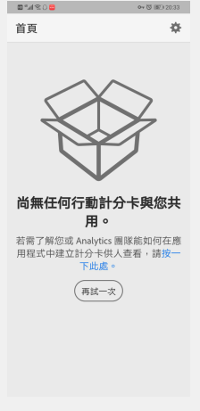
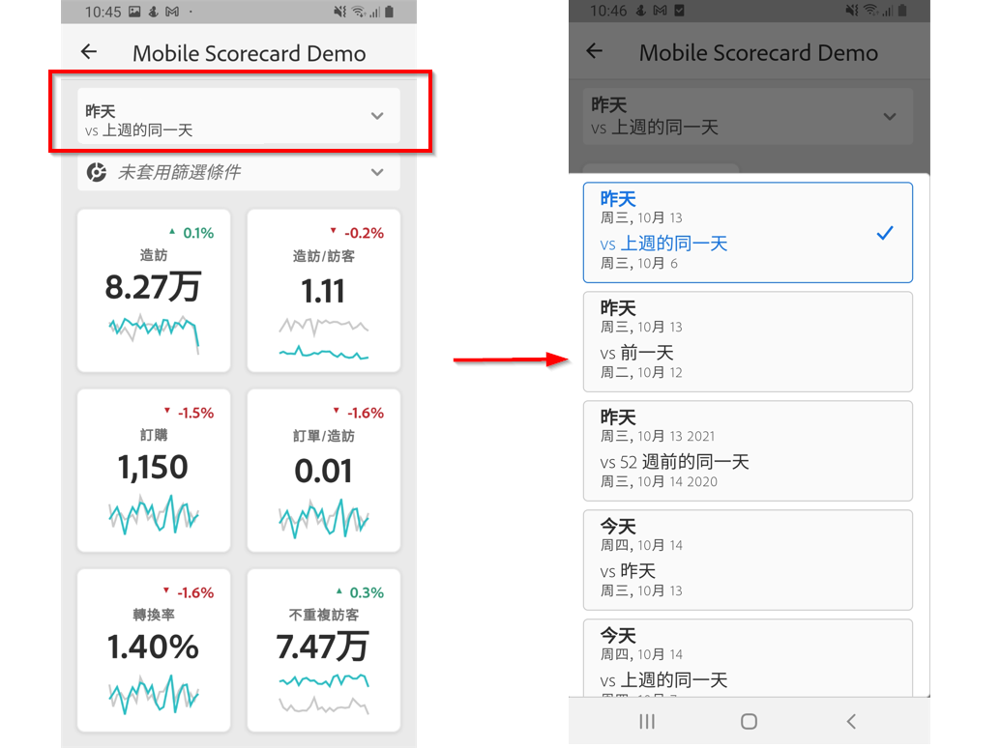

# Adobe Analytics儀表板： 執行使用者快速入門手冊

>[!IMPORTANT]
>
>Adobe Analytics控制面板未發行，僅適用於受邀客戶的測試版測試。 本檔案僅供測試版使用者使用，不代表功能的完整功能。 如果您想成為此>功能的測試版使用者，請聯絡Ashok Gorrepati(gorrepati@adobe.com)。

## 簡介

Adobe Analytics儀表板可隨時隨地從Adobe Analytics獲得深入資訊。  此應用程式可讓使用者透過行動裝置存取計分卡，享有符合直覺的操作方式。計分卡是關鍵量度和其他元件的集合，以圖磚式版面配置呈現，點選上面的項目即可取得詳細劃分資料和趨勢報表。iOS和Android作業系統都支援控制面板。

## 關於本指南

本指南旨在協助執行使用者讀取和解譯Analytics控制面板上的記分卡。 此應用程式可讓執行使用者在自己的行動裝置上，輕鬆快速地檢視廣泛演算的重要摘要資料。

## 術語表

| 詞語 | 定義 |
|--- |--- |
| 消費者 | 在行動裝置上檢視 Analytics 關鍵量度和深入分析的執行人員 |
| 組織者 | 從 Analytics 尋找及分發深入分析，以及設定計分卡以供消費者檢視的資料識讀人員 |
| 組織 | 為消費者建立或編輯行動計分卡的行為，計分卡內容包含相關量度、維度和其他項目 |
| 計分卡 | 包含一或多個拼貼的控制面板檢視 |
| 圖磚 | 計分卡檢視畫面呈現量度的形式 |
| 劃分 | 輔助性質的檢視畫面，點選計分卡中的圖磚即可顯示。此檢視畫面會在圖磚所顯示的量度上展開，並依使用者的選擇顯示其他劃分維度。 |
| 日期範圍 | 控制面板報告的主要日期範圍 |
| 比較日期範圍 | 與主要日期範圍相比較的日期範圍 |

## 在您的裝置上設定控制面板

要有效地使用控制面板，您需要讓記分卡管理員協助您設定控制面板。 本節提供相關資訊，幫助您在組織者的協助下完成設定。

### 取得存取權

要訪問控制面板上的記分卡，請確保：

* 您處於 Adobe Analytics 的有效登入狀態
* 您的組織者已正確建立行動計分卡並與您共用

### 下載並安裝控制面板

若要下載及安裝應用程式，請根據裝置的作業系統，依步驟操作。

**iOS 裝置：**

1. Click the following public link (It is also available in Analytics under **Tools** > **dashboards**):

   [iOS 連結](https://testflight.apple.com/join/WtXMQxlI)：`https://testflight.apple.com/join/WtXMQxlI`

   按一下連結後，系統會顯示下列 Testflight 畫面：

   

2. 點選畫面上的&#x200B;**「在 App Store 中檢視」**&#x200B;連結，前往下載 Testflight 應用程式。

3. 安裝Testflight應用程式後，請在Testflight中尋找並安裝Adobe Analytics控制面板，如下所示：

   

**Android 裝置：**

1. Tap the following Play Store link on the user&#39;s device (It is also available in Analytics under **Tools** > **dashboards**):

   [Android](https://play.google.com/apps/testing/com.adobe.analyticsmobileapp)：`https://play.google.com/apps/testing/com.adobe.analyticsmobileapp`

   點選連結後，點選下列畫面上的「成為測試者」連結：

   

2. 點選下列畫面上的&#x200B;**「透過 Google Play 下載」**&#x200B;連結：

   

## 使用控制面板

要使用控制面板：

1. 登入應用程式。啟動控制面板時，會出現登入畫面。 使用您現有的 Adobe Analytics 憑證，依提示操作。此應用程式同時支援 Adobe 和 Enterprise/Federated ID。

   

2. 選擇公司。After you sign into dashboards, the **Choose a company** screen appears. 此畫面會列出您所屬的登入公司。點選與您所共用計分卡相關聯的公司名稱。

3. 接著，計分卡清單會顯示已與您共用的所有計分卡。點選要檢視的計分卡。

   

   *注意：如果您登入後看到未共用任何內容的訊息，請向組織者確認下列事項：*

   * *您可以登入正確的 Analytics 例項*
   * *已與您共用計分卡*

      

4. 檢查圖磚在計分卡中的顯示方式。

   

   圖磚的其他資訊：

   * 走勢圖的粒度取決於日期範圍的長度：
   * 若長度為一天，圖表會顯示每小時趨勢
   * 若長度為一天以上、一年以下，圖表會顯示每日趨勢
   * 若長度為一年 (含) 以上，圖表會顯示每週趨勢
   * 百分比值變更公式為量度合計 (目前日期範圍) - 量度合計 (比較日期範圍) / 量度合計 (比較日期範圍)。
   * 下拉畫面即可重新整理計分卡。

5. 點選圖磚，即可顯示圖磚劃分的詳細運作資訊。

   

6. 變更計分卡日期範圍：

   

   *注意：您也可以使用相同方式，變更上述劃分檢視中的日期範圍。*

   根據您點選的時間間隔 (**日**、**週**、**月**&#x200B;或&#x200B;**年**)，畫面會顯示兩個日期範圍選項：目前的時間範圍和上一個日期範圍。點選其中一個選項，並選取第一個範圍。在&#x200B;**比較對象**&#x200B;清單底下，點選顯示的任何一個選項，比較此時段的資料與您選取的第一個日期範圍。點選畫面右上方的&#x200B;**「完成」**。**「日期範圍」**&#x200B;欄位和計分卡圖磚會隨著您所選取新範圍的新比較資料而更新。

7. 更新計分卡。如果計分卡中沒有您可能感興趣的所有度量或劃分，請連絡您的 Analytics 團隊以更新計分卡。更新後，您可以下拉畫面上的資訊卡，重新整理並載入最近新增的資料。

8. 提供意見回饋。提供意見回饋：

   1. 點選控制面板畫面右上方的使用者圖示。
   2. 在&#x200B;**我的帳戶**&#x200B;畫面上，點選&#x200B;**「意見回饋」**&#x200B;選項。
   3. 點選並查看提供意見回饋的選項。
   
   

**回報錯誤**：

點選需要的選項，再選擇適合錯誤的子類別。在錯誤回報表單的頂端欄位中提供您的電子郵件地址，並在下方欄位中說明錯誤。帳戶資訊的螢幕擷取畫面會自動附加至訊息，但如有需要，點選附件影像的 **X** 即可刪除此影像。您也可以選擇錄製螢幕、新增更多螢幕擷取畫面或附加檔案。若要傳送報表，請點選表單右上方的紙飛機圖示。

**建議改進事項**：

點選需要的選項，再選擇適合建議的子類別。在建議表單的頂端欄位中提供您的電子郵件地址，並在下方欄位中說明錯誤。帳戶資訊的螢幕擷取畫面會自動附加至訊息，但如有需要，點選附件影像的 **X** 即可刪除此影像。您也可以選擇錄製螢幕、新增更多螢幕擷取畫面或附加檔案。若要傳送建議，請點選表單右上方的紙飛機圖示。

**提出問題**：

點選需要的選項，在頂端欄位中提供您的電子郵件地址，並在下方欄位中說明問題。螢幕擷取畫面會自動附加至訊息，但如有需要，點選附件影像的 **X** 即可刪除此影像。您也可以選擇錄製螢幕、新增更多螢幕擷取畫面或附加檔案。若要傳送問題，請點選表單右上方的紙飛機圖示。
