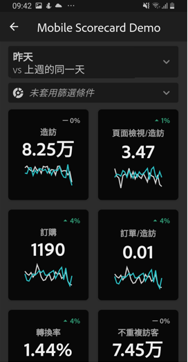

# 透過應用程式設定執行使用者

某些情況下，執行使用者可能需要額外的協助，才能存取及使用應用程式。本節提供相關資訊，幫助您提供這類協助。

## 確認應用程式使用者能夠存取 Adobe Analytics

1. 在[Experience CloudAdmin Console](/help/admin/admin-console/permissions/product-profile.md)中設定新用戶。

1. 若要共用計分卡，您必須授予應用程式使用者存取計分卡元件的權限，例如Analysis Workspace、計分卡所依據的報表套裝，以及區段、量度和維度。

## 應用程式使用者的系統必要條件

若要確保執行使用者在應用程式上擁有您計分卡的存取權，請確定：

* 使用者裝置的行動作業系統需為 iOS 10 (含) 以上版本或 Android 4.4 (KitKat) (含) 以上版本
* 使用者處於 Adobe Analytics 的有效登入狀態。
* 您已為使用者正確建立行動計分卡，並與他們共用這些計分卡。
* 他們可存取計分卡所包含的元件。 請注意，您可以在共用計分卡至&#x200B;**[!UICONTROL 共用內嵌元件]**&#x200B;時選取選項。

## 協助主管下載並安裝應用程式

**若執行使用者使用 iOS：**

按一下以下連結 (也可從 Analytics 中的&#x200B;**[!UICONTROL 「工具]** > **[!UICONTROL Analytics 儀表板 (行動應用程式)」]**&#x200B;底下存取)，然後依照提示下載、安裝和開啟應用程式：

`[iOS link](https://apple.co/2zXq0aN)`

**若執行使用者使用 Android：**

按一下以下連結 (也可從 Analytics 中的&#x200B;**[!UICONTROL 「工具]** > **[!UICONTROL Analytics 儀表板 (行動應用程式)」]**&#x200B;底下存取)，然後依照提示下載、安裝和開啟應用程式：

`[Android link](https://bit.ly/2LM38Oo)`

下載並安裝完畢後，執行使用者就可使用現有的 Adobe Analytics 憑證登入應用程式；系統可支援 Adobe 和 Enterprise/Federated ID。

## 協助主管存取您的計分卡

1. 讓執行使用者登入應用程式。

   出現「**[!UICONTROL 選擇公司]**」螢幕。 此畫面會列出執行使用者所屬的登入公司。

1. 請他們點選套用至您所共用計分卡的登入公司或Experience Cloud組織名稱。

   接著，計分卡清單會顯示該登入公司與執行人員共用的所有計分卡。

1. 請他們依&#x200B;**[!UICONTROL 最近修改的]**&#x200B;將清單排序（如果適用）。

1. 請他們點選計分卡的名稱以加以檢視。

   

### 說明計分卡UI

向執行使用者說明圖磚在您共用的計分卡中會如何顯示。

圖磚的其他資訊：

* 走勢圖的詳細程度取決於日期範圍的長度：
* 若長度為一天，圖表會顯示每小時趨勢
   * 若長度為一天以上、一年以下，則會顯示每日趨勢
   * 若長度為一年 (含) 以上，圖表會顯示每週趨勢
   * 百分比值變更公式為量度合計 (目前日期範圍) - 量度合計 (比較日期範圍) / 量度合計 (比較日期範圍)。
   * 下拉畫面即可重新整理計分卡。

1. 點選圖磚，即可顯示圖磚劃分的詳細運作資訊。

   

   * 點選走勢圖上的任一點，可查看與線上該點相關聯的資料。

   * 其中包含一個表格，會顯示新增至圖磚的維度資料。點選向下箭頭可選取維度。如果未將任何維度新增至圖磚，表格將會顯示圖表資料。

1. 若要變更計分卡的日期範圍，點選日期標題並選取想要檢視的主要和比較日期範圍組合。

   

## 變更應用程式偏好設定

若要變更偏好設定，請點選上方顯示的&#x200B;**[!UICONTROL 偏好設定]**&#x200B;選項。在偏好設定中，您可以開啟生物特徵辨識登入，或是將應用程式設定為深色模式，如下所示：

## 疑難排解

如果執行使用者登入後看到未共用任何內容的訊息：

* 執行使用者可能選取了錯誤的Analytics例項，或
* 可能未與執行使用者共用計分卡。

確認執行使用者可以登入正確的Adobe Analytics執行個體，且已共用計分卡。

>[!IMPORTANT]
>
>自 2020 年 10 月起，Adobe 將逐步推出一系列增強功能，以最佳化「Adobe Analytics 儀表板」應用程式的效能。這些增強功能著重於快取將計分卡填入日期 (當天除外) 的歷史 Analytics 資料。該資料將於最多 24 小時內，透過安全的 Microsoft Azure 公用雲端儲存空間帳戶進行快取。若要選擇不使用上述效能增強功能，請連絡您的 CSM。
