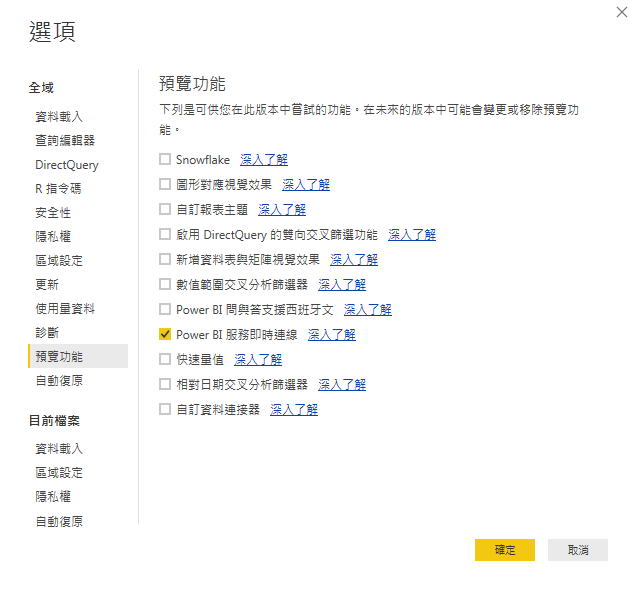

# 將已發佈資產提取至Power BI桌面

說明如何將 Report Builder 發佈的資產帶入 Power BI Desktop

## 必要條件 {#section_BDFDAE1E300B429FB6EBCB21AD1383A0}

* 您必須安裝最新的 Power BI Desktop (2017 年 4 月版本)
* 此程序會假設您已將 Report Builder 的格式化表格或請求發佈至 Power BI 服務。

## 程序 {#section_CB03E6E1B066457EA0F6FC08FFF5EFDD}

在 2017 年 4 月的 Power BI Desktop 更新中，Microsoft 發佈了可在 Power BI 服務中連接至資料集的功能。這項功能可讓您從已發佈至雲端的現有資料集建立新報表。您可以運用此功能獲得更完善的協同合作體驗，並減少整個團隊中重工的情形。

1. In Power BI Desktop, go to **[!UICONTROL File]** &gt; **[!UICONTROL Options and settings]** &gt; **[!UICONTROL Options]** &gt; **[!UICONTROL Preview features.]**
1. Enable **[!UICONTROL Power BI Service Live Connection]** and click **[!UICONTROL OK]**. 

1. 重新啟動 Power BI Desktop。
1. Once you have restarted the desktop, go to **[!UICONTROL Home]** &gt; **[!UICONTROL Get Data]** &gt; **[!UICONTROL More...]**.
1. Search for and select **[!UICONTROL Power BI service]**.
1. Under **[!UICONTROL Microsoft Power BI service]** &gt; **[!UICONTROL My Workspace]**, select the dataset that you had previously published from Report Builder.

如需詳細資訊，請參閱此 [Microsoft 部落格文章](https://powerbi.microsoft.com/en-us/blog/connecting-to-datasets-in-the-power-bi-service-from-desktop/)。
