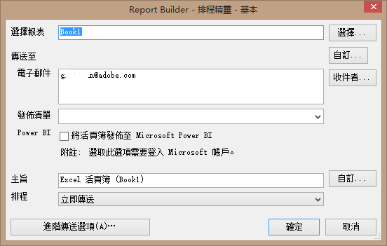
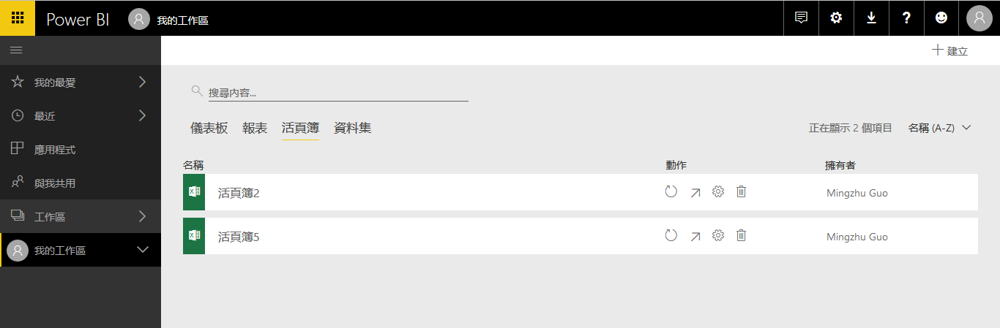
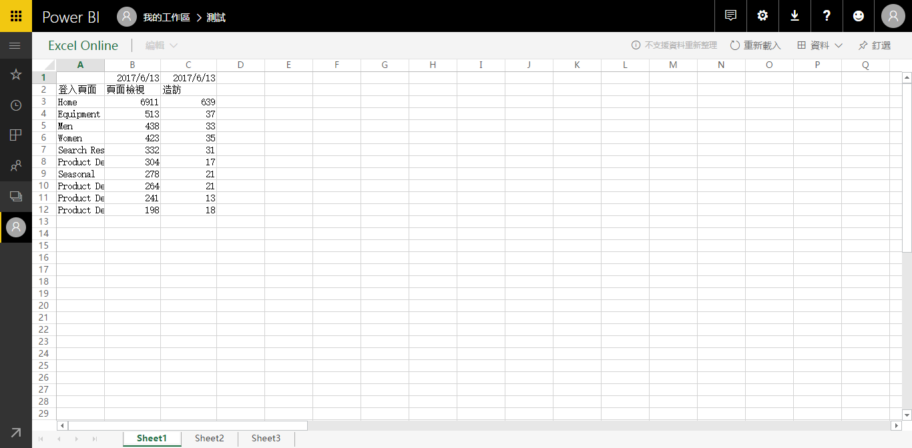
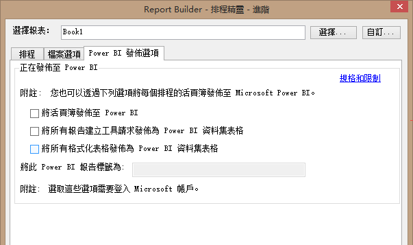
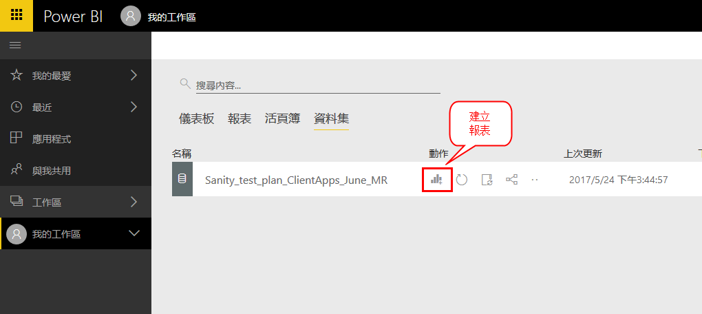
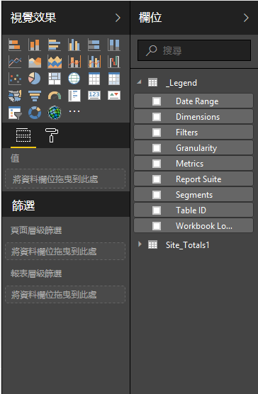
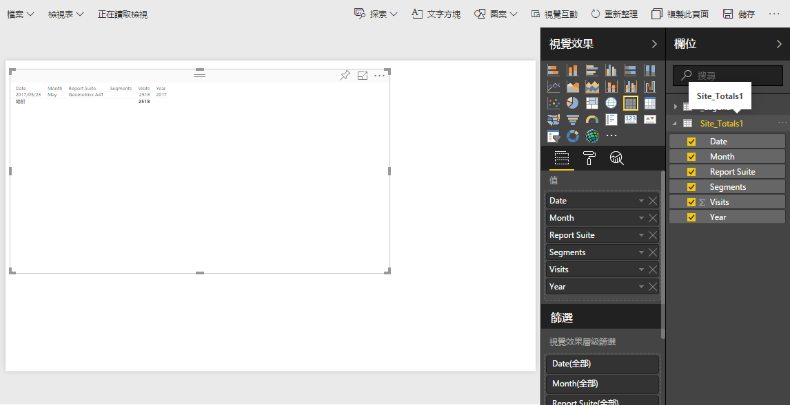
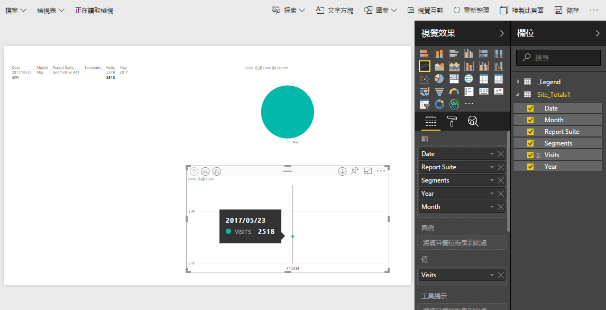
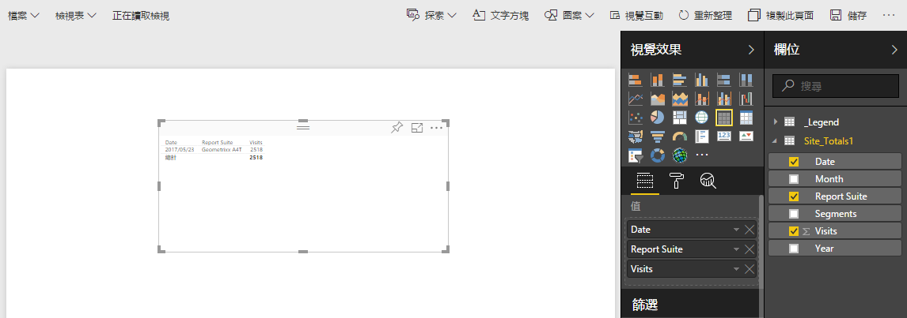
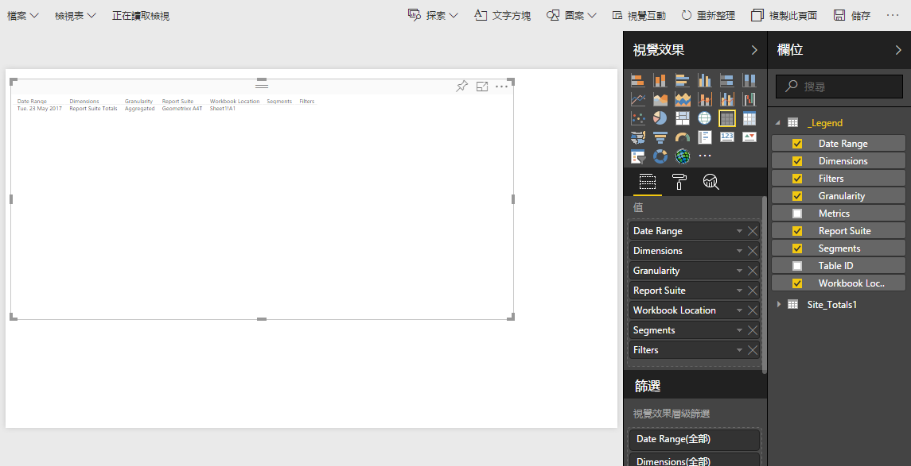

# 發佈至 Power BI - 概觀

Microsoft Power BI是一套商業分析資料板，可用來分析資料並分享見解。 Adobe Analytics與Power BI的整合可讓您在Microsoft Power BI中視覺化報告建立工具分析資料，並輕鬆在組織內共用資料。

以前，身為分析師，您會排程「報告建立工具」活頁簿透過電子郵件（或FTP）散發。 您現在可讓企業使用者利益相關者在跨平台和裝置皆可存取的網路環境中，存取（從其Power BI帳戶）精確和最新的資料。

結合Report Builder的報表產生功能與Power BI的視覺化功能，讓組織中的每個人都能存取資訊。 使用 Power BI，您還可以將 Adobe Analytics 與其他資料來源整合 (例如銷售點、CRM)，以發掘獨特的客戶分析資料、關聯及商機。

與Adobe Report Builder的整合可讓您

* [將已排程的 Report Builder 活頁簿發佈到 Power BI](/help/analyze/report-builder/whats-new-arb.md#rb-5-5-section)
* [以 Power BI 資料集表格發佈活頁簿中的所有格式化表格](/help/analyze/report-builder/whats-new-arb.md#rb-5-5-section)
* [以 Power BI 資料集表格發佈所有 Report Builder 請求](/help/analyze/report-builder/whats-new-arb.md#rb-5-5-section)

## 系統要求 {#section_0B71092D853446F38FA36447DAC0D32B}

* [已安裝](/help/analyze/report-builder/setup/t-install-arb.md) Adobe Report Builder 5.5
* 可讓您登入 Power BI 的有效 Microsoft 帳戶

## 將活頁簿發佈至 Power BI {#section_21CA66229EC240D49594A9A7D3FBA687}

已排程的活頁簿為格式化的 Excel 試算表，其中填入來自 Adobe Analytics 的資料，並以定期排程的方式傳送。

**在 Report Builder 中發佈活頁簿**

1. 在報告建立工具中，產生並儲存活頁簿。
1. On the Report Builder Toolbar, click **[!UICONTROL Schedule]** > **[!UICONTROL New]**.

1. 在「基本排程精靈」中，核取旁邊的方塊 **[!UICONTROL Publish Workbook to Microsoft Power BI]**。

   

1. 指定您的電子郵件並立即傳送，或指定排程頻率（每小時、每日等）。
1. 按一 **[!UICONTROL OK]** 下以發佈。
1. 現在會要求您登入您的Microsoft帳戶。 提供您的認證。
1. 報告建立工具活頁簿會排程並發佈至Power BI。

   在每個排程例項中，當報告建立工具排程程式以更新的Analytics資料重新整理活頁簿後，活頁簿將會發佈至Microsoft Power BI。

**在 Power BI 中檢視 Report Builder 活頁簿資料**

1. 在Power BI中，按兩下功能表下方的活頁 [!UICONTROL Workbooks] 簿。

   

1. 您現在可以檢視活頁簿控制面板資料。    

1. 您可以接著釘選此活頁簿的某個區域，以將其包含在任何 Power BI 控制面板中。

## 將活頁簿中所有格式化表格以 Power BI 資料集表格形式發佈。{#section_7C54A54E75184DD6BAEF4ACCE241239A}

>[!NOTE] 如果活頁簿含有巨集，系統將會停用「以 Power BI 資料集表格形式發佈活頁簿中所有格式化表格」功能。

您可以只匯入活頁簿中所有格式化表格的內容，不能匯入整個活頁簿。

**使用案例**：您有 Excel 活頁簿，可從多個 Report Builder 請求帶入資料，也可建立含有大量公式的摘要表格。您只能將摘要表格匯入Power BI並建立視覺化。

**在 Report Builder 中發佈格式化表格**

1. 在 Report Builder 中，產生含有標題列且其後接著一列資料的資料表格。
1. 選擇表並從菜 **[!UICONTROL Format as Table]** 單中選 [!UICONTROL Home] 擇。 The table gets named by default (Table 1, Table 2, etc.), but you can change the name on the [!UICONTROL Design]menu.

1. On the Report Builder Toolbar, click **[!UICONTROL Schedule]** > **[!UICONTROL New]**.

1. 在「基本排程精靈」中，按一下 **[!UICONTROL Advanced Scheduling Options]**。
1. 在頁籤 [!UICONTROL Scheduling Wizard - Advanced]上，選中 **[!UICONTROL Publishing Options]** 旁邊的複選框 **[!UICONTROL Publish all Formatted Tables as Power BI dataset tables]**。

   

1. （可選）您可以在Power BI中自訂已發佈資產的名稱。 如果您使用版本修訂作為活頁簿名稱的一部分（例如myworkbook_v1.1.xlsx），而且您不希望版本號碼顯示在已發佈Power BI資產的名稱中，這個功能就很有用。 這樣做的好處是，當版本號碼改變時，已發佈的資產不會變更(您可前往[這裡](/help/analyze/report-builder/c-publish-power-bi/specifications-limits.md)檢視規格)。

**在 Power BI 中檢視表格資料**

1. In Power BI, go to the **[!UICONTROL Workspaces]** > **[!UICONTROL Datasets]** menu.

   

1. 選取您發佈的資料集，然後按一 [!UICONTROL Create report] 下旁邊的圖示。 請注意，這些表格將顯示為「欄位」。

   

1. 選擇一個表及其關聯列。

   

1. 從菜單 [!UICONTROL Visualizations] 中，可以選擇如何在Power BI中直觀顯示表。 例如，您可以選擇以折線圖呈現資料：

   

1. 從這裡，您可以從此資料集表格建立視覺化。

## 以 Power BI 資料集表格形式發佈所有 Report Builder 請求 {#section_0C26057C7DBB4068A643FDD688F6E463}

您可以將所有請求轉換成資料集表格，並在這些表格上方建立視覺效果。

>[!IMPORTANT]
>
>如果活頁簿含有超過 100 個請求，系統只會將前 100 個請求發佈至 Power BI。此外，對於發佈至Power BI的每個請求，僅會發佈前10,000列資料。 因此，雖然這些要求可透過排程成功傳送，但發佈至Power BI的範圍有限。

1. 在報告建立工具中，開啟或建立含有報告建立工具請求的活頁簿。
1. On the Report Builder Toolbar, click **[!UICONTROL Schedule]** > **[!UICONTROL New]**.

1. 在「基本排程精靈」中，按一下 **[!UICONTROL Advanced Scheduling Options]**。
1. 在標 [!UICONTROL Scheduling Wizard - Advanced]簽上， **[!UICONTROL Publishing Options]****[!UICONTROL Publish all Report Builder Requests as Power BI Dataset Tables]** 核取 

1. 按一下 **[!UICONTROL OK]**.

**在 Power BI 中檢視請求資料**

每個排程的報告建立工具請求都會發佈為資料集中的表格。 每個請求表都以請求中的主要維度命名，且其中有 [!UICONTROL Report Suite] 和一 [!UICONTROL Segments] 欄。

1. In Power BI, go to the **[!UICONTROL Workspaces]** > **[!UICONTROL Datasets]** menu.

1. 選取您所發佈的請求，然後按一 [!UICONTROL Create report] 下其旁的圖示。

   請注意，這些請求會以表格的形式出現在功能 [!UICONTROL Fields] 表中。

   

   >[!NOTE]
   >
   >不論如何設定活頁簿中 Report Builder 請求的編排方式 (樞紐配置、自訂配置、隱藏部分欄)，Report Builder 會一律以相同的二維單一標題列格式發佈請求：「日期」、「維度」、「量度」、「報表套裝」、「區段」。

1. 另請注意，還有一個名為的附加表 **[!UICONTROL Legend]**。 如果您從「報告建立工具」上下文擷取請求，可能很難記住每個請求的代表性。 例如，圖例表的用途是在表ID下顯示每個請求的名稱。 您也可以新增其他「圖例」欄，以取得請求的完整檢視。

   

