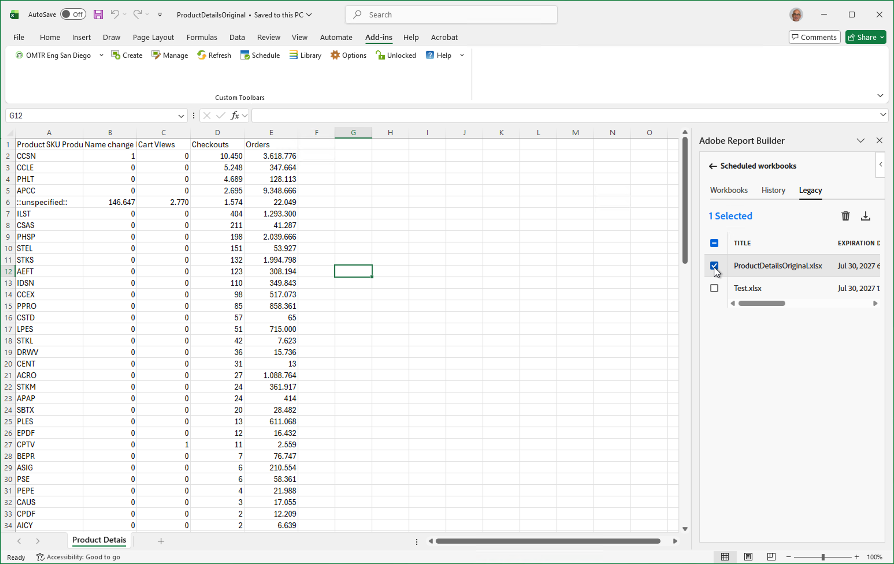

# 轉換舊版Report Builder活頁簿

舊版Report Builder將於2026年6月終止服務。 您應該將活頁簿從舊版Report Builder移轉至新Report Builder。 新的Report Builder提供便利的方法，可快速移轉使用舊版Report Builder建立的活頁簿。

>[!IMPORTANT]
>
>在轉換舊版活頁簿之前，請先複製每個活頁簿並重新命名一個版本。 這可確保您隨時擁有原始舊版活頁簿的副本（需要時）。

>[!BEGINSHADEBOX]

如需示範影片，請參閱 [轉換活頁簿](https://experienceleague.adobe.com/zh-hant/docs/analytics-learn/tutorials/exporting/report-builder/upgrade-and-reschedule-workbooks){target="_blank"}。

>[!ENDSHADEBOX]

>[!NOTE]
>
>若要轉換舊版活頁簿，您必須先設定[新的Report Builder](/help/analyze/report-builder/report-builder-setup.md)。

## 開啟舊版活頁簿

若要開啟舊版活頁簿，您可以：

* 從&#x200B;**[!UICONTROL Report Builder中心]**&#x200B;的[排程](report-builder-hub.md)索引標籤開啟已排程的舊版活頁簿。 此動作是排程舊版活頁簿的偏好方法。 當您要[排程轉換的舊版活頁簿](#schedule-a-converted-legacy-workbook)時，您可以選擇使用與舊版活頁簿關聯的排程。

   1. 開啟[!DNL Excel]並從AdobeLogoRedonWhite **** Report Builder[!DNL Excel]。

   1. 選取&#x200B;**[!UICONTROL 登入]**&#x200B;並登入Report Builder。

   1. 在&#x200B;**[!UICONTROL Report Builder中心]**&#x200B;中選取[排程](report-builder-hub.md)。
   1. 選取&#x200B;**[!UICONTROL 舊版]**&#x200B;標籤。 索引標籤會列出您已建立的舊版Report Builder排程活頁簿。

      

   1. 從清單中選取您要轉換的排程活頁簿，然後選取。 活頁簿已下載，並在[!DNL Excel]的新視窗中開啟。 您現在可以[轉換舊版Report Builder活頁簿](#convert-a--workbook)。

* 直接從您的本機電腦或網路開啟舊版活頁簿。 使用此方法時，系統不提供您使用可能與舊版活頁簿關聯的排程。  當舊版活頁簿在[!DNL Excel]中開啟時：

   1. 從AdobeLogoRedOnWhite **** Report Builder[!DNL Excel]。
   1. 選取&#x200B;**[!UICONTROL 登入]**&#x200B;並登入Report Builder。
   1. 然後[轉換舊版活頁簿](#convert-a-workbook)。

## 轉換舊版活頁簿

若要轉換舊版活頁簿：

1. 開啟舊版活頁簿後，新的Report Builder會偵測此活頁簿是否包含[舊版Report Builder](/help/analyze/legacy-report-builder/home.md)請求。

   ![顯示移轉升級的[!DNL Excel] Report Builder升級報告熒幕擷圖](assets/upgrade-workbook.png){zoomable="yes"}

1. 如果找到一或多個舊版要求，請在&#x200B;**[!UICONTROL 升級活頁簿]**&#x200B;對話方塊中按一下&#x200B;**[!UICONTROL 升級]**&#x200B;以升級活頁簿。

   >[!NOTE]
   >
   >您必須個別升級每個請求。 不支援大量升級。

1. 若您升級，會出現&#x200B;**[!UICONTROL 警告]**&#x200B;對話方塊，提醒您變更活頁簿。 此外也鼓勵您在繼續之前，先建立舊版活頁簿的備份。

   ![顯示移轉警告的[!DNL Excel] Report Builder升級報告熒幕擷圖](assets/upgrade-warning.png){zoomable="yes"}

1. 按一下&#x200B;**[!UICONTROL 繼續]**&#x200B;以繼續升級。

   如果升級成功，便會顯示&#x200B;**[!UICONTROL 活頁簿升級已完成]**&#x200B;通知。

   ![ [!DNL Excel] Report Builder升級報告熒幕擷圖顯示移轉已完成](assets/upgrade-complete.png)

   * 選取&#x200B;**[!UICONTROL 關閉]**&#x200B;以關閉通知，並繼續使用活頁簿處理新Report Builder的更新要求。

   * 選取[下載]升級報告&#x200B;**[!UICONTROL 以下載並開啟顯示升級結果的新]**&#x200B;活頁簿。 [!DNL Excel]如需範例，請參閱下文。

     ![顯示移轉報告的[!DNL Excel] Report Builder升級報告熒幕擷圖](assets/upgrade-report.png)

您現在可以[管理活頁簿中的資料區塊](/help/analyze/report-builder/manage-reportbuilder.md)。 這些資料區塊是升級的結果，會取代您舊有的Report Builder請求。

## 排程轉換的舊版活頁簿

您可以選擇使用您從Report Builder中心的&#x200B;**[!UICONTROL 排程]**&#x200B;索引標籤下載並開啟的舊版活頁簿的排程詳細資料。 此選項不適用於具有您從本機電腦或網路開啟之排程詳細資料的舊版活頁簿。

1. 若要使用舊版排程來排程轉換的舊版活頁簿：

   * 從Report Builder中心選取&#x200B;**[!UICONTROL 傳送活頁簿]**，或
   * 從Report Builder中&#x200B;**[!UICONTROL 排程]**&#x200B;索引標籤可用的&#x200B;**[!UICONTROL 活頁簿]**&#x200B;索引標籤中選取&#x200B;**[!UICONTROL 排程活頁簿]**。

1. 系統提供您使用舊版活頁簿的排程詳細資料，作為預設排程設定。

   ![ [!DNL Excel] Report Builder舊版排程設定選項的熒幕擷圖](assets/upgrade-legacy-schedule-convert.png)

   * 選取&#x200B;**[!UICONTROL 使用]**&#x200B;以使用舊版排程詳細資料。 排程詳細資料已預先填入[傳送活頁簿](schedule-reportbuilder.md#schedule-a-workbook)介面。
   * 選取&#x200B;**[!UICONTROL 不要使用]**&#x200B;以不使用舊版排程詳細資料。
   * 選取「**[!UICONTROL 取消]**」進行取消。

   選取&#x200B;**[!UICONTROL 從未來使用中移除舊版中繼資料]**，以便未來不再為此活頁簿使用舊版排程詳細資料。

## 從舊版Report Builder移轉

舊版Report Builder的部分功能在Report Builder中不支援、部分支援或實作方式不同：

* **即時要求**。 即時請求不受支援，並且已從轉換的舊版活頁簿中移除。

* **路徑/流失報告**。 不支援退出請求，並且會從轉換的舊版活頁簿中移除。

* 排程報告&#x200B;**[!DNL FTP]的**&#x200B;選項。 排程報表以傳送至[!DNL FTP]位置的選項已無法使用。

* **將活頁簿發佈到排程報告的[!DNL Power BI]選項**。 將報表排程至[!DNL Power BI]的選項已無法使用。

* **訪客量度**。 下列量度在轉換的舊版活頁簿中會轉換為&#x200B;*不重複訪客*，即使報表結果可能並非完全相符： `visitorshourly`、`visitorsdaily`、`visitorsweekly`、`visitorsmonthly`、`visitorsquarterly`和`visitorsyearly`。 此轉換也適用於`mobilevisitorshourly`、`mobilevisitorsdaily`、`mobilevisitorsweekly`、`mobilevisitorsmonthly`、`mobilevisitorsquarterly`和`mobilevisitorsyearly`。

* **自動重新驗證**。 開啟新的[!DNL Excel]檔案時，您需要明確重新驗證。 此重新驗證是[!DNL Office Add-ins]功能的安全性功能。

* **複製含有一組資料區塊的工作表**。 若要支援包含多個資料區塊的工作表復本，請執行下列動作：

   1. 在[!DNL Excel]活頁簿中選取您要複製的工作表標籤。
   1. 從索引標籤的內容功能表中，選取&#x200B;**[!UICONTROL 移動或複製……]**
   1. 在&#x200B;**[!UICONTROL 移動或複製]**&#x200B;對話方塊中：
      1. 選取您要複製工作表的目標位置。
      1. 請確定您已啟用&#x200B;**[!UICONTROL 建立復本]**。
      1. 選取&#x200B;**[!UICONTROL 確定]**。
   1. 從來源工作表：
      1. 選取包含所有資料區塊的儲存格範圍。
      1. 從選取&#x200B;**[!UICONTROL 複製]** [複製資料區塊](/help/analyze/report-builder/report-builder-hub.md)。
   1. 在目標工作表中：
      1. 選取您要將複製的儲存格範圍貼上到的儲存格。
      1. 從選取&#x200B;**[!UICONTROL 貼上]** [貼上資料區塊](/help/analyze/report-builder/report-builder-hub.md)。

* **日期範圍**。 Report Builder不會移轉日期範圍格式選項&#x200B;**[!UICONTROL 將開始和結束期間顯示為]**，套用至舊版Report Builder中日期範圍的列標籤。

* **平均**。 Report Builder不會移轉套用至舊版Report Builder中量度之選取的格式選項&#x200B;**[!UICONTROL 平均選項]** （**[!UICONTROL 每日平均]**&#x200B;向上直到&#x200B;**[!UICONTROL 每年平均]**）。 使用計算量度來取代選取的選項。

* **在文字前置/後置**。 Report Builder不會移轉套用至舊版Report Builder中量度的&#x200B;**[!UICONTROL 前置文字/後置文字]**。

* **小計**。 Report Builder不會移轉套用到舊版Report Builder中量度的格式化選項&#x200B;**[!UICONTROL SubTotal（此請求）]**。 當您在舊版活頁簿要求中使用&#x200B;**[!UICONTROL SubTotal（此要求）]**&#x200B;時，功能會轉換為&#x200B;**[!UICONTROL Total]**。 例如：在前5個頁面名稱的舊版資料區塊中，您已使用&#x200B;**[!UICONTROL SubTotal（頁面檢視）]**&#x200B;來傳回前5個頁面名稱的頁面檢視總和。 移轉後，前5個頁面名稱的相同資料區塊會傳回&#x200B;*所有*&#x200B;頁面名稱的頁面檢視總和。 使用計算量度功能來取代舊版&#x200B;**[!UICONTROL SubTotal]**&#x200B;功能。
