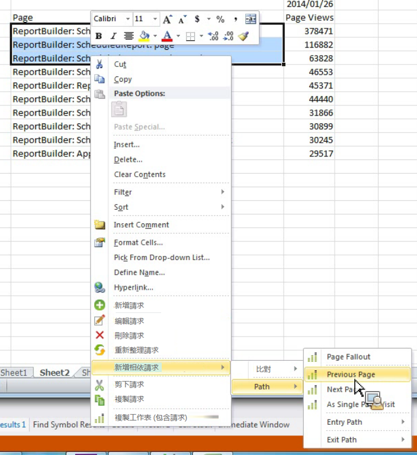

# 新增相依請求以篩選路徑報表

說明如何使用預先定義的篩選條件建立路徑報表。

行銷 Reports &amp; Analytics 提供一些獨立報表，作為帶有預先定義篩選條件的最上層路徑報表，例如[!UICONTROL 「下一個]與[!UICONTROL 上一個網站區域」]報表、「登入與[!UICONTROL 退出網站區域」]報表，以及[!UICONTROL 「單一網站區域」]報表。

Report Builder does not offer these as standalone reports, but you can create them through the **[!UICONTROL Add dependent request]** &gt; **[!UICONTROL Path]** context menus. 可使用的報表包括:

* 路徑 &gt; 頁面流失
* 路徑 &gt; 登入路徑
* 路徑 &gt; 退出路徑
* 路徑 &gt; 下一頁
* 路徑 &gt; 登入路徑 &gt; 下一頁
* 路徑 &gt; 上一頁
* 路徑 &gt; 退出路徑 &gt; 上一頁
* 路徑 &gt; 登入路徑 &gt; 作為登入頁面
* 路徑 &gt; 退出路徑 &gt; 作為退出頁面

1. Select multiple rows from an existing request, then right-click **[!UICONTROL Add Dependent Request]** &gt; **[!UICONTROL Path]**.

    (請注意，如果要查看「**[!UICONTROL 頁面流失]」功能表項目，您至少必須選取 3 列。)**

   

1. Select the predefined filter, for example **[!UICONTROL Previous Page]**.

   「請求精靈」便會顯示，並已選取「上一頁」度量。1.繼續在「請求精靈」中調整您的請求，並產生您的請求。
