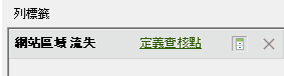

# 使用請求精靈篩選路徑流失報表

說明將篩選條件套用至流失報表的步驟。

此範例顯示「頁面流失」報表。

1. In Adobe Report Builder, click **[!UICONTROL Create]** to open the Request Wizard.
1. 選擇正確的報表套裝。
1. In the tree view on the left, select **[!UICONTROL Paths]** &gt; **[!UICONTROL Page]** &gt; **[!UICONTROL Page Fallout]**.

   

1. 設定適當的 [日期範圍](/help/analyze/report-builder/data-requests/configuring-report-dates/custom-calendar.md)。
1. 按&#x200B;**[!UICONTROL 「下一步」]**。
1. In Step 2 of the Wizard, under **[!UICONTROL Row Labels]**, click the **[!UICONTROL Define Checkpoints]** link. (在流失報表中，您永遠必須定義路徑元素，這點與路徑報表已預先套用模式不同。)

   

1. Select the **[!UICONTROL Filter]** option.

1. In the **[!UICONTROL Define Site Section Fallout Checkpoints]** dialog, define checkpoints from a range of cells or from a list. Then click **[!UICONTROL OK]**.
1. 決定要從儲存格範圍或清單選取。
1. If you select from a list, click **[!UICONTROL Add]** to select checkpoints to add to the fallout path. 您可以定義 3 到 8 個查核點。(Search for available elements by clicking **[!UICONTROL More]**.)

   For more information on refining the filter, see [Filter Dimensions](/help/analyze/report-builder/layout/c-filter-dimensions/filter-dimensions.md). 1. Move **[!UICONTROL Available Elements]** from the left column to the right by selecting them and clicking the orange arrow.
1. Click **[!UICONTROL OK]** three times, then click **[!UICONTROL Finish]**.

   報表應該會立即重新整理。
