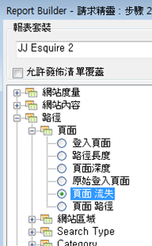

# 使用請求精靈篩選路徑流失報表

說明將篩選條件套用至流失報表的步驟。

此範例顯示「頁面流失」報表。

1. 在 Adobe Report Builder 中，按一下&#x200B;**[!UICONTROL 「建立」]**&#x200B;以開啟「請求精靈」。
1. 選擇正確的報表套裝。
1. 在左側的樹狀檢視中，選取&#x200B;**[!UICONTROL 「路徑]** > **[!UICONTROL 頁面]** > **[!UICONTROL 頁面流失」]**。

   

1. 設定適當的[日期範圍](/help/analyze/report-builder/data-requests/configuring-report-dates/custom-calendar.md)。
1. 按&#x200B;**[!UICONTROL 「下一步」]**。
1. 在精靈的步驟 2 中，按一下&#x200B;**[!UICONTROL 「列標籤」]**&#x200B;底下的&#x200B;**[!UICONTROL 「定義查核點」]**&#x200B;連結(在流失報表中，您永遠必須定義路徑元素，這點與路徑報表已預先套用模式不同)。

   ![顯示[定義查核點]連結的熒幕擷圖。](assets/define_checkpoints.png)

1. 選取&#x200B;**[!UICONTROL 「篩選」]**&#x200B;選項。

1. 在&#x200B;**[!UICONTROL 「定義網站區域流失查核點」]**&#x200B;對話方塊中，從儲存格範圍或清單定義查核點。接著，按一下&#x200B;**[!UICONTROL 「確定」]**。
1. 決定要從儲存格範圍或清單選取。
1. 如果您要從清單選取，請按一下&#x200B;**[!UICONTROL 「新增」]**，選取要新增至流失路徑的查核點。您可以定義 3 到 8 個查核點(按一下&#x200B;**[!UICONTROL 「更多」]**&#x200B;可搜尋可用元素)。

   如需縮小篩選範圍的詳細資訊，請參閱[篩選維度](/help/analyze/report-builder/layout/c-filter-dimensions/filter-dimensions.md)。1. 選取&#x200B;**[!UICONTROL 「可用元素」]**，並按一下橘色箭頭，可將其從左欄移至右側。
1. 按三次&#x200B;**[!UICONTROL 「確定」]**，然後按一下&#x200B;**[!UICONTROL 「完成」]**。

   報表應該會立即重新整理。
