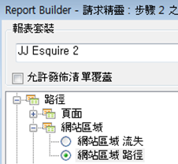
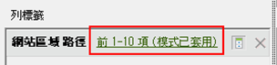
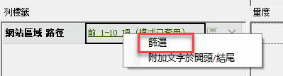
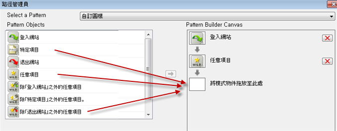
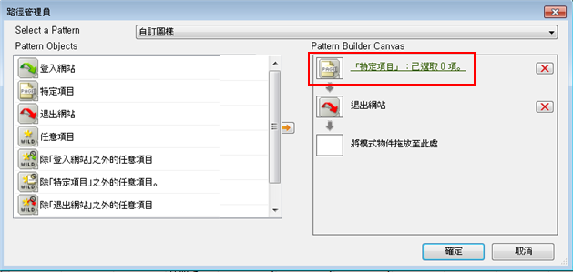
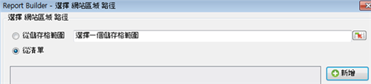
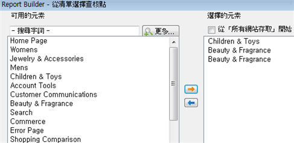

# 使用請求精靈篩選路徑報表

說明將篩選條件套用至路徑報表的步驟。

此範例使用網站區域路徑。

1. 在 Adobe Report Builder 中，按一下&#x200B;**[!UICONTROL 「建立」]**&#x200B;以開啟「請求精靈」。
1. 選擇正確的報表套裝。
1. 在左側的樹狀檢視中，選取&#x200B;**[!UICONTROL 「路徑]** > **[!UICONTROL 網站區域]** > **[!UICONTROL 網站區域路徑」]**。

   

1. 指定適當的日期。

1. 按&#x200B;**[!UICONTROL 「下一步」]**。

1. 在精靈的步驟 2 中，按一下&#x200B;**[!UICONTROL 「列標籤」]**&#x200B;底下的&#x200B;**[!UICONTROL 「前 1-10 項 (模式已套用)」]**&#x200B;連結。依預設，在路徑報表中，模式皆已套用。

   

1. 選取&#x200B;**[!UICONTROL 「篩選」]**&#x200B;選項。

   

1. 在&#x200B;**[!UICONTROL 「定義網站區域路徑的路徑模式」]**&#x200B;對話方塊中，您可以指定
   * 第一個報表的起始排名。
   * 您要在此報表中顯示的專案數。
1. 按一下&#x200B;**[!UICONTROL 「編輯」]**&#x200B;以定義路徑模式。

1. 如果您想要自訂模式，請將任一&#x200B;**[!UICONTROL 「模式物件」]**&#x200B;從左側清單拖放至右側的&#x200B;**[!UICONTROL 「模式產生器畫布」]**。

   

1. 您也可以從&#x200B;**[!UICONTROL 「選取模式」]**&#x200B;下拉式清單中選取預先定義的模式，並加以修改。可用的模式包括：

   

   其中有些模式是特定於Report Builder的：登入路徑的下一個專案模式、退出路徑的上一個專案模式、下一個專案模式。

## 若要編輯預先定義的模式

您可以在選取陣列後編輯預先定義的陣列。

1. 繼續上述步驟，選取模式。 例如，您可以選取「**[!UICONTROL 退出網站模式]**」:

   

1. 定義使用者在退出前所依循的網站區域路徑。 按一下&#x200B;**[!UICONTROL 「特定項目: 已選取 0 項」]**。如果您正在編輯現有請求，您可以從儲存格範圍中選取或從區段清單中選取，以定義此路徑。

1. 若要從先前請求的儲存格範圍中選取，請選取&#x200B;**[!UICONTROL 「從儲存格範圍」]**，然後按一下儲存格選取器圖示。接著，從報表中選取儲存格。

   

1. 若要從網站區域清單選取，請選取&#x200B;**[!UICONTROL 「從清單」]**，然後按一下&#x200B;**[!UICONTROL 「新增」]**。

1. 選取元素，然後按一下橘色箭頭，以將元素從&#x200B;**[!UICONTROL 「可用元素」]**&#x200B;欄移至&#x200B;**[!UICONTROL 「選擇的元素」]**&#x200B;欄。按一下「**[!UICONTROL 確定]**」。

   

1. 若要儲存您剛剛建立的模式，請按一下&#x200B;**[!UICONTROL 「儲存」]**。

1. 按三次「確定」****，然後按一下「完成」**[!UICONTROL 以產生篩選路徑]**。
